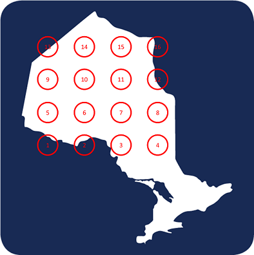
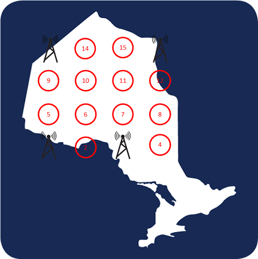
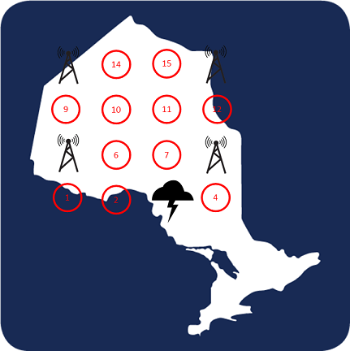
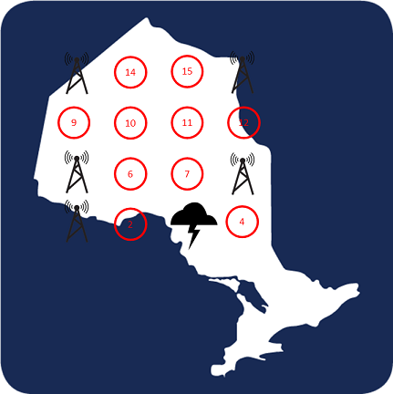



# Quantum Cohort Project Business Application

For each weekly project, your team is asked to complete the below business application exercise.
To complement the technical tasks, please consdier the four questions below.
You are free to format your response to these four questions as you wish (with the final question done as a short recorded video), and to include
the content (or links to the content) on your forked repository.


## Step 1: Explain the technical problem you solved in this exercise

We use quantum simulation methods to find a global maximum for problems that would be impractical to solve using classical algorithms.

There are many pain-points across various industry verticals that are related to the maximum independent set (MIS) problem, which describes finding a global maximum among discrete solutions. The reason for this difficulty is that the number of possible solutions to the problem grows exponentially with the number of inputs, and the classical brute-force method of checking to see whether each solution is optimal is computationally expensive. By using quantum computation, or even quantum computation simulation methods, we can leverage or simulate the principles of superposition and entanglement to find a global maximum in less time than the classical approach can.

As a simple illustration, here we construct a $4\times4$ unit disk graph composed of 16 different sites, each of which can be "on" or "off". Each site may represent the possibility of allocating scarce resources to that location, with "off" representing 'no' and "on" representing 'yes'. The possible number of solutions is the number of different permutations, which is then $2^{16}$. In this illustration, we assume a scenario in which we wish to maximize some arbitrary geographical area as efficiently as possible, by using the smallest amount of resource that is sufficient to maximize the covered area. This could be representational of choosing to allocate resources to the sites that are "on" in the optimized solution. To simulate this, we introduce a constraint asserting that no two adjacent sites can be "on", which is analogous to a given site having a particular coverage area and there being no need for coverage overlap. We can further weight each site according to inherent reliability, and maximize the solution according to coverage area with reliable efficiency.

In risk management, some level of redundancy is often built into solutions that involve liability or risk. In our simulated solution we find the maximum area covered with the fewest number of resources in the most reliable way possible, and we then consider the event of a failure of a given "on" site in the optimized solution (the site turns "off"). We re-optimize the problem using the remaining 15 sites, and find the new ideal way to reliably and efficiently cover the desired area. We arbitrarily select some of the new sites to include with the original network, building in some redundancy for even greater reliability at the cost of efficiency.

## Step 2: Explain or provide examples of the types of real-world problems this solution can solve

We mention two examples of real-world problems that can be solved using this approach, but our technical solution focuses on the latter.

First: Road networks include intersections with varying levels of reliability. Subject to a constraint on the geographical area that an intersection should service, it is desirable to cover a maximum geographical area with the fewest number of intersections possible. This problem can be further optimized by building in some redundancy in routing, given that intersections can "fail" due to vehicle accidents, weather events, etc.

Second: This week, a problem was experienced by Rogers and its network resulting in a loss of service. While we do not know the specific cause of this problem, we consider similar situations in which a network company wishes to maximize the area of coverage with the fewest number of resources, in the most reliable way possible. Further, we use our method to simulate building some redundancy into the network to reduce the risk of failure and subsequent loss of service. Our simple illustration shows how our method can solve this problem for a cellular network.

First, our $4\times4$ grid represents possible sites at which a cell tower could be built, and we overlay this grid on a map of Ontario:



We assume that a cell tower has a coverage distance equal to the distance between two neighbouring sites. We consider the goal to provide maximized cellular coverage (i.e., to the entire grid) with the fewest number of cell towers, and further weight each site according to its inherent reliability, which may include factors such as localized weather events, hardware age and wear, etc. We then use our method to find the solution which maximizes the reliability of the cell tower network, while providing coverage to the entire grid with the fewest number of towers possible:



If we take an example of a weather event at a random site, and if that site is occupied by a tower and knocks the tower out, we would re-solve the problem to find the solution that maximizes network reliability using the new 15-site grid:



Now, in order to maximize reliability while considering efficiency and coverage area, and absent of a financial analysis with real data, we can use an arbitrary decision to build towers at some of the sites in the new most reliable solution, in addition to the original network. By including some redundancy, we can increase reliability while still preserving high efficiency.



Using the Rydberg-atom quantum computation method, we have maximized the network coverage area with the fewest number of hubs, while maximizing the reliability of the placement of those hubs. As an added step, we have simulated a hub failure to determine the most efficient method of building in redundancy to further reduce the chance of a service outage. This concept can feasibly be extended to much larger grid sizes than would be viable using classical techniques, and could even be extended to 3-dimensional cases, such as satellite networks. 


## Step 3: Identify at least one potential customer for this solution - ie: a business who has this problem and would consider paying to have this problem solved

Some companies that have this problem and would consider paying for a solution are:

- Rogers
- Telus
- Bell
- Sprint
- AT&T
- SpaceX

## Step 4: Prepare a 90 second video explaining the value proposition of your innovation to this potential customer in non-technical language

See the below link. In our video, we explain the value proposition to a company like Rogers:

https://1drv.ms/v/s!Aly-26RuXWZBxQv_Z6joLbJAxkbF
