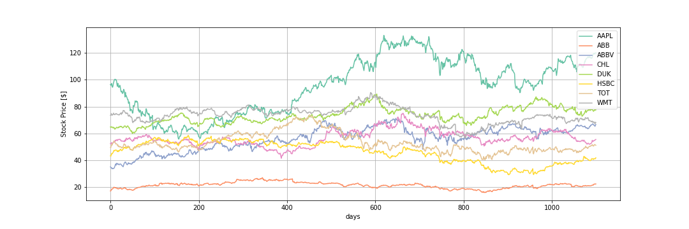
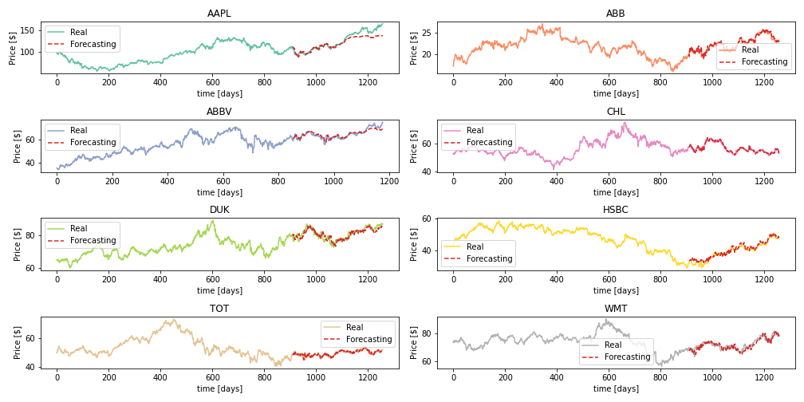
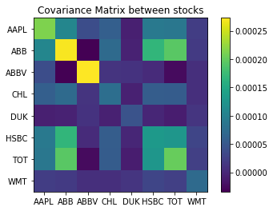
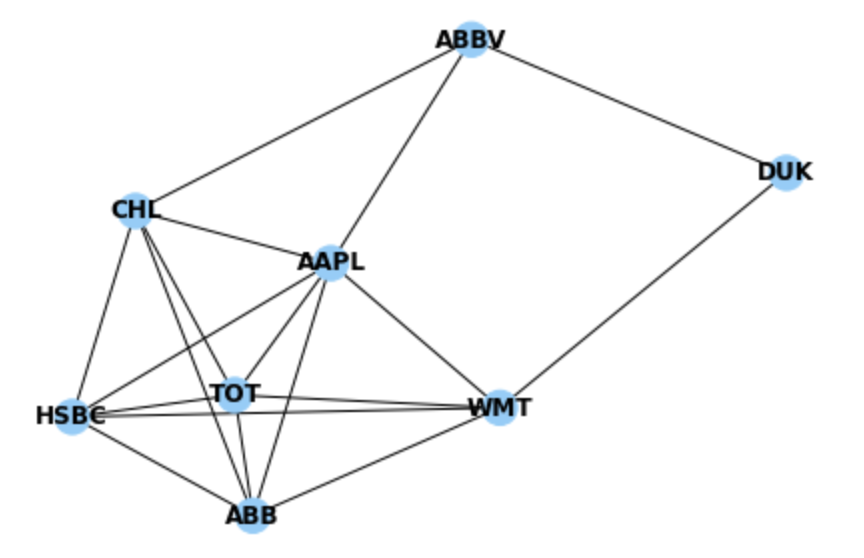
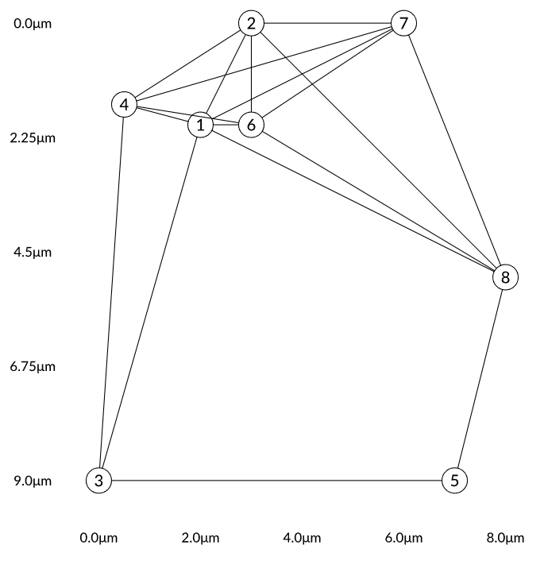
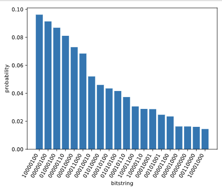
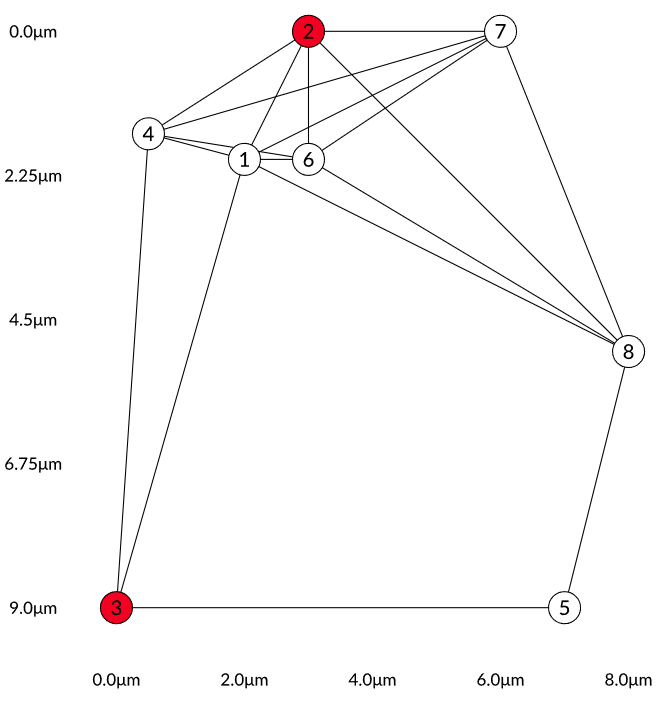
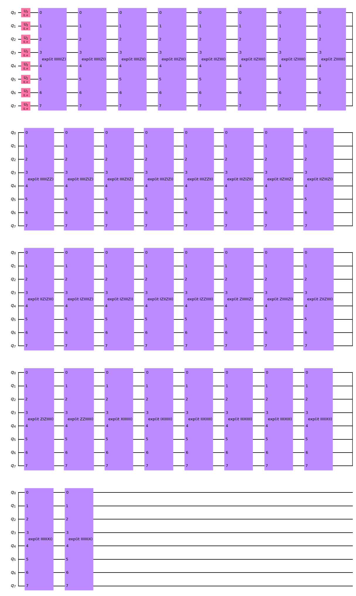
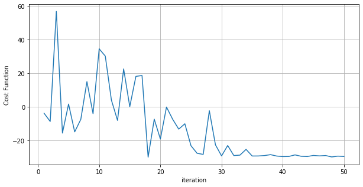
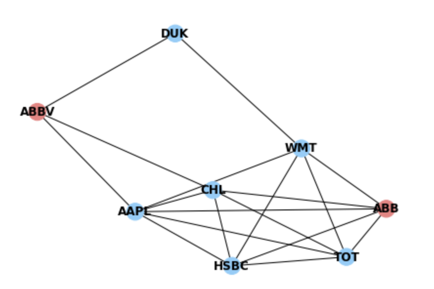

# Business Application : Oracle of assets

*Quantum in economics, it changes everything and we help you make your decisions!*

Figure 1. Logo for Oracle of assets. 

## Introduction

One of the challenges of computing is to solve problems with a large amount of data, but there are some problems due to their complexity that take a long time to solve, these are known as NP problems, and one of these is the Maximum Independent set (MIS), there are different proposals to solve but they fail to reduce its complexity as the greedy strategy. There is possible in  a graph $G(n, m)$ that contains $n$ vertices and $m$ edges, it is known that unless $\mathrm{P}=\mathrm{NP}$ no polynomial algorithm can find a $O\left(n^{1-\epsilon}\right)$ approximate solution in the worst case.

Figure 2. Example of a graph. 

One of the latest efforts in quantum computation research is to use a sizable quantum many-body system to solve non-deterministic polynomial-time (NP)-optimization problems. One proposal is the design of the Rydberg Blockade, one of the most important properties of neutral-atom quantum computing based on Rydberg states. It naturally encodes the independent set constraint. Other is using The Quantum Approximate Optimization Algorithm (QAOA), where a quantum state is created by a p-depth circuit specified by 2p variational parameters and using a classical optimizer to find the  best states. 

In the financial markets are complex environments that produce huge amounts of noisy data. Therefore, there are difficulties in dealing with these, one of the problems, online portfolio selection, aims to exploit data from different stocks to select asset portfolios in order to obtain positive investment results considering to decrease the different possible risks. One option is use the quantum advantage to improve this kind of  problems.

## Problem: Portfolio optimization 

By considering the above case, the portfolio optimization problem can be implemented. Where each stock has time-dependent returns, which may or may not be correlated with other stocks. For this, a graph must be considered where each vertex is a stock, and there is an edge between the vertices if the assets are correlated or not within a certain threshold. 

To solve this problem can be based on the maximum clique problem, where this is represented in a graph is the largest subset of vertices that are completely connected. That is, each vertex is adjacent to all other vertices in the clique.  The natural complement to this problem is MIS. 

## What is Oracle Of Assets?

The oracle of assets is a tool for investors that identifies a subgroup of assets that minimize the risk to lose money. Using neutral atoms, we can identify such a subgroup using an algorithm known as Maximum Independent Set (MIS). The subgroup of assets will not share a correlation between them, therefore if the price in the market of one of the assets decreases it won't affect the price of the others. Our algorithm will ensure that the subgroup will have the greater variety of assets possible for an investor to invest in.

Figure 3. Eight stock prices. 

## Business

Any system that has multiple processes that are altered in the evolution of time, through certain factors that we cannot control, as is the case of the complex environment in which technology, media and telecommunications companies or investors who want to value their assets considering the risks and current situations of the companies of their interest. Where they are trying to drive growth by optimizing their asset portfolios. It consists of two phases, the quantitative finance problems, which is the prediction, and the decision-based optimization of these predictions. Therefore, covariance forecasting models are important, they are optimized with unique objectives and constraints based on the prediction. In the case of identifying the shares of a company, when investing it is important to consider the positions, the line of business and that some depend on another company for their relationships or that they are a block of a larger company, such as the shares of their CEOs. 

Like the case Multiverse & BBVA mentioned in their news, we need to find a way that we can tell investors where to put their money. Where the best sequence of buying and selling is most accurate with our proposal. But this will depend on time with multiple conditions where the objective is to increase profits and decrease losses, being a rational being is what we are looking for.

## Example 

In order to demonstrate our project, we used 8 stocks from 8 conglomerates based on the work from Xu et al. [2]:

- Basic Materials: TOTAL S.A. "TOT"
- Consumer Goods: Appel Inc. "AAPL"
- Healthcare: AbbVie Inc. "ABBV"
- Services: Wall-Mart Stores Inc. "WMT"
- Utilites: Duke energy corporation "DUK"
- Financial: HSBS Holding pcl "HSBC"
- Industrial Goods: ABB Ltd. "ABB"
- Technology: China Mobile Limited "CHL"

The information comes from Sep 2012 to Sep 2017 with daily Technical information of Open, High, Low, Close, Adj Close, and Volume for the stocks price.

Figure 4. Eight stock prices predictions. 

For this purpose, a hybrid classical-quantum algorithm is used for forecasting. With those values now, covariance matrix can be  obtained.

Figure 5. Covariance matrix. 

If the correlation between the two stocks exceeds a threshold during a period of time it means they are connected. We use a graph representation to show such a correlation as an edge between two nodes (the stocks).

Figure 6.  Graph for the Portfolio optimization. 

### Proposals 1

We made two solution proposals in different frameworks, the first one using neutral atom.

 The graph for this architecture is designed with the representation of the covariance matrix. And exists a natural connection between the independent set constraint, and the Rydberg Blockade phenomenon in neutral-atom quantum computing using Rydberg states. we chose an arbitrary lattice for certain points and the smallest spacing was 0.5 μm and the largest was 7.5μm. For all the previous considerations the blockade radius to be 7.5 μm. 

Figure 7. Atom list. 

Is important considr that the Rydberg blockade radius can be computed with

$$
C_{6} / R_{b}^{6} \sim \sqrt{\Delta^{2}+\Omega^{2}}
$$

The default $C_{6}=2 \pi * 862690 \mathrm{MHz} \mu \mathrm{m}^{6}$. For encoding the corresponding MIS problem at $\Omega=0$, the detuning can be set around $2 \pi \times 11 \mathrm{MHz}$ for a blockade radius of $7.5 \mu \mathrm{m}$ (see the parameters in $\mathrm{S}$. Ebadi, et al.).

The histogram result you can see different state with probability in the figure 8.

Figure 8. Histogram for atom list.

For those we select  all the states with more probability and the correct answer is in that subset, where is 3,4.

Figure 9. Graph solution using proposal 1.

### Proposals 2

Using the other using QAOA in Qiskit form IBM. We cna obtain the same graph but in a quantum circuit.

Figure 10. Quantum circuit for QAOA.

The cost function is obtained in the following plot.

Figure 11. Cost function.

The result is the same like in the previous proposal, we cna compare both graph.

Figure 12. QAOA's result.

