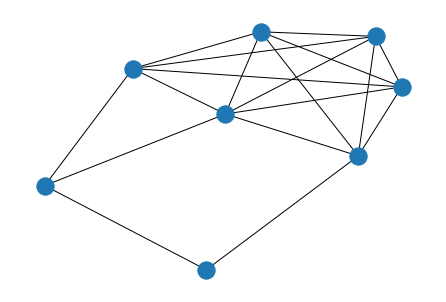
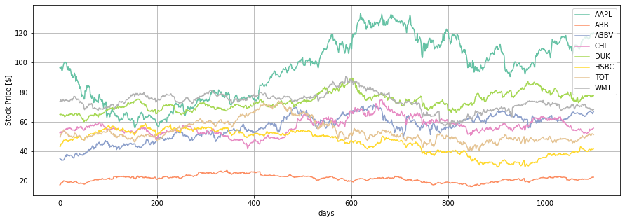

# Business Application : Oracle of assets

*Quantum in economics, it changes everything and we help you make your decisions!*

## Introduction

One of the challenges of computing is to solve problems with a large amount of data, but there are some problems due to their complexity that take a long time to solve, these are known as NP problems, and one of these is the Maximum Independent set (MIS), there are different proposals to solve but they fail to reduce its complexity as the greedy strategy. There is possible in  a graph $G(n, m)$ that contains $n$ vertices and $m$ edges, it is known that unless $\mathrm{P}=\mathrm{NP}$ no polynomial algorithm can find a $O\left(n^{1-\epsilon}\right)$-approximate solution in the worst case.

One of the latest efforts in quantum computation research is to use a sizable quantum many-body system to solve non-deterministic polynomial-time (NP)-optimization problems. One proposal is the design of the Rydberg Blockade, one of the most important properties of neutral-atom quantum computing based on Rydberg states. It naturally encodes the independent set constraint. Other is using The Quantum Approximate Optimization Algorithm (QAOA), where a quantum state is created by a p-depth circuit specified by 2p variational parameters and using a classical optimizer to find the  best states. 

In the financial markets are complex environments that produce huge amounts of noisy data. Therefore, there are difficulties in dealing with these, one of the problems, online portfolio selection, aims to exploit data from different stocks to select asset portfolios in order to obtain positive investment results considering to decrease the different possible risks. One option is use the quantum advantage to improve this kind of  problems.

## what is Oracle Of Assets?

The oracle of assets is a tool for investors that identifies a subgroup of assets that minimize the risk to lose money. Using neutral atoms, we can identify such a subgroup using an algorithm known as Maximum Independent Set (MIS). The subgroup of assets will not share a correlation between them, therefore if the price in the market of one of the assets decreases it won't affect the price of the others. Our algorithm will ensure that the subgroup will have the greater variety of assets possible for an investor to invest in.

#### 

A brief example for each question is included for the 
[Traveling Salesman Problem.](https://en.wikipedia.org/wiki/Travelling_salesman_problem)

## Step 1: Explain the technical problem you solved in this exercise

Example: Finding a global minimum in settings where a classical approach may not be able to find a global minimum.

## Step 2: Explain or provide examples of the types of real-world problems this solution can solve

Example: A courier has to deliver parcels to several locations and is looking to minimize its travel time. (e.g., “the travelling salesman problem”).

## Step 3: Identify at least one potential customer for this solution - ie: a business who has this problem and would consider paying to have this problem solved

Examples: 
- Federal Express
- Canada Post

## Step 4: Prepare a 90 second video explaining the value proposition of your innovation to this potential customer in non-technical language

Example: By travelling to all destinations via the shortest route, a courier can generate the same revenue that it would have generated following any other route, but will minimize travel costs (e.g., fuel costs). By minimizing travel costs, the courier will be more profitable than it would have been had it travelled through any other route.

**Please store your video externally to the repo, and provide a link e.g. to Google Drive**
