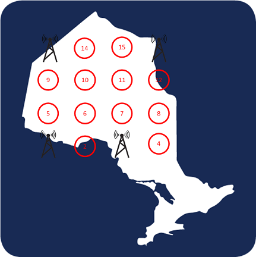
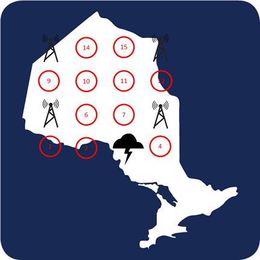

Team 11: Jordan Smith, Kenneth Sharman, Shan Zhong, Ezad Shojaee

## Project 1: State preparation and MIS optimization wth neutral atom arrays

This project will guide you through a novel quantum computing architecture pursued by a number of quantum startups, which trap neutral "Rydberg" atoms in an arbitrary array using optical tweezers.

The calculations described in this document were performed using the [Bloqade](https://queracomputing.github.io/Bloqade.jl/dev/) open-source software package. 

## Task 1: Adiabatic state preparation with Bloqade

Please see [task1_calculations.ipynb](./Calculations/task1_calculations.ipynb) for the calculation details associated with task #1.

Our first task is to investigate Rydberg state preparation in a one-dimensional (1D) chain. The target state, known as the $\mathbb{Z}_2$ state, consists of alternating ground ($g$) and first-excited states ($r$), i.e.,
$$ |\psi \rangle = | g \hspace{1mm} r \hspace{1mm} g \hspace{1mm} r \hspace{1mm} g \hspace{1mm} r  \cdots \rangle . $$

We found that all 1D chains will have excitations at the endpoints, which is due to the repulsive nature of the excited states. If the number of atoms in the chain is even, then it is not possible to have excitations at the endpoints and still obtain the $\mathbb{Z}_2$ state. Thus, we investigate only chains with odd numbers of atoms in this analysis and start with the state preparation of 9 atoms. We are interested in the 9-qubit state as it evolves in time according to the Hamiltonian. The average occupation on each site as a function of time is described by the following contour plot.

We see that the Rydberg densities converge towards the $\mathbb{Z}_2$ ordered state. Unfortunately, it appears that the excited states in the middle of the chain are not prepared to the ideal target state. Further insight can be gained by calculating the expectation value of the Pauli X operator for our prepared state. For both the ground and excited states, the expectation value of the Pauli X operator is equal to zero. Thus, we expect that the non-ideal preparation of each site will result in non-zero expectation values. The further the expectation value from zero, the less ideal the preparation. To investigate this, we the plot the expectation of the Pauli X operator for each site.

Just as we saw with the time evolution, the above plot shows that state preparation is better at the endpoints and decreases in fidelity as we consider states towards the middle of the chain. We also see that state preparation of the even numbered sites is better as compared to odd numbered sites. This is not surprising since both the initial and target states of the even numbered sites are the ground state.

Finally, we wish to determine the viability of the adiabatic protocol for quantum computing based on Rydberg atom arrays. The adiabatic condition states that the system is evolved slow enough such that the atoms stay in the ground state [1]. The lower-bound for the time required to evolve the Rydberg atom system and stay within the adiabatic protocol is given by the inverse square of the energy-splitting between the ground and excited states $\Delta E\,$ [1], i.e.,
$$ t >> \frac{\text{MHz}}{(\Delta E/2\pi)^2} , $$
where $t$ is the time evolution of the system. Thus, the smaller the energy splitting, the longer the time required to evolve the system. We can determine the minimum energy splitting as a function of the detuning, for a fixed Rabi frequency:

The minimum splitting is found to be 1.61 MHz, which is shown on the above plot with the dashed red line. For the 9 atom 1D chain and a Rabi frequency of $2\pi \times 4$ MHz, the minimum time evolution is
$$ t >> \frac{\text{MHz}}{(1.61 \text{ MHz})^2} = 0.39 \mu s . $$
Next, it would be interesting to determine the dependence of the calculation time on the number of atoms. To that end, we calculate and plot the energy splitting and the minimum evolution time for chains with an increasing number of atoms:

The plot on the left shows that even for a small number of qubits, the adiabatic protocol requires a relatively small energy separation between the ground and excited states. This becomes problematic when considering a larger number of atoms, as it becomes increasingly difficult to drive the system while ensuring that it remains in the ground state as required by the adiabatic protocol.

The plot on the right shows how the minimum time required to complete the protocol scales with the number of atoms. An advantage of this protocol is that the runtime is $O(2^n)$, which demonstrates that the quantum protocol does indeed have an advantage over its classical counterpart. 

Our analysis indicates that despite a speedup in the runtime, executing the adiabatic protocol is likely infeasible for a large number of qubits. We have seen that state preparation with high-fidelity is difficult for a large number of qubits, and the ability to adhere to the adiabatic requirements in terms of driving the system without exciting the state becomes increasingly difficult for a large number of atoms.

## Task 2: Larger arrays with the Blockade Approximation

Please see [task2_calculations.ipynb](./Calculations/task2_calculations.ipynb) for the calculation details associated with task #2.

Full space simulation of more than 15 atoms takes prohibitively long (if even possible). But, by eliminating the states that violate the Rydberg blockade (even though not perfect), this reduces the size of our problem, drastically. The question is, how are we sure that this truncation is a good approximation? We are going to do the following to compare the subspace method with the fullspace: 

1. Prepare 11 sites with d = 5.48 $\mu m$ and fix the maximum Rabi frequency according to the algorithm
2. Calculate the simulation for both methods.
3. Plot the Rydberg density as a function of time for both methods.

Using the results, we compare the full evolution of 11 atoms in the $Z_2$ phase transition with the subspace method (meaning eliminating the parts of the Hilbert space where two adjacent atoms are in the Rydberg state). We see that the deviation in Rydberg densities are more apparent in the middle sites, however all the populations converge in the end.

## Task 3: MIS

Please see [task3_calculations.ipynb](./Calculations/task3_calculations.ipynb) for the calculation details associated with task #3.

### 3.0 Background

In graph theory, an independent set means no two vertices in a graph that belong to the same set can be connected by an edge. A maximal independent set (MIS) is the largest independent set of all independent sets. Usually, the MIS problems are NP-hard, or non-deterministic polynomial-time hard, which are unlikely to be solved in an amount of time that scales polynomially with the problem size. Interestingly, these NP-hard problems can be addressed on Rydberg atom arrays thanks to the Rydberg Blockade phenomenon in neutral-atom Rydberg states. 

A Rydberg blockade is triggered due to the strong interaction between atoms excited to Rydberg states. If two atoms are within the blockade radius, $R_b$, then they cannot be both excited to the Rydberg state. The independent set constraint means two vertices cannot both be in the independent set when they are connected by an edge. Thus, Rydberg atoms can be considered to be the independent vertices and the solutions of MIS problems can be efficiently encoded in the ground state of interacting atoms in 2D arrays by utilizing the Rydberg blockade mechanism.

### 3.1 Solving 4x4 DUGG

In task 3, we follow the steps in the [tutorial](https://github.com/QuEraComputing/Bloqade.jl/blob/master/examples/4.MIS/main.jl) to solve the 4x4 DUGG problem. We first create a 4x4 diagonally connected unit-disk grid graph (DUGG) with 0.8 filling, by using the random_dropout function. Here, we choose the lattice constant (a) to be equal to 4.5 um. Next, we set the blockade radius to be 7.5 um, such that all nearest neighbors and next-nearest neighbors (diagonal) are within the blockade radius. The mechanism of Rydberg blockade only allows one Rydberg excitation in the blockade radius. 

We first solve this MIS problem using a classical algorithm called Generic Tensor Network. For this specific DUGG, we get the MIS size as 4, and the number of maximum independent sets is 26. Then we solve the same problem with the quantum algorithm and visualize the configuration by coloring the Rydberg excitations on the 4x4 graph. The following figures show two cases where the MIS size equals 4 for this specific DUGG.

In some cases, two vertices are on the edge that violates the blockade constraint. This is usually because the Rydberg interaction is not strong enough close to the edge of the unit disk to trigger the energy penalty. This can be fixed by running some postprocessing.  

The mean value of the MIS size that is calculated by the quantum algorithm is $\approx$ 4.16, which is close to 4. This means there is a substantial probability for measuring an MIS state.

### 3.2 Parametrize the pulses

Next, we parameterize the Rabi and detuning frequencies to optimize our system and get a more accurate MIS. We use two methods: one is to add coefficients to the value of the Rabi frequency and the detuning at each time step; the other is to smoothen the piece-wise linear pulses with a Gaussian filter. The Rabi fequency and detuning pulses for the two methods are shown as follows:

After pulse parameterizations, the mean value of the MIS becomes more accurate with values of 4.05 and 4.12, respectively in each case.

### 3.3 A Larger Array: 5x5 DUGG

In the last step, we generate a 5x5 diagonally connected unit-disk grid graph (DUGG) with 0.68 filling by using the random_dropout function. Here, we choose the lattice constant, a, to be equal to 4.5 um and set the blockade radius to be 7.5 um. A filling value of 0.68 gives us 17 sites filled with atoms. Adding more atoms will dramatically increase the computation time.

Similarly, we use a classical algorithm to calculate the MIS size, and we get a resulting MIS size of 7, and the number of MISs is 6. Then we use a quantum algorithm, and visulize the configurations by coloring the Rydberg excitations. The figures below are two examples:

## Task 4: Business applications

### Finally, use your simulations to solve a groundstate encoding problem for an industrial application. Set up a problem, and solve it on as large a graph as possible using adiabatic state preparation protocols. Link this to your Business Application.

Please see [task4_calculations.ipynb](./Calculations/task4_calculations.ipynb) for the calculation details associated with task #4, and our [Business_Application](./Business_Application.md).

Inspired by the recent service outage experienced by Rogers, we simulate how the Rydberg atom computer could be used to determine the ideal locations of cell towers which comprise nodes of the service network. We then add redundancy to the network by randomly selecting a node to fail, and recalculating the node placement. A network which consists of towers at all the calculated locations would reduce the risk that Rogers would experience a massive outage in the future.

To setup an example problem of how this approach could be used, we consider a two dimensional (2D) array of Rydberg atoms which represent the possible cell tower locations. We encode the problem in a bitstring by considering vacant locations to be represented by the ground state and occupied locations by the excited state (that is, the cell tower is built and in operation at that location). Having cell towers at neighboring locations might not be the best use of resources since the area they provide service to would overlap too much. The problem of determing how many, and where to place the cell towers can be represented as a Maximum Independent Set (MIS) problem. The set of solutions represents all the possibilities of how the network could be constructed.

We consider a single metric which represents how ideal it is to build a cell tower at a location. A value of '0' indicates that it is not feasible or partical to build the tower, and a value of '1' indicates that the location is ideal. After solving the MIS problem, for each bitstring solution, we multiply the value of each bit by the corresponding metric, and then sum the bits resulting in a single real number. The solution with the highest value represents the ideal placement of the cell towers.

First, we specify the array of possible tower locations. Our example calculation will consider a 4x4 array. Since only one Rydberg excitation is allowed within the blockade radius, we consider this to model the fact that in a network with no redundancy, cell towers should not be closer to each other than a specified distance. As an example, we overlay our array on a map of Ontario:

Our initial goal is to determine where the cell towers should be placed to construct a network with no redundancy. This is equivalent to finding a maximum independent set of our 2D array. The results of our calculations are presented in the following table.

|Bitstring | Rating |
|---|---|
|1001000000001001| 1.5793766670083484|
|1010000000001010| 2.0685979486952313|
|0001010000001001| 1.619442778453172|
|0000010100001001| 1.5929585440116867|
|1001000010000001| 1.2956550003137908|
|1000001000001001| 1.769332713399164|
|1010000000000101| 1.929256872144633|
|1001000000001010| 1.5257297961842728|
|0001010000011000| 1.6627330914036365|
|1000000100001001| 1.5528924325668636|
|1001000000000101| 1.3863887196336746|
|0010100000001001| 2.029389018020144|
|1000000110000001| 1.269170765872306|
|1010000000001001| 2.1222448195193073|
|1000001000001010| 1.7156858425750885|
|1001000001000001| 1.6216214939761544|
|0101000000011000| 1.2971027486162772|
|1001000010000010| 1.2420081294897152|
|1001000000011000| 1.6226669799588131|
|0101000000000101| 1.0608244882911384|
|0101000000001001| 1.2538124356658127|
|0001100000001001| 1.4865208655091857|
|0001100000011000| 1.5298111784596502|

We see that out of the solutions that do not have neighboring excitations, 1010000000001001 has the highest overall rating. This corresponds to cell towers positioned at sites 1, 3, 13, and 16, illustrated in the following graphic:

Next, we simulate a power-outage at a random site. Site 3 is removed from our array: 

We rerun our calculations and the results are as follows:

|Bitstring | Rating |
|---|---|
|101000010100000| 0.30166967414897516|
|101000000001001| 1.0846040936329597|
|101000000001010| 0.9652539393884894|
|101000010000001| 0.686189123790324|
|101000010000010| 0.5668389695458536|
|001100000001001| 1.2986596072214058|
|100001000001001| 1.2147138673459328|
|011000000001001| 1.913642422713388|
|101000000011000| 1.2462594991197984|
|011000010000001| 1.5152274528707521|
|000101000001001| 1.4287693809343789|
|101000000000101| 1.5246675618655097|
|001100000011000| 1.4603150127082445|
|011000000000101| 2.353705890945938|
|001010000000101| 1.9964571546425094|
|100001000001010| 1.0953637131014622|
|000100100001001| 2.0576323979675|
|001010000001001| 1.5563936864099595|

We see that out of the solutions that do not have neighboring excitations 000100100001001 has the highest overall rating. This corresponds to cell towers positioned at sites 4, 7, 12, and 15. Since site 3 was removed from our original array, these sites correpond to 5,8,13,16 on the original lattice, as illustrated in the following graphic:

Combining the two solutions, we have determined that cell towers should be positioned at sites 1, 5, 8, 13, and 16. The result of our constructed network, including redundancy, is as follows (we included the storm in this diagram to illustrate that a tower at location 8 would prevent loss of service in the south-east region):

Our solution has neighboring cell towers. Introducing redundancy into our network may result in direct neighbors. Of course, our basic calculations only simulated a single random power-outage. A more complete calculation would consider a larger array and numerous power-outage simulations- perhaps involving more than one site that goes down. That aside, our example illustrates a potential application that could be used in an industrial setting.

## CHALLENGE 2: QAOA (Quantum Approximate Optimisation Algorithm) vs Adiabatic for MIS (Maximum Independent Set) 

### In addition to adiabatic protocols, other state preparation protocols are currently being explored on quantum computing hardware. A leading variational protocol is the Quantum Approximate Optimization Algorithm (QAOA), in which time evolution occurs via rapidly switching between a cost and mixer Hamiltonian. For your problems above, particularly your Business Application, attempt a QAOA solution and compare your results to the adiabatic approach.

Please see [task2_calculations.ipynb](./Calculations/task2_calculations.ipynb) for the calculation details associated with challenge #2.

### To do           

#### C2.1 Create a 4 by 4 graph with 20% dropouts   

#### C2.2 Solve classcialy via Tensor Networks

#### C2.3 Do the adiabatic simulation (either fullspace or subspace)

#### C2.4 Use the QAOA algorithm (arxiv:1411.4028) which is a hybrid quantum-classical algorithm. The classical part is an optimizer, and the quantum part can be a neutral-atom quantum computer first evolving under the Rydberg Hamiltonian parameterized pulse sequences and then being measured in the computational basis. Here, the pulse sequence is 3 periods in detuning/Rabi waveform. 
    
#### Flowchart
    
##### C2.4.1 Evaluate loss (a metric which the more negative the better) with no optimization and no smoothing of the pulse shape
    
##### C2.4.2 Evaluate loss with smooth pulse shapes: Gets better

#### C2.4.3 Optimize through the Nelder-Mead method to make the right answers, more probable  

For instance, look at the following sequences, as correct instances:
(1) starts with 1001 and ends with 11 (no more 1s)
(2) starts with 1001 and ends with 10001 (no more 1s) 

# References
[1] Albash, Tameem, and Daniel A. Lidar. "Adiabatic quantum computation." Reviews of Modern Physics 90.1 (2018): 015002.

