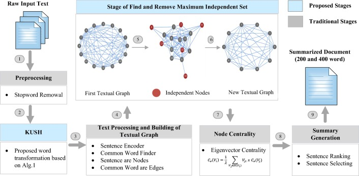
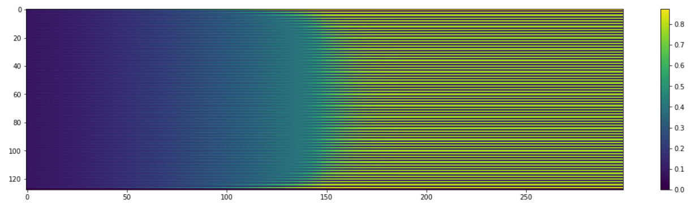

## Project 1: State preparation and MIS optimization wth neutral atom arrays

Team 13: Richard Givhan, Mykola Maksymenko, Can Unlu, David FEllah, Mert Esencan

In this project we assessed the potential of neutral atoms arrays to perform computations of optimization problems.

First we addressed Tasks 1 and 2. We explored the capability of classical Bloqade simulator of Rydberg atom arrays and various approaches to
designing the detuning protocols for parameters of the Hamiltonian. Our maximal arrays for the full precision
simulation with ODE or exact diagonalization were up to 16 to 18 sites, while for Rydberg blockade subspace we
were able to perform simulations of up to 30 sites on a standard Macbook Air laptop.

We then followed Task 3 with implementing MIS problem solver using Bloqade simulation of Rydberg atoms array. To this end we tested
algorithm with hand-crafted detuning protocols as well as tested variational fine-tuning of protocol in
order to optimize the designed loss function for a resulting state. Here the maximal size of the
considered system was 18 sites.

Finally, we addressed the NLP problem of extractive text summarization using mapping to neutral atoms array. As
summarization of large bulks of texts is a hard and wide-spread business problem it may potentially become a
promising business application of neutral atoms-based quantum computers.

In addition to main tasks we addressed proposed Challenges. Namely,

* Challenge 1. We implemented simple custom TEBD algoritm and for a Neel-like state preparation managed to
access system sizes up to 512 atoms.
* Challenge 2. We implemented protocol fine-tuning via hybrid Quantum-Classical optimization in Task 2.
* Challenge 3. We ideated and tested QML application to enhance our NLP algorithm in Task 4.

## Task 1 - State preparation

For more details follow TASK 1 notebook.

In this task we run a number of experiments with preparation of a CDW-like state using Bloqade.  Namely:

* For a chain of 16 sites (comfortable simulation time within 5-10 min) we emplyed linear detuning protocol and achieved a sub-optimal CDW state with a domain-wall-like defect.

* We further employed a smooth detuning protocol which reduced the high-frequency oscillation defects during the evolution and improved the probability of the optimal solution. The global solution, however, remained suboptimal.

* The expectation of SigmaX could serve as a loss function helping to fine-tune detuning protocol in order to achieve perfect CDW state.

* Finally, we computed the Energy gap and its scaling with the system size. The inverse scaling plot suggests that the gap will close in the thermodynamical limit.

## Task 2 - System size experiments and Blockade approximation

In the previous Task 1 we experimented with maximally reacheable system sizes and got to N=20. Here we employed the Blockade Approximation and were able to reach sizes N=30 on the 2D square lattice. This is clearly way below advantage provided by Neutral atoms experiments. Our results for 2D lattice also provided a sub-optimal CDW state.

## Task 3 (+ Challenge 2) - MIS problem and protocol fine-tuning

Here we approached MIS problem within Blockade approaximation for a pruned 2D lattice of a size N=18 sites.

We first run a standard smooth protocol and arrive to a suboptimal MIS solution. 

We further parametrize the tuning protocol and employ a Hybrid Quantum-Classical optimization using a loss function constructed to maximize probability density. This allowed to arrive to an optimal state.

## Task 4 (+ Challenge 2,3) - Business application

Here we focus on a non-obvious application of above methods to a Natural Language Processing. Variety of a state of the art NLP massively rely on a language-graph analysis. We are following [recent paper by Uckan et. al. ](https://www.sciencedirect.com/science/article/pii/S111086651930324X) that proposed Extractive summarization approach based on MIS problem and presented results that are superior to alternative classical NLP methods on a standard ROUGE score metrics.

**We extend the proposed approach by mapping the MIS problem to Quantum Neutral Atoms processor.**

To this end, we provide a proof of concept on a toy model for two texts of 5 sentences with corresponding similarity graphs (site numbers represent the sentence index). We further employ smooth parametrization of detuning parameters to arrive to a MIS solutions and reconstruct the .

| Text 1 | Text 2 |
| ------ | ------ |
| Quantum computing is one of the hottest topics in the technology sector today. The technology is enabling individuals and companies to solve computational problems that were previously considered intractable. Cryptography, chemistry, quantum simulation, optimization, machine learning, and numerous other fields have been significantly impacted by this technology. While quantum computers aren’t going to replace classical computers immediately, quantum technology is significantly changing the way the world operates. Many entities are focused on developing quantum computing hardware since this is the core bottleneck today.  | The tower is 324 metres (1,063 ft) tall. About the same height as an 81-storey building. It was the tallest structure in Paris. Its base is square, measuring 125 metres (410 ft) on each side. It was the first structure to reach a height of 300 metres. Excluding transmitters, the Eiffel Tower is the second tallest free-standing structure in France after the Millau Viaduct. |
|  |  |
|  |  |

| Text 1 summarization| Text 2 summarization |
| ------ | ------ |
| Quantum computing is one of the hottest topics in the technology sector today Cryptography, chemistry, quantum simulation, optimization, machine learning, and numerous other fields have been significantly impacted by this technology While quantum computers aren’t going to replace classical computers immediately, quantum technology is significantly changing the way the world operates | It was the first structure to reach a height of 300 metres. Excluding transmitters, the Eiffel Tower is the second tallest free-standing structure in France after the Millau Viaduct. |

## QML-like extension to MIS for Text Summarization

The above solution is based on perfect MIS problem solving. However given flexibility of the detuning protocol we can optimize toward a designed objective: 
* style of the text, 
* page rank sum of the resulting nodes in the graph
* context diversity of different sentences
* other NLP metrics derived with further postprocessing of the resulting text. 

Below we finetuned the adiabatic protocol to produce slightly different resulting bitstring for Text 1 - **[01011]**. Such approach could be straight-forwardly embedded into a complex Hybrid architecture that might involve variety of NLP techniques to produce proper feedback loss to optimize quantum protocol. 

|  |  |

## Challenge 1 - Large-scale TEBD simulations

As a PoC we implemented custom TEBD algorithm in NumPy to benchmark potential scaling to large system sizes. An interesting observation is that we mainly deal with semi-classical states which have very low entanglement. To this end, even adiabatic real-time evolution is performed in the subspace of low-entanglement states which allows us to simulated very large systems. In our experiments we went to system sizes up to N=512.

While on the one hand we can simulate large semi-classical problems the method is not capable to address such large system sizes of a truly Quantum problems which were addressed in the experiment with 256 atoms. 

Below is a summary of simulations. We first run imaginary time evolution (similar to cooling of a real system) and then perform real-time evolution with time-dependent Hamiltonian from there. Similarly to Bloqade examples, we sometimes fall into the sub-optimal solution as in the image below.

## Conclusions:

In this project we explored the potential of a neutral atoms approach to solving optimization problems. We explored the limitations of the currently available Bloqade simulator and potential mapping of the real-world problems to neutral atoms processor in a simulator. We propose interesting NLP problem that potentially can benefit from maping to quantum device and explore its extension via Quantum Machine Learning.

The current Neutral atoms arrays provide advantage for the truly quantum problems like simulating the quantum phase transitions. However, for semi-classical optimization problems Tensor Networks can provide a viable alternative.

With the above we covered Tasks 1, 2, 3, 4 and Challenges 1, 2, and 3. of the project.

For more details refer to the [Business Application found here](./Business_Application.md)
