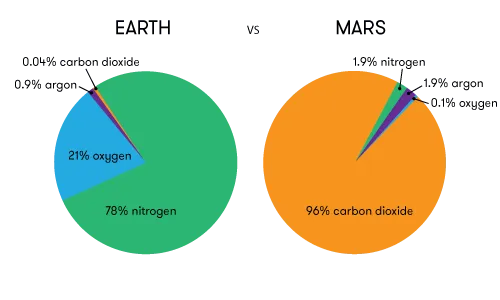
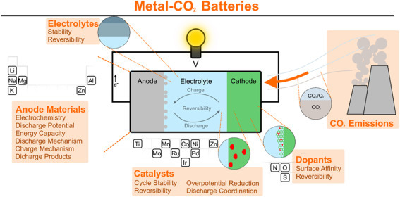
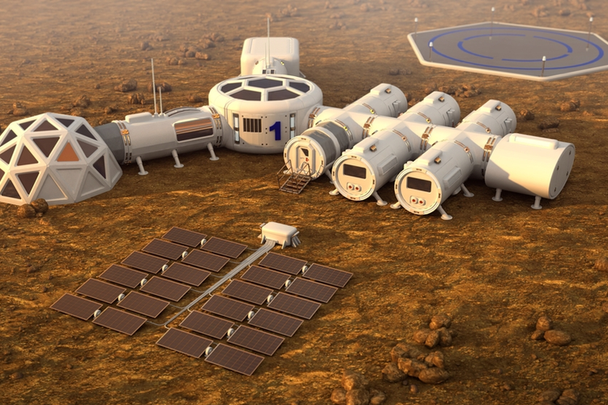
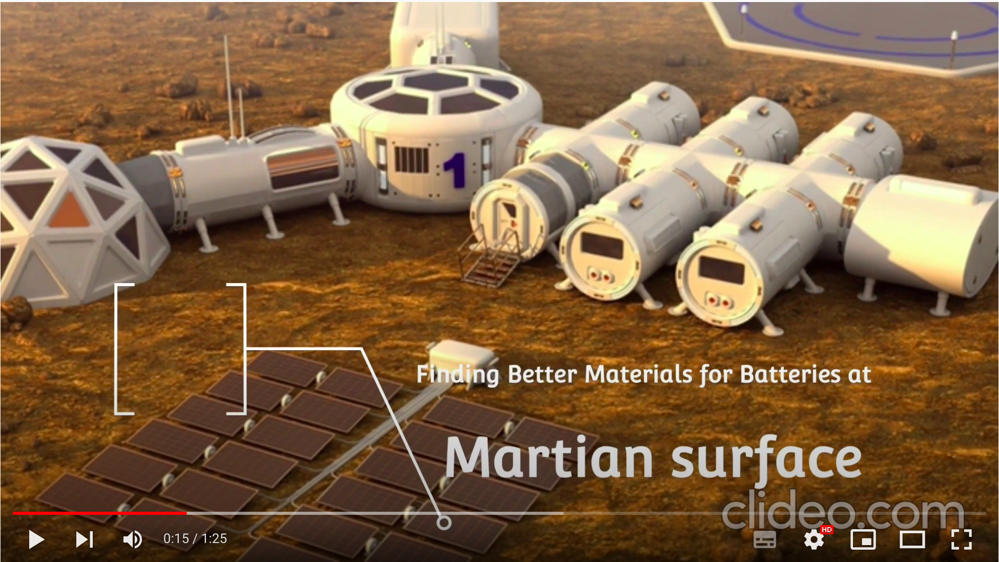

# Quantum Cohort Project Business Application

For each weekly project, your team is asked to complete the below business application exercise.
To complement the technical tasks, please consdier the four questions below.
You are free to format your response to these four questions as you wish (with the final question done as a short recorded video), and to include
the content (or links to the content) on your forked repository.

A brief example for each question is included for the 
[Traveling Salesman Problem.](https://en.wikipedia.org/wiki/Travelling_salesman_problem)

## Step 1: Explain the technical problem you solved in this exercise

### Finding new materials for batteries using VQE for manufacturing on Mars and Earth

Lithium based batteries have been go to batteries for the current tech industry. Despite having so many advantages it has some big disadvantages, as it is a rare element on Earth, so it's very costly and its mining process is very harmful for our environment.

New variants of Lithium battery has been already designed by using the variational quantum eigensolver (VQE) algorithm to simulate elements of Li-S batteries to get the ground state energies and the dipole moments of the molecules that could form in lithium-sulfur batteries during operation: lithium hydride (LiH), hydrogen sulfide (H2S), lithium hydrogen sulfide (LiSH), and the desired product, lithium sulfide (Li2S). These batteries are promised to provide 4 times charging capacity and longevity.  

Similarly, our goal is to simulate molecules like Lithium oxides such as Potassium, Magnesium and Aluminum oxides to get the ground state energies using variational quantum eigensolver (VQE) algorithm so that we could replace this rare metal.

Also to simulate Metal-CO2 batteries, which is another kind of battery where CO2 becomes the energy carrier thus helping in reducing carbon dioxide emissions and also getting better energy capacity.

## Step 2: Explain or provide examples of the types of real-world problems this solution can solve

These other variants of Lithium batteries are definitely cheaper, better and easily accessible on Earth as well on Mars, whereas Lithium is very rare and hard to get, so it could be easily used in electric vehicles and solar power plants for storage of energy.

Also it could be used in Space missions for Mars, where CO2 and other elements like Potassium, Magnesium and Aluminum are present in abundance, thus reducing payload of the mission. 

On Earth it will help to reduce global warming and climate change and on Mars it will reduce the excess CO2 from the environment.

## Step 3: Identify at least one potential customer for this solution - ie: a business who has this problem and would consider paying to have this problem solved

Examples: 
- SpaceX
- NASA
- Tesla

## Step 4: Prepare a 90 second video explaining the value proposition of your innovation to this potential customer in non-technical language

