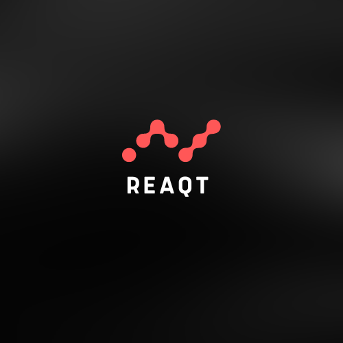
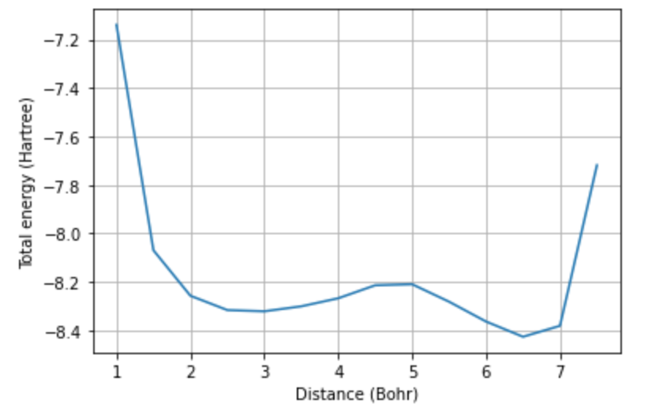
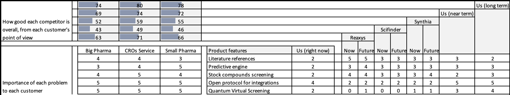

## REAQT

## Explain the technical problem you solved in this exercise

We determine the activation energy barriers and reaction rates of simple chemical reactions by solving for the reactants' PES (potential energy surface). To solve for the PES, we use VQE to determine the collective ground state of the reactants at different atomic distances. In our example problem, we solve for the PES of hydrogen exchange between Lithium and Hydrogen. This determines the activation energy needed for the H atom in LiH to disassociate from the molecule and bond with another H atom, as such:

$$ LiH + H \longrightarrow Li + H^{2} $$

Below is a diagram of potential energy surface of the hydrogen exchange reaction. The two minima in the curve represent the energy of the reactants (LiH and H) and products (Li and H^2). The transition state is represented by the local maximum. These are the configurations illustrated in the animation above.

## Explain or provide examples of the types of real-world problems this solution can solve
Drug discovery services market is projected to reach USD 31.4 billion by 2026 from USD 16.1 billion in 2021, at a CAGR of 14.3% during the forecast period of 2021 to 2026. This growth is largely driven by improvements in deep learning models, such as DeepMind's FermiNet, that can predict the electronic structure of molecules. Although quantum computing will improve our ability to generate new candidate materials and drugs, this is currently not the biggest pain point within the industry. We have many promising candidates already-- the difficulty is figuring out how to synthesize them in the lab so that we can test whether they behave as expected. 

Retrosynthesis is the process of determining which series of transformations need be applied to off-the-shelf reactants to form a desired candidate molecule. Current state-of-the-art deep learning models predict the [top 50 reaction paths with a probability of 75%](https://www.nature.com/articles/nature25978). Attempting each synthesis route currently costs around $1000 in labor and resource costs. The guessing game of retrosynthesis can quickly lead to bills in the tens of thousands of dollars, for molecules as simple as derivatives of glycine (i.e. NH2–CF2–CO2H, which has, until the use of quantum simulation, resisted synthesis). This is where we at Reaqt come in.

Reacqt's quantum-informed AI performs the retrosynthesis route screening process and then simulates the most promising routes on a quantum computer (by determining the PES of the reaction as stated above). These high accuracy simulations allow us to eliminate most of the faulty route suggestions that would have made it to the lab. Only the top few candidates are tested in the lab, mitigating costs. The outcomes of these experiments are used as additional training data for the candidate-screening neural net. Our screening neural net also benefits from using Quantum Monte Carlo Search to identify more promising paths more quickly. Below is a diagram illustrating how Reaqt works.

 
# Competitors 

We expect our system to outperform competitor AI models (typically graph or seq-2-seq neural networks) as quantum hardware scales. Below is a competitors analysis chart of how we rate our near and long term competitiveness.

[Reaxys Predictive Retrosynthesis](https://www.elsevier.com/solutions/reaxys/predictive-retrosynthesis) 

[SciFinder](https://www.cas.org/solutions/cas-scifinder-discovery-platform/cas-scifinder/retrosynthesis-planning) 

[Synthia](https://www.sigmaaldrich.com/UA/en/services/software-and-digital-platforms/synthia-retrosynthesis-software) 

[IBM RXN](https://rxn.res.ibm.com/) 

# Competitors analysis

The above competitors matrix showcases that focusing on Quantum-Engine and cross-platform integrations could be benefitial to win CROs customer segment in a near-term and further expand to other customers segment as a long-term strategy.

## Identify at least one potential customer for this solution - ie: a business who has this problem and would consider paying to have this problem solved

Pharmaceutical & biotechnology companies, CROs, and research centers and academic & government institutes. Pharmaceutical & biotechnology companies are the largest end user of this market.

* [Bienta](https://bienta.net/)
* [Enamine](https://enamine.net/services/biology-services)
* [Life Chemicals](https://lifechemicals.com/) 
* [Comgenex](https://www.rdchemicals.com/targeted-compound-libraries/comgenex.html)
* [Exscienta](https://www.exscientia.ai/)

## Prepare a 90 second video explaining the value proposition of your innovation to this potential customer in non-technical language

[Check out Reaqt](https://drive.google.com/drive/folders/1bCvCgwjpHO-ZL-JmLLNoXr04_PGx3zbJ?usp=sharing)
