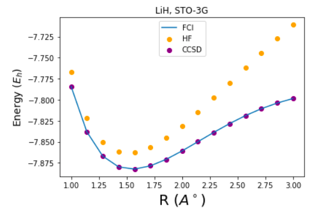
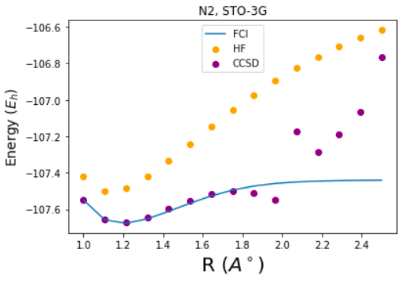
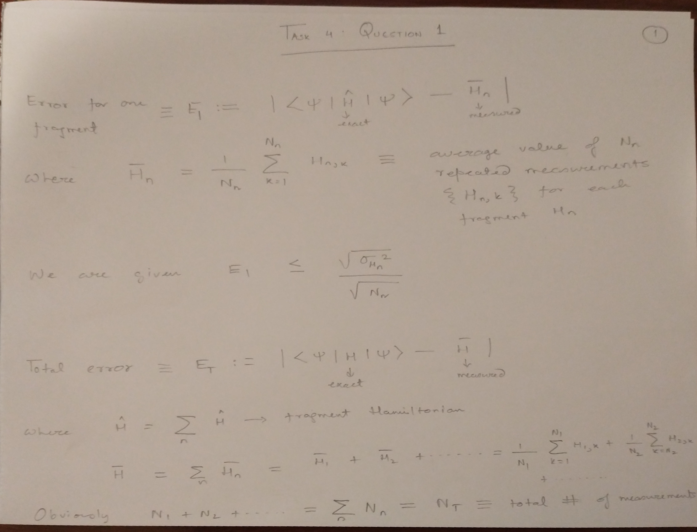
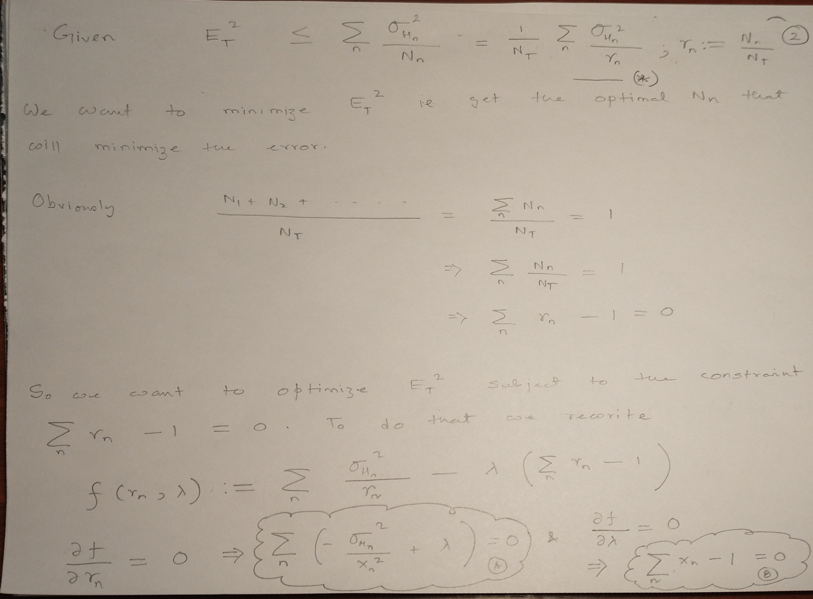
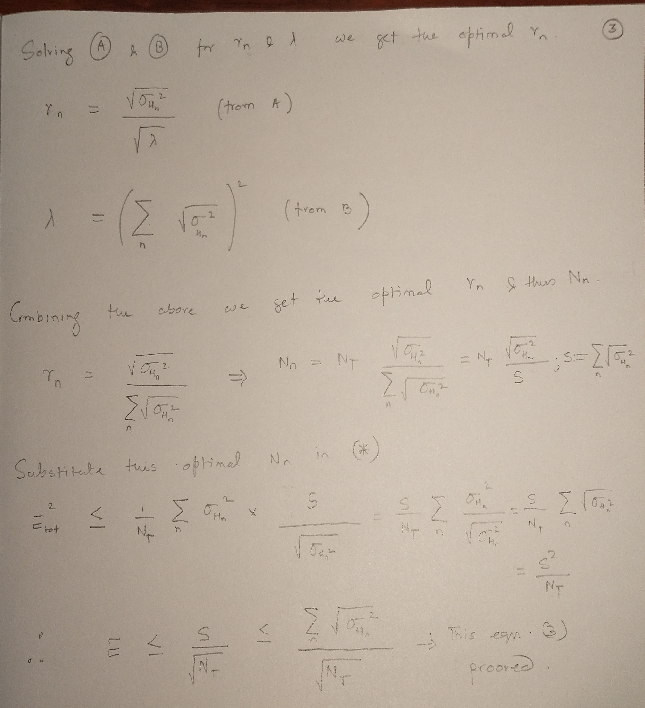
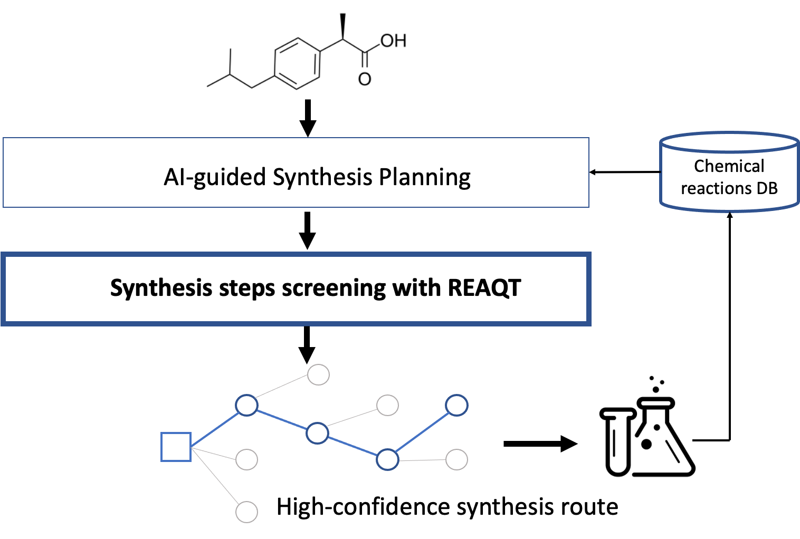
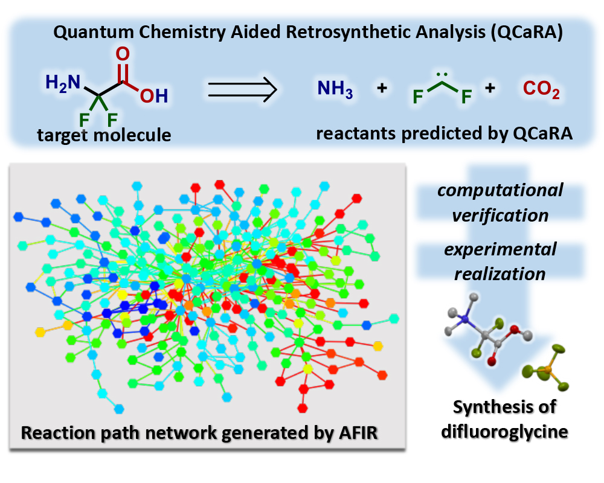

## Project 2: VQE: Constructing potential energy surfaces for small molecules

Team 1: Sultana Hadi, Richard Givhan, Mykola Maksymenko, Sourav Sen Choudhury, Gopal Mahadevan

In this projectwe explore the potential of gate-based NISQ quantum computers for solving electronic structure problems. As a reference system we focused on LiH.

To this end, we 

* 1. experimented with classical methods in [Notebook 1](S1_Classical_Methods.ipynb) and expored how these methods behave in the presence of strong correlations in N_2.
* 2. generated the qubit Hamiltonian for LiH in [Notebook 2](S2_Hamiltonian_Gen.ipynb)
* 3. Prepared the VQE algorithm and run it on a quantum simulator and hardware backend [VQE Notebook in Qiskit](VQE_LiH_Qiskit.ipynb) and [VQE Notebook in Pennylane](LiH_energy_surface.ipynb)

Our Business application is focused on **enhancing retrosynthesis analysis with Quantum Computing**. Here [we prepare a PoC](LiHH_hydrogen_exchange.ipynb) based on Hydrogen exchange reaction for LiH and H2. This demo highlihts energy surface and reactivity calculations for such reaction.

Below we provide details on each of the steps and answer task related questions.

## STEP 1: Generating PES using classical methods

In this task we constructed Potential Energy Surfaces (PES) for a LiH and N2 molecules. Here we focused on CCSD, HF and FCI simulations and minimal basis (STO-3G). 

| LiH PES | N2 PES |
| :---: | :---: |
|  |  |

### Answer to Question 1 of STEP #1 :

The Hartree-Fock (HF), Configuration Interaction Singles and Doubles (CISD) and Full Configuration Interaction (FCI) are all variational methods. Only Coupled Cluster Singles and Doubles (CCSD) is a non variational perturbative technique.    

The advantage of the the variational method over perturbative techniques is that it is more robust in cases where it is difficult to identify the unperturbed Hamiltonian (i.e a Hamiltonian which may have a very small perturbation, but nevertheless we can still solve for the eigenstates of that Hamiltonian) .  

Non-variational techniques should be preferred over variational ones only if, 

1. It is easy to identify a solvable unperturbed Hamiltonian. 

2. The method is computationally simpler to implement. 

3. The method gives more accurate results. 

***

### Step 2: Generating the qubit Hamiltonian.

### Answer to Question 1 of STEP #2:

The function must enforce the fermionic anti-commutation relations i.e for $a_{k}$, $a^{\dagger}_{k}$ the function must apply a phase according to the even or odd parity of occupations of orbital states less than $k$. 

***Is there any other condition ? I can't think of one.***

### Answer to Question 2 of STEP #2:

The molecular Hamiltonian is real due to TRS, therefore,  all the cofficients of the Pauli strings/words in the qubit hamiltonian should be real numbers.

***

- Unitary transformations.
- Hamiltonian measurements.
- Use of quantum hardware.

### Step 3: Unitary Transformation
 
###  Question 1 of STEP 3: 
*Q: Standard Hamiltonian symmetries are i) number of electrons *N̂**e* = ∑*k**â**k*†*â**k*, ii) electron spin *Ŝ*2, iii) electron spin projection *Ŝ**z*, iv) time-reversal symmetry, and v) point-group symmetry for symmetric molecules. Which of these symmetries are conserved in a) UCC and b) QCC?*

### Answer to Question 1.a.UCC  of STEP 3: 

*By construction, UCC preserve the number of electrons *N̂**e*, electron spin projection *Ŝ**z* symmetries.* The construction of the  UCC that preserve *N̂**e* and *Ŝ**z* symmetries is straightforward. In principle one can build a UCC that  also prserve
 electron spin *Ŝ*2, but that is costly interms of gate. The more symmteries we want to preserve, the higher gate cost we pay. 
 
 ### Answer to Question 1.b.QCC of STEP 3: 
 QCC can break the  number of electrons *N̂**e*, electron spin projection *Ŝ**z*, and electron spin *Ŝ*2 symmetries. QCC is more economic, but it comes with a cost of symmetry breaking, and one has to come up with ways to ensure conservation of the important symmetries.
 
 ###  Question 2 of STEP 3:
 *Why symmetries are helpful for constructing a unitary operator which rotates the initial state |*0*⟩ to the eigenstate |*ψ̂*⟩?*
 ### Answer to Question 2 of STEP 3: 
 
The Hilbert space is exponentially large. By using symmetry constraint, we are working in a smaller subspace, and symmetries project us to the right subsface without seraching the exponentially large hilbert space.

###  Question 3 of STEP 3: : What are the ways to restore symmetries if your unitary transformation break them?

 ### Answer to Question 3 of STEP 3:  There are two ways to incorporate the symmetry. 
 One is to put the symmtery constraint when we are computing the expecation value of the Hamiltonian. For example, if we want to preserve a symmetry $\hat{Q}$ , then we have 

 $$F[\psi] = \langle \psi| \hat{H} - \mu (\hat{Q}-Q)^2|\psi\rangle.$$
 
  Second is to project the Hamiltonian into a subspace of the symmetry we want preserve.  For example, we want $\hat{Q}$ symmtery, we have a projection operation $\hat{P_Q}$ for a symmetry $\hat{Q}$

 $$F[\psi] = \langle \psi| \hat{P_Q}\hat{H}\hat{P_Q}|\psi\rangle.$$
 
 
The Hilbert space is exponentially large. By using symmetry constraint, we are working in a smaller subspace, and symmetries project us to the right subsface without seraching the exponentially large hilbert space.

## Step 4. Hamiltonian measurements

Below we provide handwritten notes on Question 1 on the number of measurements needed for target error. 

## Business Application. REAQT - Quantum-enhanced Synthesis Planning

We aim to apply VQE to enhance retrosynthesis analysis workflows. In drug discovery and chemistry industry it is important not only to propose an interesting candidate molecule, but also to inspect its potential to be synthesised. A number of software tools help finding the reaction pathway based on the large knowledge bases of documented reactions. However, many AI-proposed novel reactions pathways often have low confidence rate and may lead to a number of failed experiments in the lab. Here the careful quantum chemistry calculations would allow to assess variety of discovered reaction pathways and increase the success of experiments in the lab, while dramatically reducing time and material costs.

We base our technology hypothesis on a number of recent papers that assess chemical reactions success and rates with the helps of accurate quantum chemistry calculations. In a recent paper by [Mita et.al](https://pubs.rsc.org/en/content/articlelanding/2020/SC/D0SC02089C) this thinking was applied directly to retrosynthesis problem for the classical case and demonstrated on small molecules example. See image below 

Moving to VQE opens up potential to scale up future solutions once the large and robust enough quantum computers will be available on the market. To this end, we evaluate the chemical reactions simulations on the PoC example of [LiH and H2 hydrogen exchange](BusinessApplication_PoC.ipynb).

For more details refer to the [Business Application found here](./Business_Application.md)
