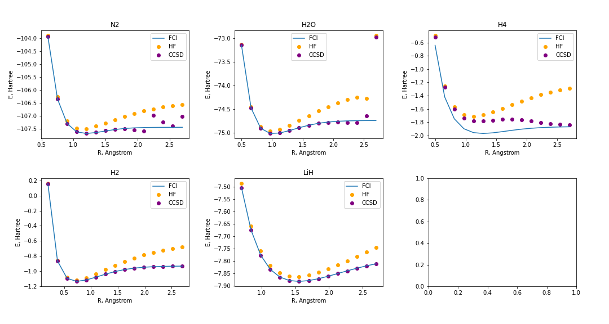
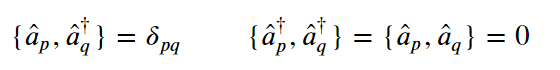
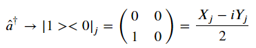
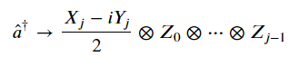
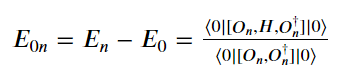

Team 8 - Week 2 :  Ezad Shojaee, Jordan Smith, Ken Sharman, Madhava Syamlal, Amogh Apsingekar

## Project 2: VQE: Constructing potential energy surfaces for small molecules

This project will guide you through the state-of-the-art techniques for solving electronic structure problems on NISQ computers.

## Step 1: Generating PES using classical methods

Our task is to investigate the ground-state problem which is to determine the ground-state wavefunction and energy associated with a system of interest. We start by discussing several classical computational methods of determining the electronic ground-state structure. 

#### Variational approaches:

The variational approach in quantum mechanics is a method of approximating the ground-state wavefunction. An initial guess is made for the wavefunction which depends on several parameters. The expectation value of the energy is calculated using this trial wavefunction, and the parameters are varied such that the energy is minimized. The result corresponds to the ground-state wavefunction and the associated energy represents an upper bound to the ground state energy.

Here, we consider the performance of two variational methods: The Hartree-Fock (HF) method and the Configuration interaction (CI) method. In the HF method, the wavefunction used is assumed to the product of single-electron wavefunctions and is subject to the antisymmetric requirement [1]. The many-body problem is simplified by considering each electron to move in an effective potential which represents the average density of all the other electrons. A strength of the HF method can be seen in the simplicity of the theory, however, the simplification also leads to low accuracy of the ground-state energy because electron correlation is not included. CI methods aim to overcome this issue by considering multiple orbital configurations of the electrons, whereas the HF method only considers a single configuration. In this way, spatial correlations of the electrons are included and the resulting energies are more accurate. While CI methods are generally more accurate than the HF method, a downside is that commonly used approximate CI methods do not necessarily scale correctly with the number of electrons in the system. To be specific, the energy should be linearly proptional to the number of electrons in the system, however, CI methods do not guarantee that this relationship will hold.

#### Non-variational approach:

An non-variational approach, known as the Coupled Cluster (CC) method, guarantees the correct scaling of the system with the number of electrons. The CC method considers multiple electron configurations and is developped using perturbation theory. A significant disadvantage associated with the CC method is that the calculated energy does not provide an upper-bound for the exact energy.

#### Comparing the variational and non-variational approaches:

To see these methods in practice, we analyzed the following set of molecules: H$_2$, LiH, H$_4$, H$_2$O, and N$_2$. Please see [Task 1 Notebook](./Compiled_Notebooks/S1_Classical_Methods.ipynb) for calculation details.

We investigated the energy of each molecule as a function of the bond length using the HF method, the Coupled Cluster Singles and Doubles (CCSD), and the exact answer within the chosen basis Full Configuration Interaction (FCI). Please see the S1_Classical_Methods notebook for our calculation details. The results of our calculations are as follows.

The above plots show that for every molecule, the exact energy is lower than the energy calculated using the HF method. This was expected since variational methods such as the HF method provide an upper bound for the exact energy. We also see that the CCSD energy can be lower than the exact energy, which is consistent with our understanding that the CCSD does not provide an upper-bound.

Another observation is that for all molecules, there are significant discrepancies between the approximate and exact energies- particularly in the region where the bond is longer than the equilibrium length. We can see that the energy of the weakly correlated molecules on the bottom row (H$_2$ and LiH) are better behaved than the energies associated with the highly correlated molecules on the top row (H$_2$O, N$_2$ and H$_4$). In particular, the relationship between the CCSD energy and bond length exhibit unexpected behaviours for the N$_2$ and H$_2$ molecules.

Depending on what properties are to be calculated, the runtime and accuracy of the calculation are both factors which dictate the ideal method to be used. The exact solution scales exponentially with the size of the system, and approximate methods scale polynomially with the size. None of the methods are ideal solutions to the ground-state problem for every application. We now turn to the quantum world to see if we can overcome some of these limitations.

## Step 2: Generating the qubit Hamiltonian

To proceed to VQE one needs to generate the qubit Hamiltonian, the easiest path is via first generating the electronic Hamiltonian in the second quantized form and then transform it into the qubit form using one of the fermion-to-qubit transformation: Jordan-Wigner or Bravyi-Kitaev.  Next, some qubit operators can be substituted by number ($\pm 1$) because their states are stationary for the specific electronic state (e.g., ground state). This reduction is very useful for fitting larger problem in a fewer qubit description and is based on Hamiltonian symmetries.

Please see [Task 2 Notebook](./Compiled_Notebooks/S2_Hamiltonian_gen.ipynb) for calculation details. The notebook demonstrates the Hamiltonian generation for h2 considering the equilibrium bond length of $0.74\overset{\circ}{A}$. The fermionic Hamiltonian is mapped to the qubit (spin) Hamiltonian using the Jordan-Wigner transformation. The ground state energy of the fermionic Hamiltonian (-1.12 E$_h$) is compared to that of the qubit Hamiltonian (-1.14 E$_h$), and also the energy of a smaller Hamiltonian generated by the qubit-tapering technique (-1.10 E$_h$). All three values agree with one-another to an accuracy of 0.1 eV.

#### 2.1 What are the requirements for a function of qubit operators to be a valid mapping for the fermionic operators?

First, recall that fermionic creation/annihilation operators in the second quantization formalism are required to obey the anti-commutation relations:

To run our quantum algorithm, we first must transform the Hamiltonian, which is originally expressed in second quantization, as a linear combination of the Pauli operators. In order for the mapping transformation to be valid, we must ensure that it preserves the anti-commutation of the fermionic operators [2]. This is not a given, as Pauli operators do not naturally obey the anti-commutation relations.

To illustrate the transformation, we consider the Jordan-Wigner transformation. Let $| 0 \rangle_j$ ($| 1 \rangle_j$) denote the unoccupied (occupied) state of the $j$-th spin orbital. For a single operator, the creation operators could be expressed as:

The problem with this transformation is that the Pauli operators do not satisfy the anti-commutation relation.

There is an easy and intuitive way to change the transformation so that the anti-commutation relation is enforced. We apply Z gates to each qubit from $0$ to $j-1$.

One can easily verify that the anti-commutation relation is now enforced.

#### 2.2 The electronic Hamiltonian is real (due to time-reversal symmetry), what consequences does that have on the terms in the qubit Hamiltonian after the Jordan-Wigner transformation?

Time reversal ensures that the fermionic Hamiltonian is real and symmetric. By implication, the Jordan-Wigner transformed qubit Hamiltonian must also be real. If the mapping is performed such that the resulting operators are expressed as products of the Pauli matrices [3] then the assertion that the Hamiltonian be real implies that operators composed of an even number of Y gates are not included. This reduces the set of possible operators, reducing the depth of the circuit.

## Step 3: Unitary transformations

Please see [Tasks 3,4,5, challenge 1 Notebook](./Compiled_Notebooks/Task3,4,5,Challenge1.ipynb) for calculations details associated with task 3,4,5, and challenge 1.

In VQE, the final energy will crucially depend on the ansatz/form of the parameterized unitary employed in state preparation. The goal here is to try two methods: Unitary Coupled Cluster including
Single and Double excitations (UCCSD) and Qubit Coupled Cluster (QCC) methods
and benchmark them for energy calculations of small molecules.

#### UCCSD

In the Coupled cluster method one introduces electronic correlation to the initial guess wavefunction (usually HF) 
by operating with the exponential of the sum of low order excitation operators. In UCCSD in particular we just include single and double excitations. Remember HF state is the antisymmetrization of the case where all electrons occupy the low-energy eigenstates of single particle system. The exponentiation of Single and Double excitation operators is $e^{(T_{1} + T_{2})}$ where $T_{1}$ annihilates electron in an occupied state and creats one in an excited one (again, states here are all the eigenstates of single electron system i.e. non-interacting)
$T_{2}$ does the same on two electrons.

This ansatz is referred to as CCSD and can be efficiently solved a system of equations to obtain the optimized CCSD
amplitudes. NOTE: CCSD can violate the variational principle and give energies lower than the ground state!

Note that exponentiation of $T_{1} + T_{2}$ can not trivially be decomposed in terms of gates native to our hardware, So, we do Trotterization; In this example we take the number of steps to be 1.

We want to do the following optimization

$E_{min} = min_{\theta} \langle HF | U^{\dagger} (\theta) H U(\theta) | HF \rangle$ where H is fixed given by

the atomic structure and $U(\theta)$ is the ansatz parametrized by $\theta$. 

#### QCC

QCC makes no direct reference to fermionic algebra and constructs an efficient ansatz directly in qubit-space by finding multi-qubit Pauli strings (entanglers) with lower energy. This is done through an energy-lowering heuristic employing the energy gradient (methods like BFGS) with respect to a Pauli strings variational amplitude. 
As opposed to UCCSD, the circuit depth and number of parameter is chosen to meet hardware limitations,
i.e. one must choose how many exponentiated Pauli strings will be entering the QCC ansatz.

The VQE optimization for the QCC ansatz is of the form 

$E_{min} = min_{\Omega, t} \langle \Omega | U^{\dagger} (t) H U(t) | \Omega \rangle$

where $\Omega$ is the collective Euler angles parameterizing single-qubit rotations on all qubits, 
and t are entangler amplitudes. For H2, QCC energy converged to the FCI energy with only a single entangler!

## Step 4: Measurement Grouping on H2 molecule

Please see [Tasks 3,4,5, challenge 1 Notebook](./Compiled_Notebooks/Task3,4,5,Challenge1.ipynb) for calculations details associated with task 3,4,5, and challenge 1.

In VQE, the task is to minimize $\langle \Psi(\theta) | H | \Psi(\theta) \rangle$ where $\Psi(\theta)$ is prepared by applying a parametrized Unitary $U(\theta)$ on the fiducial state (easy to prepare in the lab, e.g. all $| 0  \rangle$).
To calculate the expectation value we have to "measure" in the basis of H for each $\Psi(\theta)$, many times. What does this entail, exactly? We have to know the eigenbasis of H to measure in that basis. For very small molecules one can obtain that basis, but very soon it becomes intractable. 

The way to get around this, is to group the terms in Hamiltonian (which now are all products of Pauli's on different qubits) into subgroups with commuting terms. Then, because all of these terms share the same eigenbasis, one can measure in that basis and evalute the outcome of all of those. 

REMEMBER: measurement is destructive, therefore, measuring in each basis ruins the state; So, the less bases we have to measure, the less preparation is needed.

Finding the minimum number of subgroups with commuting elements is a problem in Graph Theory called "Minimum Clique Cover Problem" which itself is NP-hard but there are polynomial-time algorithms for finding its approximate solutions which are not guaranteed to find the optimum solution, and scale quadratically with the number of nodes in the graph/terms in the Hamiltonian. 

Having the subgroups, we need to rotate the state (in preparation step) to prepare the observable suitable for measurement. Then the expectation values can be evaluated knowing that the eigenvalues of Pauli products are easily obtained.

So, the flowchart is:
   (1) find the minimum subgroups of the Hamiltonian (sum of products of Pauli's) each contain commuting terms.
   (2) find the eigenbasis per each subgroup and measure in that basis, meaning prepare the eigenbasis by the suitable unitary.  
   (3) for each initial state in the ansatz (each U($\theta$)) measure many times after preparing each one of the shared eigenbasis obtained above.
   (4) analyze data to estimate $\langle \Psi(\theta) | H | \Psi(\theta) \rangle$.
   
Please refer to Ref. [4] for a tutorial on measurement optimization.

## Step 5: Quantum Circuits

Please see [Tasks 3,4,5, challenge 1 Notebook](./Compiled_Notebooks/Task3,4,5,Challenge1.ipynb) for calculations details associated with task 3,4,5, and challenge 1.

Quantum computers can use a specific set of gates known as universal gate set. Given the entanglers and their amplitudes found in Step 3, we can find corresponding representation of these operators in terms of elementary gates using the following procedure.

We ran the H$_2$ molecule calculation on the IBM manila machine. The job summary is as follows:

## Challenge 1: Excited states

We're going to review the method called EOM (Equation of Motion) [4]. 

1- Define excitation operator i.e. jump from ground state $| 0 \rangle$ to $| n \rangle$ being the $n^{th}$ excited state
$O^{\dagger}_{n} = |n><0|$

2- Find the approximate solution of the following

where $E_{n}$ and $E_{0}$ are the $n^{th}$ excited state and ground state energies, respectively, and $[ A,B,C ] = \frac{1}{2} ([[A,B],C] + [A,[B,C]])$. Notice the knowledge of the ground state (evaluated by any method such as UCCSD or QCC discussed before is enough)

To do such, one expresses $O_{n}^{\dagger}$ as linear combination of basis excitation operators with variable expansion coefficients. The excitation energies are then obtained through the minimization of the above equation in the coefficient space. Usually one does this in the basis of Fermionic orbital creation and annihilation operators. Define single and double excitation operators (like the ones in UCCSD), expand $O_{n}^{\dagger}$ in terms of them and put it in Equation in part (2) (of the Challenge 1, here) to derive a parametric equation for the excitation energies. Apply the variational principle to get a "secular set of equations". Quantum advantage is achieved by the efficient measurement of each single matrix element of this EOM generalized eigenvalue problem. Classically the scaling depends on the wave-function ansatz, but more importantly, the measurement of the expectation values in a quantum computer scales with the number of terms in the Hamiltonian as $\mathcal{O}(N^{4})$!!

The Quantum Algorithm goes as this:
First, Jordan-Wigner transformation is used to map the operators originally expressed in terms of Fermionic creation/annihilatio operators onto the qubits space. Then evaluated using the ground-state wave function prepared in the quantum hardware from, before, e.g. through a VQE calculation, to compute the needed matrix elements of the secular set of equations mentioned above. From these measurements the secular equation is constructed and its 2n eigenvalues are classically solved to obtain the first n excitation energies.

## Business Application

Please see the [Business_Application.md](./Business_Application.md) file for our business application.

## References

[1] Hoggan, Philip E. Novel Electronic Structure Theory: General Innovations and Strongly Correlated Systems. Academic Press, 2018.

[2] Tilly, Jules, et al. "The variational quantum eigensolver: a review of methods and best practices." arXiv preprint arXiv:2111.05176 (2021).

[3] Tang, Ho Lun, et al. "qubit-adapt-vqe: An adaptive algorithm for constructing hardware-efficient ansätze on a quantum processor." PRX Quantum 2.2 (2021): 020310.

[4] [Pennylane.ai measurement optimization](https://pennylane.ai/qml/demos/tutorial_measurement_optimize.html#grouping-qwc-terms)

[5] Ollitrault, Pauline J., et al.,  "Quantum equation of motion for computing molecular excitation energies on a noisy quantum processor", PHYSICAL REVIEW RESEARCH 2, 043140 (2020).
