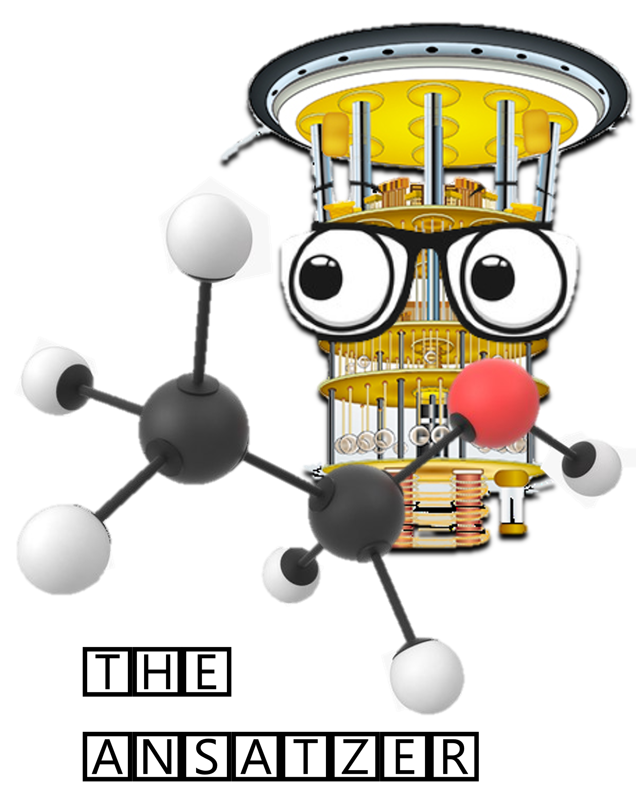
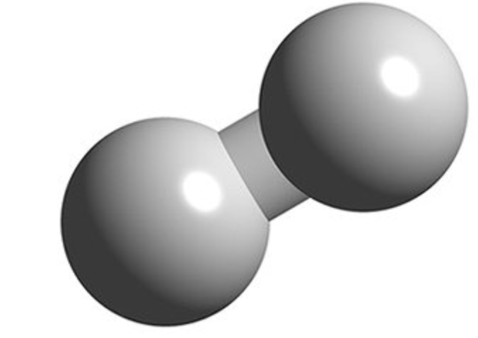
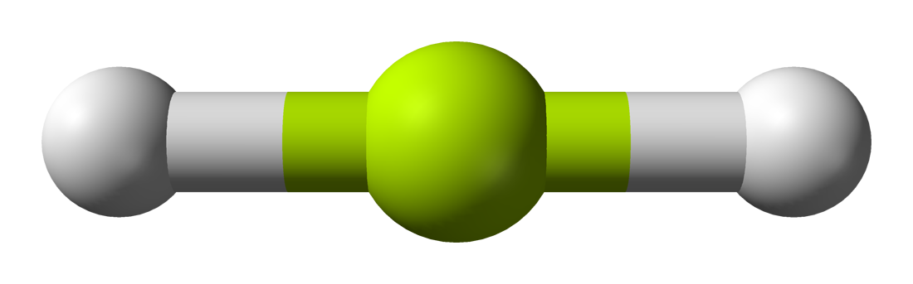
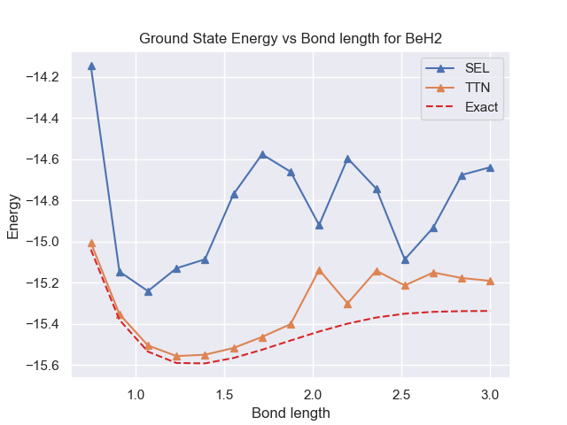

## Project 2: VQE: Constructing potential energy surfaces for small molecules

This project will guide you through the state-of-the-art techniques for solving electronic structure problems on NISQ computers.

Open up [instructions.pdf](./Instructions.pdf) to begin learning about your tasks for this week!

**Please edit this markdown file directly with links to your completed tasks and challenges.**

## Tasks include:

### Generating PES using classical methods.

**1) Among classical methods, there are techniques based on the variational approach and those that are not. Identify variational methods among those that were used and explain advantages of the variational approach. Are there any arguments for using non-variational techniques?**

Notebook with the resutls about $H_{2}$, $H_{2} O$, $H_4$ and $N_2$ you can find in this [notebook]((./S1_Classical_Methods.ipynb)) 

For this work, the methods and proposals offered in resources [1](https://www.youtube.com/user/AAA22254/videos); the techniques were presented : 

- [The Hartree-Fock](https://en.wikipedia.org/wiki/Hartree%E2%80%93Fock_method) (HF), 
- [Configuration Interaction Singles and Doubles](https://en.wikipedia.org/wiki/Configuration_interaction) (CISD) 
- [Full Configuration Interaction](https://en.wikipedia.org/wiki/Configuration_interaction) (FCI) 
- [Coupled Cluster Singles and Doubles](https://en.wikipedia.org/wiki/Coupled_cluster) (CCSD) 

of these from the state of the art we can conclude that  

|Variational Method      | No Variational Method| 
|----------------------- | -------------------- | 
| Hartree-Fock           | CCSD                 | 
| CISD			         | 				        | 
| FCI                    | 				        | 

CISD and FCI are "post-Hartree–Fock linear variational method for solving the nonrelativistic Schrödinger equation within the Born–Oppenheimer approximation for a quantum chemical multi-electron system".

### Generating the qubit Hamiltonian.

**1) What are the requirements for a function of qubit operators to be a valid mapping for the fermionic operators?**

Following the ref [Lecture 3: Fermion-qubit mappings](https://www.youtube.com/watch?v=W8SW3qp3RzY), they explain that

Electronic structure problem needs to be translated to qubits, this requires to transfer both wavefunction and operators (Hamiltonian).

$$
\hat{H}_{e}(R)|\Phi_{j}(R)\rangle=E_{j}(R)|\Phi_{j}(R)\rangle \\
\hat{H}_{e}=\sum_{p q} h_{p q} \hat{a}_{p}^{\dagger} \hat{a}_{q}+\sum_{p q r s} g_{p q, r s} \hat{a}_{p}^{\dagger} \hat{a}_{q}^{\dagger} \hat{a}_{r} \hat{a}_{s}
$$

Fermions:

$$
\{a_{i}^{\dagger}, a_{j}\} &=\delta_{i j} \quad\{a_{i}, a_{j}\}=\{a_{i}^{\dagger}, a_{j}^{\dagger}\}=0 
$$

$$
|\Phi_{j}(R)\rangle &=\sum_{\bar{n}} C_{\bar{n}, j}|n_{1}, n_{2}, \ldots n_{N_{o}}\rangle, n_{i}=\{0,1\}
$$

i.e., it must be fulfilled that the function is anticomponent with respect to the operators, since fermionic operators are anticomponent.

**2) The electronic Hamiltonian is real (due to time-reversal symmetry), what consequences does that have on the terms in the qubit Hamiltonian after the Jordan-Wigner transformation?**

When mapping the values in terms of fermions it is using the Pauli operators and these are connected to real scalar values.

### Unitary transformations.

**1) Standard Hamiltonian symmetries are i) number of electrons $N_e =  \sum_k  a_{k}^{\dagger} a_k$, ii) electron spin $S^2$, iii) electron spin projection $S_z$, iv) time-reversal symmetry, and v) point-group symmetry for symmetric molecules. Which of these symmetries are conserved in a) UCC and b) QCC ?**

both can in the case of UCC preserves particle number and Ŝz symmetry. In the case of QCC it has the ability to deromperate the particle number symmetry, Ŝ2 as well as Ŝz symmetries. in turn it can break the group symmetry of symmetric molecules.  Although it manages to be faster at the time of operation with this

**2) Why symmetries are helpful for constructing a unitary operator which rotates the initial state $|0\rangle$ to the eigenstate $|\Psi \rangle$?**

Working in a huge space such as the Hilbert space, by applying the symmetry as a consequence we can reduce the size of the problem and this translates as the reduction of operators. 

**3) What are the ways to restore symmetries if your unitary transformation break them?**

Exist to proposal
- One could be a contraint  in the format:
$$
F[\psi]=\left\langle\psi\left|\hat{H}-\lambda(\hat{S}-S)^{2}\right| \psi\right\rangle
$$

- The  second one is the idea to pass the problem i na subspace, with the equation
$$
F[\psi]=\frac{\left\langle\psi\left|\hat{P}^{\dagger} \hat{H} \hat{P}\right| \psi\right\rangle}{\left\langle\psi\left|\hat{P}^{\dagger} \hat{P}\right| \psi\right\rangle}
$$

## Further Challenges:

- How to obtain excited electronic states of the same or different symmetry?
- Partitioning in the fermionic operator space.
- Applying unitary transformations on the Hamiltonian.
- Compress larger basis sets into smaller number of qubits.

## The ansatzer - your ansatz distributor - Business Application

- Different techniques have been proposed for generating ansatz for finding ground states in VQE problems. Our method gives you the ansatz that best adapts to your specific problem. We have distributed ansatz for different molecules that improve performance in terms of convergence and required less number of parameters. We are specialized in big molecules using Tree Tensor Networks (TTN). Give us your molecule and we will tailor the best performance ansatz for it!

#### Business Model

We develop novel quantum/classic  algorithms and methods for the design and benchmarkings of differents  molecules on our hybrid computing powered platform.  We license our models  and methods, giving our clients the opportunity to assure them that when using our tool according to their problem we can find the best combination of finding the answer and in the shortest possible time.

### Our Solution for different molecules 

In this section, we show the solution of VQE with our special ansatz for two different cases H2 and BeH2. The TTN is compared against a strongly correlating layer ansatz STL. Here, it can be seen that our model improves the results for the STL ansatz. 

| **H2**| **BeH2**    |
| ------------ | ------------------------ |
|  |  |
|  |  |

### Potential Customers

BASF SE is a German multinational chemical company and the largest chemical producer in the world. For this chemical company, quantum-computing will improve the modeling quantum-mechanical systems capabilities in molecules and polymers. Identifying the most effective molecular design or structures to achieve required effects—before synthesizing molecules in the lab.
