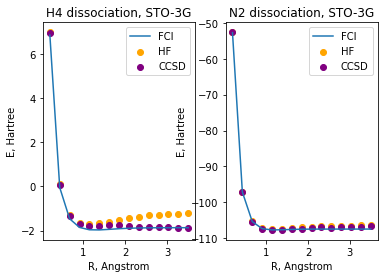

Team 12: Jitesh Lalwani, Babita Jajodia, Amit Patel, Buvan Prajwal A, Ehsan Barat 

## Project 2: VQE: Constructing potential energy surfaces for small molecules

Over the entire project, we have picked H4 to be our desired molecule for investigation as it had two bonds and that model could then be extrapolated to complex molecules.
### Task 1: Generating PES using classical methods
For first task we were assigned with Generating Potential Energy Surfaces (PES) calculations for minimal atomic basis, here we went with H4 and N2 molecules using FCI, HF, CISD, and CCSD. 

**1.  (a) Among classical methods, there are techniques based on the variational approach and those that are not. Identify variational methods among those that were used and explain advantages of the variational approach.**

| **Method** | **Identification** |
|------------|--------------------|
|     HF     |     Variational    |
|    CCSD    |   NOT Variational  |
|    CISD    |     Variational    |
|     FCI    |     Variational    |

**1. (b) Are there any arguments for using non-variational techniques?**
There are arguments for using non-variational techniques which have to do with them providing size-consistency as well as improving accuracy (at low/medium computational cost). Since there are different implementations for different techniques, they might have some reason for using them.

The scalability of post HF methods, is the main constriction to simulate larger molecules with high accuracy.

In the figure provided below, we present the pontential energy surfaces (PESs) for the dissociation of H4 and N2 molecules (in STO-3G) using the different classical methods. 

  

### Task 2: Generating the qubit Hamiltonian
Before we get started with VQE, we have to generate a qubit Hamiltonian, where the  eigenvalues in the effective Hamiltonian come out to be: 

     [-1.10115031  0.03904763]

**1. What are the requirements for a function of qubit operators to be a valid mapping for the
fermionic operators?**
The requirements to be valid mapping for fermionic (creation and annihilation) operators, function of operations on qubits should preserve the fermionic anti-commutation relations.

**2.  The electronic Hamiltonian is real (due to time-reversal symmetry), what consequences does that have on the terms in the qubit Hamiltonian after the Jordan-Wigner transformation?**

The simulator hamiltonian becomes a sum of pauli words which are One-body number operators, One-body excitation operators, Two-body number operators and Two-body excitation operators.

It can be shown then mathematically shown that coefficient of each pauli word in the qubit hamiltonian is real.

### Task 3: Unitary Transformations
In this task we will explore two approaches, the Unitary Coupled Clustered (UCC) approach and the Qubit Coupled Clustered (QCC) approach. We will look at how to generate unitary operations in the UCC and QCC schemes for model systems and to optimize their continous parameters (amplitudes).

### Task 4: Hamiltonian Measurements
We need to partition the Hamiltonian to a minimal number of group, whose elements can be all measured simultaneously as the entire Hamiltonian cannot be measured. Doing the partition which followed by measurement will help us obtain the expectation value of the qubit Hamiltonian. 

### Task 5: Use of Quantum Hardware
In order to run the Variational Quantum Eigensolver (VQE) algorithm on the actual quantum hardware, we need to present unitary transformations as a sequence of gates. Once we had represented it in terms of gate, we ran the circuit on actual quantum hardware (ibmq_manila) provided by IBM Quantum. 