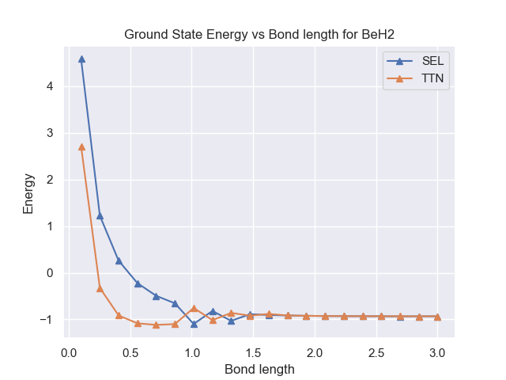

## Project 2: VQE: Constructing potential energy surfaces for small molecules

This project will guide you through the state-of-the-art techniques for solving electronic structure problems on NISQ computers.

Open up [instructions.pdf](./Instructions.pdf) to begin learning about your tasks for this week!

**Please edit this markdown file directly with links to your completed tasks and challenges.**

## Tasks include:

- Generating PES using classical methods.
- Generating the qubit Hamiltonian.
- Unitary transformations.
- Hamiltonian measurements.
- Use of quantum hardware.

## Further Challenges:

- How to obtain excited electronic states of the same or different symmetry?
- Partitioning in the fermionic operator space.
- Applying unitary transformations on the Hamiltonian.
- Compress larger basis sets into smaller number of qubits.

## The ansatzer - your ansatz distributor - Business Application

- Different techniques have been proposed for generating ansatz for finding ground states in VQE problems. Our method gives you the ansatz that best adapts to your specific problem. We have distributed ansatz for different molecules that improve performance in terms of convergence and required less number of parameters. We are specialized in big molecules using Tree Tensor Networks (TTN). Give us your molecule and we will tailor the best performance ansatz for it!

### Our Solution for different molecules 

In this section, we show the solution of VQE with our special ansatz for two different cases H2 and BeH2. The TTN is compared against a strongly correlating layer ansatz STL. Here, it can be seen that our model improves the results for the STL ansatz. 

| **H2**| **BeH2**    |
| ------------ | ------------------------ |
|  |  |
|  |  |

### Potential Customers

BASF SE is a German multinational chemical company and the largest chemical producer in the world. For this chemical company, quantum-computing will improve the modeling quantum-mechanical systems capabilities in molecules and polymers. Identifying the most effective molecular design or structures to achieve required effects—before synthesizing molecules in the lab.
