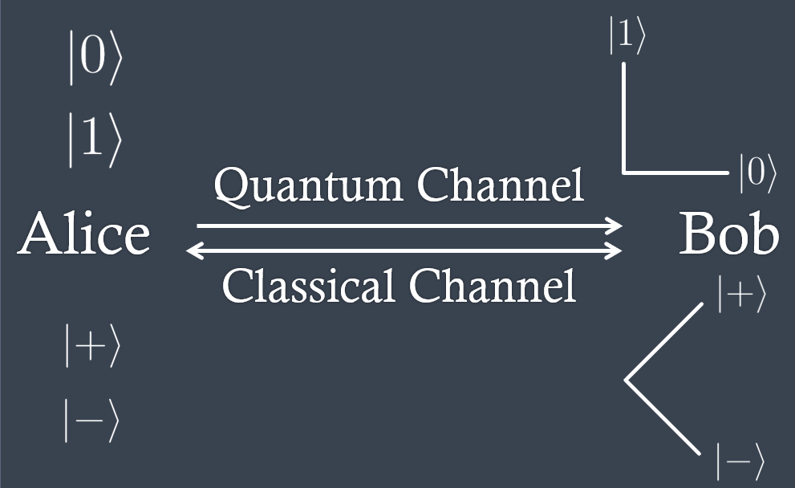

# Quantum Cohort Project Business Application

Company that helps your security and find the limits of classical computing

## How to be more secure?

Quantum computing is a support that manages to identify the limitations of quantum computing, as is the case of security in the RSA protocol, which is secure because of its exponential time complexity, $O(n^m)$, but in quantum computing there is already a proposal that can reduce its complexity known as Shor's algorithm.

Then, Quantum computing is bringing us closer and the possible methods as seen from Shor's algorithm makes us think what we can do to feel safe, we have an excellent proposal for your safety.

The most widely researched scheme is the $\mathrm{BB} 84$ protocol by Bennett and Brassard. It relies on some properties of quantum systems:
1. A qubit's state is not measureable unless the correct basis is used
2. A measurement in the wrong basis changes the state of the qubit
3. A qubit cannot be cloned unless its state is known

 Fig 1. How works BB84? 

Initial step, start to  generate a random list form 0 to 15.

The following products are available for this worrying position of security in sequrity:

1.- A tool that is about using the shor algorithm to be able to find the RSA vulnerability.

2.- The use in the companies of the BB84 protocol with two post-processing methods, one based on a previous decryption by means of the morse code and the second by the identification of the generation of the key from the BBBSS method.

## Why use those products?

It is known that quantum computing is coming and we are in this company to offer different proposals of Shor's algorithm where one can find with the least number of qubits possible an acceptable answer, as is the case of finding by a computer of 16 qubits the keys from the number 91. With our algorithm using a hybrid method we can support to find numbers with 6 digits by this proposal. For this service we can offer you with known classical methods a benchmarking of your security and evaluate possible vulnerabilities.

On the other hand, as there are companies like Cisco that are working on the creation of a quantum internet network, we offer protocols so that the delivery of information can be secure and the sending of the keys can be generated by using the BBSSS method.

## Competitors

These are companies that are designing security protocols and products:

- Pouli group
- QuNetSim

## Problem in the world

Because of the generation of multiple quantum computers and the knowledge that the use of using RSA for security is due to the fact that the current computers take many years to follow this process, but the technological advancement of quantum computers and where many mention that by the end of 2029 there will be quantum computers with millions of qubits and stable, is a problem for our security. Using the capabilities of these same computers and their benefits such as the non-cloning of information that can help us to detect when our information is vulnerable, the communication channel through the generation of protocols like ours decreases the probability of finding a failure following, being the success rate given by $(\frac{1}{2})^n$.

### Our product 

You can find 2 proposal of this in the following links:

- [product 1](./Challenge.ipynb),
- [product 2 version 1](./BB84.py),
- [product 2 version 2](./task_solution_4.ipynb)

## Potential customer 

As possible customers we consider telephone companies such as AT&T and entertainment platform companies such as Netflix, Amazon Prime, Disney +, HBO Max among others, as it is following the security trend where the accounts of its users can be shared among family and friends can be supported in these protocols to reduce the incidence of theft of passwords for such services,

## Presentation 

[Video of the presentation](https://drive.google.com/file/d/1FOh_QsKEUat25lQVEpN4Ykd452iau5Uz/view?usp=sharing)