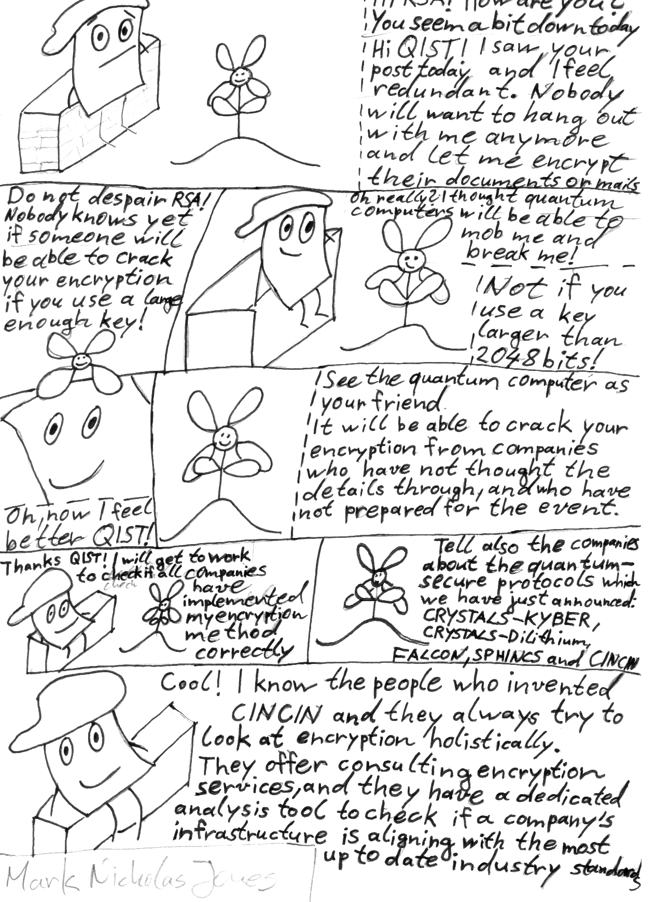

# Quantum Cohort Project Business Application

## Step 2: Explain or provide examples of the types of real-world problems this solution can solve

Cupboard provides quantum secure encryption and analysis tools to protect your valuable porcelain.

Our SaaS enterprise solutions allow you to implement the most cutting-edge cyber-security infrastructure to have the most efficient architecture for your business while being protected against malicious attacks.

Our tools combine articifial intelligence and quantum technologies to prepare you for the hybrid cloud and post-RSA era.

## Step 3: Identify at least one potential customer for this solution - ie: a business who has this problem and would consider paying to have this problem solved

Examples: 
- Federal Express
- Canada Post

## Step 4: Prepare a 90 second video explaining the value proposition of your innovation to this potential customer in non-technical language

Example: By travelling to all destinations via the shortest route, a courier can generate the same revenue that it would have generated following any other route, but will minimize travel costs (e.g., fuel costs). By minimizing travel costs, the courier will be more profitable than it would have been had it travelled through any other route.

**Please store your video externally to the repo, and provide a link e.g. to Google Drive**
