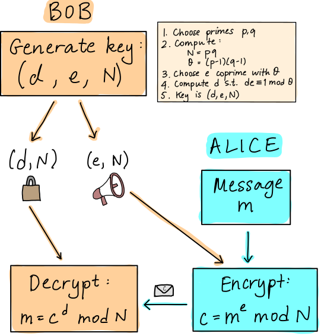

# Project 3: INSTRUCTIONS

On 5 July 2022 there was a [major press
release](https://www.nist.gov/news-events/news/2022/07/nist-announces-first-four-quantum-resistant-cryptographic-algorithms):
the National Institute of Standards and Technology (NIST) announced the first
set of tools that will become part of its post-quantum cryptographic
standard. This marks an important step towards the retooling of our digital
infrastructure to be secure against quantum computers.

You are most likely aware that a well-known (and potentially nefarious)
application of quantum computers is "breaking cryptography". While this is a
sweeping generalization, the situation is still dire: *Shor's algorithm* can be
used to determine the prime factors of numbers. More specifically, it contains a
subroutine, called *order finding*, for which there is a known quantum algorithm
that is exponentially faster than the best known classical algorithm. Some
widely-used cryptographic protocols, such as
[RSA](https://en.wikipedia.org/wiki/RSA_(cryptosystem)), are deemed secure based
on the assumption that factoring is computationally intractable. This will no
longer be the case if we can build a big enough quantum computer.

In this project you will explore the gate-model implementation of Shor's
algorithm and perform some experiments to investigate its scaling. In addition,
you will have the opportunity to explore two other quantum approaches to
factoring: a variational algorithm, and a method based on quantum annealing.

## Background: RSA

RSA is an asymmetric, or public-key cryptography protocol. It is
generally used for *key distribution*, i.e., to securely send 
keys that are used for other (symmetric, and generally faster) cryptographic protocols that
require two parties to have the same key. The RSA key (or *key pair*)
consists of two parts:

 - a publicly available part that people can use to send you
 encrypted messages,
 - a secret part, known only to you, that is used to decrypt those messages.
 
The key is designed in such a way that it is not tractable to determine
the private part of the key from the public one.

Suppose Alice would like to send a message to Bob. The RSA protocol looks
something like this:



There is some underlying number theory behind *why* this works. The details are
provided in [these slides](rsa_number_theory.pdf), if you are keen to explore
them.  The critical thing to note is that everything relies on the choice of two
prime numbers, $p$ and $q$, which are used to construct the value of the modulus $N$,
*which is part of the public key*. If we can factor $N$ and learn $p$ and $q$,
we can compute $\theta$, which, since we know $e$, allows us to recover
the private value $d$.

## Task 1: Privacy is key

Suppose you would like to send and receive messages using RSA. To start, you
generate the key $(d, e, N) = (169, 25, 299)$ and publish the public part, 
$(25, 299)$. Shortly after, you receive an encrypted message from a friend. Implement
two functions, `decrypt` and `encrypt`, according to the RSA protocol described
above, to decrypt your friend's message. 

Then, you can send them a response! Their public key is $(e, N) = (29, 91)$. 
Note that since this is a small case, you can determine by hand what their
private key is. In a real-world setting, $N$ is a very large number, e.g., 2048-
or 4096-bit.

The file `task_1.py` provides some starter Python code for you, but feel free to
translate this into any language. Within the file is also a description of how
the conversion of the message between text and integers works.

## Task 2: Everything is in order

Shor's algorithm can be used to determine the prime factors $p$ and $q$ of a
number $N$. While often described as a quantum algorithm, most of it is actually
classical. Only one part of it uses a quantum computer! However, that part is
very important, since it is the part that is classically hard.

The specific subroutine is called *order finding*. In regular modular arithmetic,
given a value $a$ and modulus $N$, the task is to find an $m$ such that 
$a^m = 1 \hbox{ mod} N$. This involves repeated multiplication of $a$ by itself, or *modular
exponentiation*. The quantum version looks similar. Suppose we have a unitary
operation $U_{Na}$ that acts as follows:

$$
U_{Na} \vert k \rangle = |a k \hbox{ mod} N \rangle.
$$

For the order $m$ such that $a^m = 1 \hbox{ mod} N$ it will also be the case that

$$
U_{Na}^m \vert k  \rangle = |a^m k \hbox{ mod} N \rangle = \vert k \rangle.
$$

For this task, research and implement the quantum algorithm for order finding. 
Then, apply it in the larger context of Shor's algorithm, starting
from the pseudocode below. Use you algorithm to factor the value $N = 91$ from
the previous task.


```
Shor's algorithm
================
Inputs: integer N with unique factorization N = pq
Outputs: p, q

p, q = 1, 1

while p * q is not N:
    choose value a in the range [2, ..., N - 2]
	
    if a and N are coprime:
        # we are lucky!
        p = a
        q = N / a

    else:
        use a quantum computer to find order m of U_Na
	    
        if m is odd:
            # invalid
            continue
			
        else:
            compute x = a ** (m / 2) mod N
		
            if x = 1 or -1 mod N:
                # invalid
                continue
            else:
                # valid!
                p = GCD(x - 1, N)
                q = GCD(x + 1, N)
```


## Task 3: Are we running Shor-t on time?

You will likely have noticed in Task 2 that Shor's algorithm is not guaranteed
to find a solution. In fact, there are few potential points of failure. How
often does your implementation succeed? How does this depend on the size of $N$?

Further to this point, now that you have an implementation, let's stress test
it. Use Shor's algorithm to factor a sequence of increasingly large $N$. How
large of a number can you reliably factor with your computer?  As you are
increasing $N$, take the opportunity to perform an analysis of:

 - Run time (wall time)
 - Number of qubits required
 - Number of quantum gates required

Present your results graphically and use this to infer the scaling of these
resources with the size of the problem instance.

After, consider the following: how does the size of your largest solved instance
compare with the size of RSA keys in use today? Can you estimate the quantum
resources that would be needed to factor numbers of this size, and when we might
have a device capable of doing so? Consider the qubit count and gate count in
your estimate. To take things further, you could even estimate a rough wall time
by looking at circuit depth, and gate operation speeds of present-day hardware.

## Task 4: Business applications

Even though organizations like NIST are establishing standards, it can
take years or decades for them to be widely adopted (case in point:
explore the history of the hash function
[SHA-1](https://en.wikipedia.org/wiki/SHA-1)). It is likely that much of our
data will still be vulnerable to quantum attack once large enough devices come online,
despite having quantum-resistant algorithms available.

To that end, your knowledge of Shor's algorithm is powerful, and with great
power comes great responsibility. It is important not only to understand, but
also to be able
to convey to others the risks of using vulnerable cryptographic protocols,
within both your own organization, and to organizations that you do business with.

Suppose that your team is part of a company that has developed a new
protocol which was selected by the (fictional) standards body QIST as one of its
options for quantum-resistant cryptography. Using any type media you wish,
design an advertisement for your product. Be creative! For example, you can
make

 - A flashy web page
 - A TV commercial or infomercial
 - A script of a conversation between your company and a potential client
 - A slide deck for a business pitch
 
The particulars of this fictional algorithm and how it works are not
important. Rather, we will be judging how your creation portrays the risks and
the benefits present in this situation.

### Once you are comfortable with the above tasks, you may turn to one or more of the below optional **Challenges** for any time remaining in your project. 

## Challenge 1:

Try running your implementation of Shor's algorithm on real quantum
hardware. How large of a number can you successfully (and reliably) factor?

## Challenge 2:

As you will have discovered in Task 3 (and Challenge 1), Shor's algorithm is not
going to be running at scale on NISQ devices any time soon. However, given that
NISQ devices are particularly suited to variational algorithms, researchers have
investigated whether factoring can be recast into this framework. For this
challenge, explore and implement [variational quantum
factoring](https://arxiv.org/abs/1808.08927). Compare its resource
usage and solution quality to that of your initial approach. How large of a
number can you successfully factor?

## Challenge 3:

Researchers have also explored how to factor using quantum annealers. Try
implementing the method described [in this
paper](https://www.nature.com/articles/s41598-018-36058-z). Again, compare its
resources and solution quality to your initial implementation, and that of
Challenge 2 if you completed it.


