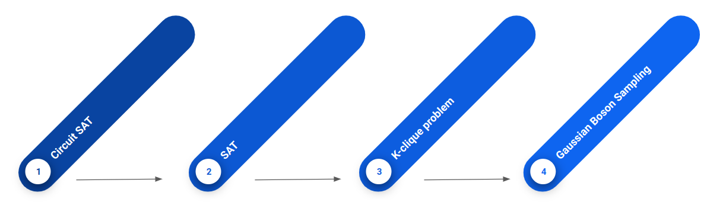
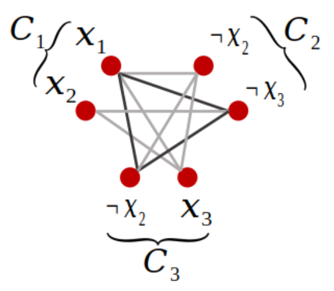

## Project 3: Shor's algorithm

This project will guide you through an exploration of the gate-model implmentation of Shor's algorithm and its scaling.

Open [INSTRUCTIONS.md](./INSTRUCTIONS.md) to begin learning about your project for this week!

**Please edit this markdown file directly with links to your completed tasks and challenges.**

## Tasks include:
* Encrypt and decrypt a message using RSA
* Research and implement the quantum algorithm for order finding
* Use Shor's algorithm to factor increasingly large sequences
* Discuss a new quantum-safe protocol as part of your Business Application

After you have completed your tasks, consider the optional Challenges below!

## Further Challenges:
* Try running your implementation of Shor's algorithm on any available quantum hardware
* Explore variational quantum factoring
* Attempt factoring using quantum annealers

What is common among these three challenges is that they all investigate how NISQ devices could be used to implement a quantum algorithm that could compete with the known classical algorithms for prime number factorization. We want to do something different: let's try to see how NISQ devices could *improve* the best classical algorithms. More specifically, we propose a novel method for speeding up the number field sieve method with gaussian boson sampling.

### The number field sieve

The number field sieve (NFS) [[1]](#1) is the best known classical method for factorizing integers. It was used in 2020 to factorize the 829-bit RSA-250 number [[2]](#2). The next number in the RSA catalog is RSA-260, which has 862 bits and has not been factored so far with any method.

A high level overview of the NFS algorithm is given here [[3]](#3):

Without having to understand all the mathematical details, it is clear that the main computational pressure is on the for loop from steps 6 to 10. The algorithm is attempting to search for a pair of integers $(a,b)$, such that the integers $a+bm$ and $g(a,b)$ are y-smooth. A y-smooth integer is one which is not divisible by any primes larger than $y$.

So how could a quantum computer make this algorithm faster? The best bet is to try and find a quantum algorithm to perform the search for smoothness. In recent research it has been shown, that if a quantum computer could achieve any asymptotic speedup in this task, then the overall algorithm would become faster [[4]](#4)

There have been proposals to do this by translating the smoothness search into a circuit satisfiability problem (CircuitSAT), which is a task to find a set of boolean variables that output "TRUE" when given as input into a boolean logic circuit (which in this case is specified by the number that we are trying to factorize) [[5]](#5). The authors of this approach also provide their code on Github, freely available under MIT licence [[6]](#6). We will use this translation to CircuitSAT as our starting point and develop a pipeline which enables us to solve a CircuitSAT problem with gaussian boson sampling.

### Gaussian Boson Sampling

Gaussian boson sampling (GBS) is a non-universal scheme for quantum computing [[7]](#7). A device which executes gaussian boson sampling is called a gaussian boson sampler, and it has very limited functionality. It cannot execute arbitrary quantum algorithms, in fact it cannot even execute a simple quantum circuit, because it is a quantum computer that has no qubits. Instead, it has modes of squeezed light and the only thing it can do with those modes is to send them through an interferometer and count the number of photons that arrive at the output.

schematic picture here

Two aspects make GBS particular interesting for near-term applications:

First, the physical setup only necessitates components which already exist today. Squeezed light can be generated with parametric downconversion. Interferometers can be built from a network of beam splitters and phase shifters, which are routinely manufactured for both free space optics and for integrated on-chip photonics. Finally, photons can be detected with commonly used threshold detectors, or more advanced number resolving technology such as transition edge sensors. All of this is in contrast to other attempts to perform quantum information processing with light, where NISQ devices are suffering from our limitations in building sources for single photons or for generating error-resistant photonic qubits such as GKP or optical cat qubits and from the inherent difficulties in applying multi-qubit gates between quantum states of light.

Second, it turns out that the task that GBS is preforming is difficult to simulate classically. Out of the four quantum advantage experiments that have been performed to date, two of them have used GBS.

Both of these factors make GBS a promising candidate for seeing some of the first examples of quantum advantage in real-world problems, but the major hurdle here is that the problem that GBS solves doesn't really appear anywhere in business or nature. Nonetheless, if we are creative, we can find a pathway between the calculation and an application.

### Solving a CircuitSAT with GBS

Here we will see that a CircuitSAT can be solved with GBS using the following pipeline:

First, Hamilton et al. [[7]](#7) showed that the probability distribution $p(\bar{n})$ in GBS can be used to calculate the Hafnian of a matrix $B_S$.

$$p(\bar{n})=|\sigma_Q|^{-1/2}|\text{Haf}(B_s)|^2$$

The matrix $B_S$, can be specified by choosing appropriate parameters for the squeezers, beam splitters, and phase shifters in the device. The precise values needed to implement a specific matrix can be derived using a combination of various matrix decompositions, which have also been implemented by Xanadu in an open-source package called StrawberryFields [[8]](#8)

If the matrix that we are investigating is an adjacency matrix of a graph, then the Hafnian of the matrix is equal to the number of perfect matchings in this graph [[9]](#9). For a given number of vertices, the graph which has the highest number of perfect matchings is a clique (a graph in which all vertices are connected to each other). When we perform GBS, we don't always detect photons on every output. We can actually regulate, by tuning the squeezing parameters, how many detections we would like to have on average. This means that we can take a graph, calculate its adjacency matrix, prepare the corresponding GBS experiment, and sample submatrices (which correspond to subgraphs). When we do this sampling, we detect a particular pattern of photons, each with a probability given by the equation above. With the highest probability, we will detect photons at the outputs which correspond to the submatrix with the highest hafnian, which in turn corresponds to the subgraph which is closest to being a clique. Therefore, we can use a GBS device to find cliques in graphs. This has been previously applied to an important problem in chemistry, namely molecular docking [[10]](#10) and Xanadu has a nice tutorial which explains all of this with a coded example [[11]](#11).

Now that we have established that a GBS device is able to find cliques in graphs, lets see how a CircuitSAT is equivalent to this problem. We know that this should in principle be possible if we recognize that both the CircuitSAT problem and k-Clique problem (to see if a graph contains a clique larger than k), are both NP-complete problems, which have been proven to be reducible to one another in polynomial time [[12]](#12). To do this, we take an intermediate step. First, we show that we can solve a boolean satisfiability problem (SAT) by identifying cliques in a graph. The process was essentially explained already by Karp in 1972 [[12]](#12) in almost a single sentence and there exist plenty of more detailed explanations as well, for example in Ref [[13]](#13). A short description of the procedure is the following:

In an SAT, you are given a set of $n$ boolean variables and a set of $m$ logical clauses using those variables or their negations. Each of those clauses evaluate to true if at least one of the variables or their negations in the clause are true. The task is to find out if there exist values for each boolean variable, such that all the logical clauses simultaneously evaluate to true. For every clause $C_m$, we create a vertex in the graph for every boolean variable in that clause. Then we connect all vertices, which do not belong to the same clause and also do not include opposite values for the same boolean variable. So what have we achieved? Well, we know that we have $m$ groups of vertices, which are not connected internally. Therefore, the biggest clique that could possibly exist in this graph is of size $m$. We also know that if each clause evaluates to true, then each of those groups must contain a boolean variable that has a value of true. Based on how we constructed the edges, we know that all of these vertices are connected to each other if and only if they have no contradictions. Therefore, the SAT problem is satisfiable if and only if there exists a clique of size $m$ in the graph that we have constructed! In conclusion, we can find the solution to an SAT problem by using a GBS device to search for cliques of size $m$.

Below is an example, where we can see that for the variables $x_1$, $x_2$ and $x_3$, the clauses $C_1$, $C_2$ and $C_3$ are mutually satisfiable due to the existence of a clique in the graph. Not only do we find out that there exists a solution, we can also read the solution from the graph: in this case, $x_1$ must be true, while $x_2$ and $x_3$ are false.

The last step is to show that a CircuitSAT problem can be formulated as a SAT problem. This step might not even be necessary from a mathematical point of view, because it seems to be implied from Ref [[4]](#4) that the smoothness problem can be directly expressed as a SAT. However, from a practical point of view, if we want to make use of the existing code that generates a CircuitSAT formulation for the smoothness search [[6]](#6), we ought to add this extra step. The reduction of a CircuitSAT to a SAT is not particularly complicated and can be found in chapter 3 of Ref [[14]](#14)

## Business Application
For each week, your team is asked to complete a Business Application. Questions you will be asked are:

* Explain to a layperson the technical problem you solved in this exercise.
* Explain or provide examples of the types of real-world problems this method can solve.
* Identify at least one potential customer for this solution - i.e. a business who has this problem and would consider paying to have this problem solved.
* Prepare a 90 second video explaining the value proposition of your innovation to this potential customer in non-technical language.

For more details refer to the [Business Application found here](./Business_Application.md)

## References
<a id="1">[1]</a>
Lenstra, A. K., Lenstra, H. W. Jr., Manasse, M. S. & Pollard, J. M. The number field sieve. In Proceedings of the twenty-second annual ACM symposium on Theory of computing, 564–572 (ACM, 1990).

<a id="2">[2]</a>
https://listserv.nodak.edu/cgi-bin/wa.exe?A2=NMBRTHRY;dc42ccd1.2002

<a id="3">[3]</a>
Bernstein, D. J., Biasse, J. & Mosca, M. A low-resource quantum factoring algorithm. In Post-Quantum Cryptography 330–346 (Springer, Cham, 2017).

<a id="4">[4]</a>
Mosca, M., Vensi Basso, J. M. & Verschoor, S. R. On speeding up factoring with quantum SAT solvers. Sci. Rep. 10, 1–8. https://doi.org/10.1038/s41598-020-71654-y (2020).

<a id="5">[5]</a>
Mosca, Michele, and Sebastian R. Verschoor. "Factoring semi-primes with (quantum) SAT-solvers." Scientific Reports 12.1 (2022): 1-12.

<a id="6">[6]</a>
Verschoor, S. R. SAT factoring. GitHub. https://github.com/sebastianv89/factoring-sat (2019).

<a id="7">[7]</a>
Hamilton, Craig S., et al. "Gaussian boson sampling." Physical review letters 119.17 (2017): 170501.

<a id="8">[8]</a>
https://strawberryfields.readthedocs.io/en/stable/code/api/strawberryfields.ops.Interferometer.html

<a id="9">[9]</a>
https://the-walrus.readthedocs.io/en/latest/hafnian.html

<a id="10">[10]</a>
Banchi, Leonardo, et al. "Molecular docking with Gaussian boson sampling." Science advances 6.23 (2020): eaax1950.

<a id="11">[11]</a>
https://strawberryfields.ai/photonics/apps/run_tutorial_max_clique.html

<a id="12">[12]</a>
Karp, Richard M. "Reducibility among combinatorial problems." Complexity of computer computations. Springer, Boston, MA, 1972. 85-103.

<a id="13">[13]</a>
Bronts, M. M. Giving a step-by-step reduction from SAT to TSP and giving some remarks on Neil Tennant's 'Changes of Mind'. Diss. Faculty of Science and Engineering, 2014.

<a id="14">[14]</a>
https://web.archive.org/web/20111226032218/http://www.cs.berkeley.edu/~luca/cs170/notes/lecture22.pdf