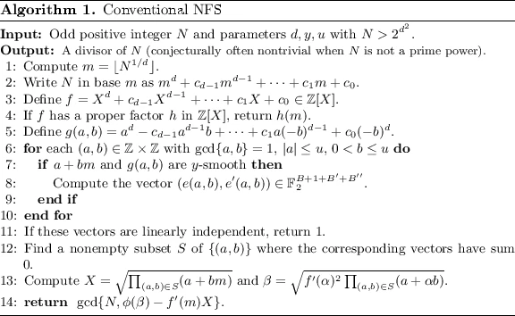
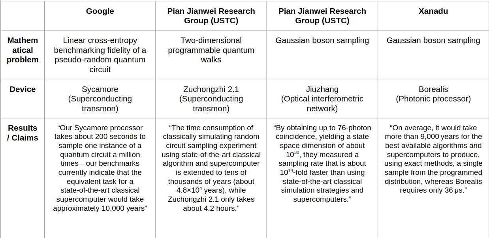

## Project 3: Shor's algorithm

This project will guide you through an exploration of the gate-model implmentation of Shor's algorithm and its scaling.

Open [INSTRUCTIONS.md](./INSTRUCTIONS.md) to begin learning about your project for this week!

**Please edit this markdown file directly with links to your completed tasks and challenges.**

## Tasks include:
* Encrypt and decrypt a message using RSA
* Research and implement the quantum algorithm for order finding
* Use Shor's algorithm to factor increasingly large sequences
* Discuss a new quantum-safe protocol as part of your Business Application

After you have completed your tasks, consider the optional Challenges below!

## Further Challenges:
* Try running your implementation of Shor's algorithm on any available quantum hardware
* Explore variational quantum factoring
* Attempt factoring using quantum annealers

What is common among these three challenges is that they all investigate how NISQ devices could be used to implement a quantum algorithm that could compete with the known classical algorithms for prime number factorization. We want to do something different: let's try to see how NISQ devices could *improve* the best classical algorithms. More specifically, we propose a novel method for speeding up the number field sieve method with gaussian boson sampling.

### The number field sieve

The number field sieve (NFS) [[1]](#1) is the best known classical method for factorizing integers. It was used in 2020 to factorize the 829-bit RSA-250 number [[2]](#2). The next number in the RSA catalog is RSA-260, which has 862 bits and has not been factored so far with any method.

A high level overview of the NFS algorithm is given here [[3]](#3):

Without having to understand all the mathematical details, it is clear that the main computational pressure is on the for loop from steps 6 to 10. The algorithm is attempting to search for a pair of integers $(a,b)$, such that the integers $a+bm$ and g(a,b) are y-smooth. A y-smooth integer is one which is not divisible by any primes larger than $y$.

So how could a quantum computer make this algorithm faster? The best bet is to try and find a quantum algorithm to perform the search for smoothness. In recent research it has been shown, that if a quantum computer could achieve any asymptotic speedup in this task, then the overall algorithm would become faster [[4]](#4)

There have been proposals to do this by translating the smoothness search into a circuit satisfiability problem (CircuitSAT), which is a task to find a set of boolean variables that output "TRUE" when given as input into a boolean logic circuit (which in this case is specified by the number that we are trying to factorize) [[5]](#5). The authors of this approach also provide their code on Github, freely available under MIT licence [[6]](#6). We will use this translation to CircuitSAT as our starting point and develop a pipeline which enables us to solve a CircuitSAT problem with gaussian boson sampling.

### Gaussian Boson Sampling

Gaussian boson sampling (GBS) is a non-universal scheme for quantum computing [[7]](#7). A device which executes gaussian boson sampling is called a gaussian boson sampler, and it has very limited functionality. It cannot execute arbitrary quantum algorithms, in fact it cannot even execute a simple quantum circuit, because it is a quantum computer that has no qubits. Instead, it has modes of squeezed light and the only thing it can do with those modes is to send them through an interferometer and count the number of photons that arrive at the output.

schematic picture here

Two aspects make GBS particular interesting for near-term applications:

First, the physical setup only necessitates components which already exist today. Squeezed light can be generated with parametric downconversion. Interferometers can be built from a network of beam splitters and phase shifters, which are routinely manufactured for both free space optics and for integrated on-chip photonics. Finally, photons can be detected with commonly used threshold detectors, or more advanced number resolving technology such as transition edge sensors. All of this is in contrast to other attempts to perform quantum information processing with light, where NISQ devices are suffering from our limitations in building sources for single photons or for generating error-resistant photonic qubits such as GKP or optical cat qubits and from the inherent difficulties in applying multi-qubit gates between quantum states of light.

Second, it turns out that the task that GBS is preforming is difficult to simulate classically. Out of the four quantum advantage experiments that have been performed to date, two of them have used GBS.

Both of these factors make GBS a promising candidate for seeing some of the first examples of quantum advantage in real-world problems, but the major hurdle here is that the problem that GBS solves doesn't really appear anywhere in business or nature. Nonetheless, if we are creative, we can find a pathway between the calculation and an application.

### Solving a CirtcuitSAT with GBS

First, Hamilton et al. showed that the probability distribuiton $p(\bar{n})$ in GBS can be used to calculate the Hafnian of a matrix.
$$
p(\bar{n})=|\sigma_Q|^{-1/2}|\text{Haf}(B_s)|^2
$$
test math
## Business Application
For each week, your team is asked to complete a Business Application. Questions you will be asked are:

* Explain to a layperson the technical problem you solved in this exercise.
* Explain or provide examples of the types of real-world problems this method can solve.
* Identify at least one potential customer for this solution - i.e. a business who has this problem and would consider paying to have this problem solved.
* Prepare a 90 second video explaining the value proposition of your innovation to this potential customer in non-technical language.

For more details refer to the [Business Application found here](./Business_Application.md)

## References
<a id="1">[1]</a>
Lenstra, A. K., Lenstra, H. W. Jr., Manasse, M. S. & Pollard, J. M. The number field sieve. In Proceedings of the twenty-second annual ACM symposium on Theory of computing, 564–572 (ACM, 1990).

<a id="2">[2]</a>
https://listserv.nodak.edu/cgi-bin/wa.exe?A2=NMBRTHRY;dc42ccd1.2002

<a id="3">[3]</a>
Bernstein, D. J., Biasse, J. & Mosca, M. A low-resource quantum factoring algorithm. In Post-Quantum Cryptography 330–346 (Springer, Cham, 2017).

<a id="4">[4]</a>
Mosca, M., Vensi Basso, J. M. & Verschoor, S. R. On speeding up factoring with quantum SAT solvers. Sci. Rep. 10, 1–8. https://doi.org/10.1038/s41598-020-71654-y (2020).

<a id="5">[5]</a>
Mosca, Michele, and Sebastian R. Verschoor. "Factoring semi-primes with (quantum) SAT-solvers." Scientific Reports 12.1 (2022): 1-12.

<a id="6">[6]</a>
Verschoor, S. R. SAT factoring. GitHub. https://github.com/sebastianv89/factoring-sat (2019).

<a id="6">[7]</a>
Hamilton, Craig S., et al. "Gaussian boson sampling." Physical review letters 119.17 (2017): 170501.