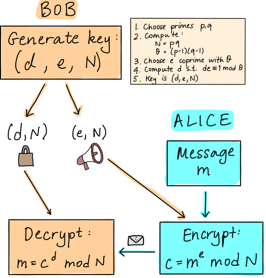

[CDL 2022 Cohort Project](../CDL_logo.jpg)
## Project 3: Shor's algorithm

This project will guide you through an exploration of the gate-model implmentation of Shor's algorithm and its scaling.

Open [INSTRUCTIONS.md](./INSTRUCTIONS.md) to begin learning about your project for this week!


**Please edit this markdown file directly with links to your completed tasks and challenges.**

## Tasks include:
* Encrypt and decrypt a message using RSA
* Research and implement the quantum algorithm for order finding
* Use Shor's algorithm to factor increasingly large sequences
* Discuss a new quantum-safe protocol as part of your Business Application

### Task 1: Privacy is key

* Encrypt and decrypt a message using RSA.

If you want to check all the procces you can find use the notebook [solution task 1](./solution_task_1.ipynb).


# Solution for task 1: Privacy is key

RSA is an asymmetric, or public-key cryptography protocol. It is generally used for *key distribution*, i.e., to securely send  keys that are used for other (symmetric, and generally faster) cryptographic protocols that require two parties to have the same key. The RSA key (or *key pair*) consists of two parts:

 - a publicly available part that people can use to send you
 encrypted messages,
 - a secret part, known only to you, that is used to decrypt those messages.
 
The key is designed in such a way that it is not tractable to determine the private part of the key from the public one.

Suppose Alice would like to send a message to Bob. The RSA protocol looks something like this:



There is some underlying number theory behind *why* this works. The details are provided in [these slides](rsa_number_theory.pdf), if you are keen to explore them.  The critical thing to note is that everything relies on the choice of two prime numbers, $p$ and $q$, which are used to construct the value of the modulus $N$, *which is part of the public key*. If we can factor $N$ and learn $p$ and $q$, we can compute $\theta$, which, since we know $e$, allows us to recover


The module `task_1` provides a Python code where you can obtain the answerfor both situations

## Recevie a message


Suppose you would like to send and receive messages using RSA. To start, you generate the key $(d, e, N) = (169, 25, 299)$ and publish the public part, $(25, 299)$. Shortly after, you receive an encrypted message from a friend. Implement two functions, `decrypt` and `encrypt`, according to the RSA protocol described
above, to decrypt your friend's message. 


Load the methods requeried for decrypt the message 

- `decrypt`:  decrypting the message to find the origial format.


``` python

"""
For this task, messages are expressed as a list of integers. Each integer represents
a separate character in the original message string. The mapping between characters 
and `decoded` (plaintext) integers is:
 - 0-9: numbers 0-9
 - 10-35: letters a-z (only lowercase is used)
 - 36: space

Example: "abc def" would be converted to [10, 11, 12, 36, 13, 14, 15].

List of the symbols to follows the previous format
"""
 
decoded_format = [str(i) for i in range(10)]+[chr(i)  for i in range(97,123) ]+[" "]


"""
Below is an *encoded* message from your friend; you will need to decode it character
by character using your RSA private key, and then convert the resulting list of
integers back to a string using the correspondence above.
"""
message_from_friend = [
    292, 290, 218, 55, 127, 174, 171, 127, 112, 24,
    251, 248, 127, 132, 218, 213, 24, 251, 248, 174, 55,
    53, 127, 233, 24, 268, 24, 251, 248
]
    
def decrypt(message, private_d, N):
    """Decrypt an encoded message. 
 
    Args:
        message (list[int]): A list of integers representing the secret message.
            Each integer in the list represents a different character in the message.
        private_d (int): Your (private) portion of the RSA key.
        N (int): The modulus of the RSA key.
 
    Returns:
        str: The decoded message.
    """
    
    # YOUR CODE HERE    
    return ''.join([decoded_format[pow(char,private_d,N)] for char in message])


def encrypt(message, public_e, N):
    """Encrypt a message 

    Args:
        message (str): A string representation of the message to send. It should
            contain only the characters a-z (lowercase), numbers 0-9, and spaces.
        public_e (int): The public portion of the RSA key (e, N) used for encoding.
        N (int): The modulus of the RSA key.
 
    Returns:
        list[int]: The message, encoded using the public key as a list of integers.
    """   
    
    # YOUR CODE HERE    
    return [pow(decoded_format.index(char),public_e,N) for char in  message]

```

Using the previous code is possible follow the next procces:

The values we obtained are used, which are as follows public_e and N, $(25, 299)$

``` python
public_e = 25
N = 299
```


The exercise indicate the private_d is 169

``` python

private_d = 169
```

By obtaining the `private_d key` and knowing `N`, the `decrypt` method can be used to encrypt the original message from the friend.


```python
decrypt(message_from_friend, private_d, N)
```


The result of the above code is: `what is your favourite colour`


## Send a response

Then, you can send them a response! Their public key is $(e, N) = (29, 91)$. Note that since this is a small case, you can determine by hand what their private key is. In a real-world setting, $N$ is a very large number, e.g., 2048-bit or 4096-bit. **consider the case the friend doesn't know what is the private_d key.**

- `encrypt`:  encrypting my message to send in a safe way to the friend.
- `find_private_d`: Obtain the private_d key requeried in decrypt method


Using the next methods to find the unkown private_d key.
```python
def phi_n(N):
    
    """Search phi_n to obtain p, q values to find the decode key
 
    Args:
        N (int): A integer value that is  the  base for encode and decode the message
 
    Returns:
        int: phi of n.
    """
    
    # save  two primes numbers p,q that are the coprime to find  N
    prime = []
    
    
    # Prime Factorization from to  N
    for i in range(2,N + 1):
        
        # if is the same value
        if N % i == 0:
            count = 1
            #check is not prime number the first half of i
            for j in range(2,(i//2 + 1)):
                if(i % j == 0):
                    count = 0
                    break
            # if is prime
            if(count == 1):
                prime.append(i)

    return (prime[0]-1)*(prime[1]-1)


def find_private_d(public_e, N):
			 
    """    calculates the modular inverse from public_e and phi
        Args:
        public_e (int): An integer value about the key public or e
        N (int): The N value for the base in the  RSA algoritmh find phi
 
    Returns:
        private_d: An integer value about the key private or d
    """
    phi = phi_n(N)
    
    #init variables
    phi_0 = phi
    
    aux_1 = 0
    private_d = 1
    
    
    # validate in case that phi is equals to 1  that return 0
    if (phi == 1) : 
        return 0
    
    # obtain the private_d value usign the inverse from public_e and phi
    while (public_e > 1) : 

        aux_2 = public_e // phi
        aux_3 = phi 
        
        phi = public_e % phi 
        public_e = aux_3 
        
        aux_3 = aux_1 

        aux_1 = private_d - aux_2 * aux_1 
        private_d = aux_3 
        
    # Make the private_d in a positive value 
    if (private_d < 0) : 
        private_d = private_d + phi_0 
  
    return private_d 
```

send my answer about the previous question 


```python
message = "green"
```

Important to know the public_e and N  for encrypt the answer


```python
public_e = 29
N = 91
```

Using the public_e and N  encrypt the message


```python
message_answer = encrypt(message, public_e, N)
message_answer
```

    [74, 27, 14, 14, 4]


The friend can not find the original answer for the question if he doesn't know about the `private_d`, But that could be possible using the method `find_private_d`


```python
private_d = find_private_d(public_e, N)
private_d
```


    5


The friend finds the original answer


```python
decrypt(message_answer, private_d, N)
```


    'green'


## Task 2: Everything is in order

* Research and implement the quantum algorithm for order finding

If you want to check all the procces you can find use the notebook [solution task 2](./solution_task_2.ipynb).


Shor's algorithm can be used to determine the prime factors $p$ and $q$ of a
number $N$. While often described as a quantum algorithm, most of it is actually
classical. Only one part of it uses a quantum computer! However, that part is
very important, since it is the part that is classically hard.

The specific subroutine is called *order finding*. In regular modular arithmetic,
given a value $a$ and modulus $N$, the task is to find an $m$ such that 
$a^m = 1 \hbox{ mod} N$. This involves repeated multiplication of $a$ by itself, or *modular
exponentiation*. The quantum version looks similar. Suppose we have a unitary
operation $U_{Na}$ that acts as follows:

$$
U_{Na} \vert k \rangle = |a k \hbox{ mod} N \rangle.
$$

For the order $m$ such that $a^m = 1 \hbox{ mod} N$ it will also be the case that

$$
U_{Na}^m \vert k  \rangle = |a^m k \hbox{ mod} N \rangle = \vert k \rangle.
$$

For this task, research and implement the quantum algorithm for order finding. 
Then, apply it in the larger context of Shor's algorithm, starting
from the pseudocode below. Use you algorithm to factor the value $N = 91$ from
the previous task.


```
Shor's algorithm
================
Inputs: integer N with unique factorization N = pq
Outputs: p, q

p, q = 1, 1

while p * q is not N:
    choose value a in the range [2, ..., N - 2]
	
    if a and N are coprime:
        # we are lucky!
        p = a
        q = N / a

    else:
        use a quantum computer to find order m of U_Na
	    
        if m is odd:
            # invalid
            continue
			
        else:
            compute x = a ** (m / 2) mod N
		
            if x = 1 or -1 mod N:
                # invalid
                continue
            else:
                # valid!
                p = GCD(x - 1, N)
                q = GCD(x + 1, N)
```

# Implementation

Import for mathematical operators, variables o functions from math; and import a integer random generator  from random library.


```python
from math import gcd,ceil, pi, log2
from random import randint
```

Using in the framework qiskit for the quantum computing algorithm for this we use the Quantum fourier Transform predefine method with other to run in a simulator backend.


```python
# Importing standard Qiskit libraries
from qiskit import QuantumCircuit, transpile, assemble, Aer, IBMQ
from qiskit.circuit.library import QFT
```

Method to design any unitary gate using  the format $2^i mod(N)$, using the idea from Drapper Adder


```python
def unitary_gate(data_qubits,value,exp,N):
    qc = QuantumCircuit(data_qubits)
    
    ## find the output for the modulo  
    const = (value**exp)%N
    
    # obtain the binary number with the same lenght
    a = bin(const)[2:]
    while len(a) < data_qubits:
        a = '0'+a
        
    a=a[::-1]
    
    # consider a list for all the rotation we can reduce
    list_a = [0]*data_qubits  
    for i in range(data_qubits): 
        if a[i] =='1':
            k = 0
            for j in range(i,data_qubits):
                # save the values rotation in a
                list_a[data_qubits-j-1] +=pi/float(2**(k))  
                k+=1

    # apply the result of the list in a quantum circuit
    for i in range(data_qubits):
        if list_a[i] != 0:
            qc.p(list_a[i],i)
            k+=1

    # convert the quantum circuit into a quantum gate
    return qc.to_gate(label=" [ "+ str(value)+"^"+str(exp)+"% "+str(N) + "] ") 
```

Design the quantum part from the Shor algorithm using Quantum Phase Estimation method.


```python
def qpe(a,N):
    # select the qubits for the quantum circuit 
    n = len(bin(N)[2:])
    m = int(ceil(log2(N)))
    
    qc = QuantumCircuit(n+m,n)
    
    # apply hadamard gates in the measurements qubits
    qc.h(range(n)) 
    qc.barrier()

    # apply the untiary gates 
    qc.h(range(n,m+n))
    for i in range(n): 
        qc.append(unitary_gate(m, a,i,N).control(1) ,[i]+[i for i in range(n,m+n)])
    
    qc.barrier()
    
    # apply inverse of the Quantum Fourier Transform QFT 
    qc.append(QFT(n,do_swaps=False).inverse(),range(n))
    
    #measure only the qubits that are equals to the lenght of N
    qc.measure(range(n), range(n))

    # apply the simulation
    aer_sim = Aer.get_backend('aer_simulator')
    t_qc = transpile(qc, aer_sim)
    qobj = assemble(t_qc, shots=1)
    result = aer_sim.run(qobj, memory=True).result()
    readings = result.get_memory()
    
    k = int(readings[0],2)
    return k

```

## Generate the shor algortihm

connect our porposal of the Quantum Phase Estimation  to find the **m** value correct for the shor algorithm, and using the pseudo code provided for the task  


```python
def shor(N):
    
    p, q = 1, 1
    
    while (p * q is not N) or p == 1 or q == 1:
        
        a = randint(2, N-2)
        if gcd(a,N)!=1:
            # we are lucky!
            p = a
            q = int(N / a)
    
        else:
             #use a quantum computer to find order m of U_Na
            m = qpe(a,N)
            if m %2 == 1:
                # invalid
                continue

            else:
                x = int(a ** (m / 2) % N)

                if (x == 1 or x == -1) % N:
                    # invalid
                    continue
                else:
                    # valid!
                    p = gcd(x - 1, N)
                    q = gcd(x + 1, N)
    return p,q
```

## Run algorithm

Using our proposal solution with the previous exercies where N is equal to 91, and remeber the solution the output for  **p = 7** and **q =13**


```python
N=91
p,q = shor(N)
p,q
```


    (7, 13)


we obtained the same output using our quantum proposal and using the methods for task 1 we can obtain the same result. for that we called the decoded message `green` that is equals to the list *[74, 27, 14, 14, 4]* , with the public key that is *29*


```python
message = [74, 27, 14, 14, 4]
public_e = 29
```

and using the following method to obtain the original message: 

- `find_private_d_task2`: Obtain the private_d key requeried in decrypt method
- `decrypt`:  decrypting the message to find the origial format.


for that using the next code 


```python
def find_private_d_task2(public_e, N, p, q):
			 
    """    calculates the modular inverse from public_e and phi
        Args:
        public_e (int): An integer value about the key public or e
        N (int): The N value for the base in the  RSA algoritmh find phi
 
    Returns:
        private_d: An integer value about the key private or d
    """
    phi = (p-1)*(q-1)
    
    #init variables
    phi_0 = phi
    
    aux_1 = 0
    private_d = 1
    
    
    # validate in case that phi is equals to 1  that return 0
    if (phi == 1) : 
        return 0
    
    # obtain the private_d value usign the inverse from public_e and phi
    while (public_e > 1) : 

        aux_2 = public_e // phi
        aux_3 = phi 
        
        phi = public_e % phi 
        public_e = aux_3 
        
        aux_3 = aux_1 

        aux_1 = private_d - aux_2 * aux_1 
        private_d = aux_3 
        
    # Make the private_d in a positive value 
    if (private_d < 0) : 
        private_d = private_d + phi_0 
  
    return private_d 


def decrypt(message, private_d, N):
    """Decrypt an encoded message. 
 
    Args:
        message (list[int]): A list of integers representing the secret message.
            Each integer in the list represents a different character in the message.
        private_d (int): Your (private) portion of the RSA key.
        N (int): The modulus of the RSA key.
 
    Returns:
        str: The decoded message.
    """
    
    # YOUR CODE HERE    
    return ''.join([decoded_format[pow(char,private_d,N)] for char in message])

```

is obtained the private_d key that is equal to task 1


```python
private_d = find_private_d_task2(public_e, N, p, q)
private_d
```


    5


Using decrypt method to find the original message that is green the  same value that task 1 using the quantum proposal from shor's algorithm.


```python
decrypt(message, private_d, N)
```


    'green'


## Task 3: Are we running Shor-t on time?

* Use Shor's algorithm to factor increasingly large sequences

If you want to check all the procces you can find use the notebook [solution task 3](./solution_task_3.ipynb).

# Solution for Task 3: Are we running Shor-t on time?

You will likely have noticed in Task 2 that Shor's algorithm is not guaranteed
to find a solution. In fact, there are few potential points of failure. How
often does your implementation succeed? How does this depend on the size of $N$?

Further to this point, now that you have an implementation, let's stress test
it. Use Shor's algorithm to factor a sequence of increasingly large $N$. How
large of a number can you reliably factor with your computer?  As you are
increasing $N$, take the opportunity to perform an analysis of:

 - Run time (wall time)
 - Number of qubits required
 - Number of quantum gates required

Present your results graphically and use this to infer the scaling of these
resources with the size of the problem instance.

After, consider the following: how does the size of your largest solved instance
compare with the size of RSA keys in use today? Can you estimate the quantum
resources that would be needed to factor numbers of this size, and when we might
have a device capable of doing so? Consider the qubit count and gate count in
your estimate. To take things further, you could even estimate a rough wall time
by looking at circuit depth, and gate operation speeds of present-day hardware.elow. Use you algorithm to factor the value $N = 91$ from
the previous task.

# Implementation

Import for mathematical operators, variables o functions from math; and import a integer random generator  from random library. And using time library for check timeexecution for methods in our proposal solution.


```python
from math import gcd,ceil, pi, log2
from random import randint
import time
```

Using in the framework qiskit for the quantum computing algorithm for this we use the Quantum fourier Transform predefine method with other to run in a simulator backend.


```python
# Importing standard Qiskit libraries
from qiskit import QuantumCircuit, transpile, assemble, Aer, IBMQ
from qiskit.circuit.library import QFT
```

Method to design any unitary gate using  the format $2^i mod(N)$


```python
def unitary_gate(data_qubits,value,exp,N):
    qc = QuantumCircuit(data_qubits)
    
    ## find the output for the modulo  
    const = (value**exp)%N
    
    # obtain the binary number with the same lenght
    a = bin(const)[2:]
    while len(a) < data_qubits:
        a = '0'+a
        
    a=a[::-1]
    
    # consider a list for all the rotation we can reduce
    list_a = [0]*data_qubits  
    for i in range(data_qubits): 
        if a[i] =='1':
            k = 0
            for j in range(i,data_qubits):
                # save the values rotation in a
                list_a[data_qubits-j-1] +=pi/float(2**(k))  
                k+=1

    # apply the result of the list in a quantum circuit
    for i in range(data_qubits):
        if list_a[i] != 0:
            qc.p(list_a[i],i)
            k+=1

    # convert the quantum circuit into a quantum gate
    return qc.to_gate(label=" [ "+ str(value)+"^"+str(exp)+"% "+str(N) + "] ") 
```

Design the quantum part from the Shor algorithm using Quantum Phase Estimation method and add a return value the qc


```python
def qpe(a,N):
    # select the qubits for the quantum circuit 
    n = len(bin(N)[2:])
    m = int(ceil(log2(N)))
    
    qc = QuantumCircuit(n+m,n)
    
    # apply hadamard gates in the measurements qubits
    qc.h(range(n)) 
    qc.barrier()

    # apply the untiary gates 
    qc.h(range(n,m+n))
    for i in range(n): 
        qc.append(unitary_gate(m, a,i,N).control(1) ,[i]+[i for i in range(n,m+n)])
    
    qc.barrier()
    
    # apply inverse of the Quantum Fourier Transform QFT 
    qc.append(QFT(n,do_swaps=False).inverse(),range(n))
    
    #measure only the qubits that are equals to the lenght of N
    qc.measure(range(n), range(n))

    # apply the simulation
    aer_sim = Aer.get_backend('aer_simulator')
    t_qc = transpile(qc, aer_sim)
    qobj = assemble(t_qc, shots=1)
    result = aer_sim.run(qobj, memory=True).result()
    readings = result.get_memory()
    
    k = int(readings[0],2)/2**n
    return k,qc

```

## Generate the shor algortihm

connect our porposal of the Quantum Phase Estimation  to find the **m** value correct for the shor algorithm, and using the pseudo code provided for the task . for check the potential of the quantu malgorithm we don't consider the case when are not coprime value in the a variable.


```python
list_only_quantum = []
list_quantum = []
list_shor = []
list_num_qubits = []
list_num_gates = []
list_num_nolocal_gates = []
list_depth = []
```


```python
def shor(N):
    
    p, q = 13, 23
    
    while p * q is not N:
        
        a = randint(2, N-2)
        if gcd(a,N)!=1:
            # we are lucky!
            p = a
            q = int(N / a)
    
        else:
            #use a quantum computer to find order m of U_Na
            start_time = time.time()
            m,qc  = qpe(a,N)
            list_only_quantum.append(time.time() - start_time)
            if m %2 == 1:
                # invalid
                continue

            else:
                x = int((a ** m) % N)

                if (x == 1 or x == -1) % N:
                    # invalid
                    continue
                else:
                    # valid!
                    p = gcd(x - 1, N)
                    q = gcd(x + 1, N)
        #print(p,q,len(qc.qubits))
    return p,q,qc
```

### Run algorithm in *qasm_simulator*

Using our proposal solution with different values, and we using an extra library numpy for manipulate  list values


```python
import numpy as np
```


```python
inputs = [15,21,35,91,253,299,667,1089,2407,6887,10403]
```


```python
#N=201
for i in inputs:
    
    for each in range(30):
        a = randint(2, i-2)
        start_time_v2 = time.time()
        m,qc = qpe(a,i)
        list_only_quantum.append(time.time() - start_time_v2)
        
    list_num_qubits.append(len(qc.qubits))
    qc2 = qc.decompose().decompose()
    list_num_gates.append(qc2.size())
    list_num_nolocal_gates.append(qc2.num_nonlocal_gates())
    list_depth.append(qc2.depth())
    list_quantum.append([np.average(list_only_quantum),np.std(list_only_quantum)])
    list_only_quantum = []
    print(i, len(qc.qubits))
```

    15 8
    21 10
    35 12
    91 14
    253 16
    299 18
    667 20
    1089 22
    2407 24
    6887 26
    10403 28


## Plot the results

Consider the number of qubits, number of gates, number of no local gates, depth of the circuit and the time for each experiment. For the plot was used the matplotlib library.  


```python
import matplotlib.pyplot as plt
```

# number of qubits/gates/depth 

Using  the integer value with respect the number of qubits, depth, no local gates and gates , all of them the  increasing trend using a larger number becomes a logarithmic function.


In case of number of qubits and depth are less  comapre with the previous ones.


```python
plt.plot(inputs,list_num_qubits,label = "Number of qubits", marker='o',color ='purple')
plt.plot(inputs,list_num_gates,label = "Number of gates", marker='o',color ='teal')
plt.plot(inputs,list_num_nolocal_gates,label = "Number of no local gates", marker='o',color ='blue')
plt.plot(inputs,list_depth,label = "depth of the circuit", marker='o',color ='green')

plt.legend(bbox_to_anchor =(0.5, 1.))
plt.xlabel("Input number for the Shor's algorithm")
plt.ylabel("Number of qubits/gates/depth")
    
plt.show()
```


    

    


# Percentage of no local gates

The case of number of gates is the most bigger with more of 300 and consider only the no local gates, these are about 80% of the gates that are used for this algorithm.


```python
plt.plot(inputs,[list_num_nolocal_gates[i]*100/list_num_gates[i] for i in range(len(inputs))],label = "Percentage of no local gates", marker='o',color ='teal')

plt.legend(bbox_to_anchor =(0.5, 1.))
plt.xlabel("Input number for the Shor's algorithm")
plt.ylabel("Percentage (%)")
    
plt.show()
```


    

    


### Num of qubits

Consider the same variables but compare with  the number of qubits, the number of gates , and depth have a linear trend.


```python
plt.plot(list_num_qubits,list_num_gates,label = "Number of gates", marker='o',color ='teal')
plt.plot(list_num_qubits,list_num_nolocal_gates,label = "Number of no local gates", marker='o',color ='blue')
plt.plot(list_num_qubits,list_depth,label = "depth of the circuit", marker='o',color ='purple')

plt.legend(bbox_to_anchor =(0.5, 1.))
plt.xlabel("Number  of qubits for the Shor's algorithm")
plt.ylabel("Number of gates/depth")
    
plt.show()
```


    

    


The percentage of no local gates are in a logarithmic trend.


```python
plt.plot(list_num_qubits,[list_num_nolocal_gates[i]*100/list_num_gates[i] for i in range(len(inputs))],label = "Percentage of no local gates", marker='o',color ='teal')

plt.legend(bbox_to_anchor =(0.5, 1.))
plt.xlabel("Number of gates")
plt.ylabel("Num of Qubits")
    
plt.show()
```


    

    


# time of execution


Consider an average of 30 times for each experiment, in **qasm_simulator**, the icnrease are exponential when the quantum circuit execute the number *10403*, this is almost 5 times with respect the previous.


```python
plt.errorbar(inputs, [i[0] for i in list_quantum], [i[1] for i in list_quantum],color = 'purple',label = "time of execution", marker='o')
plt.legend(bbox_to_anchor =(0.5, 1.))
plt.xlabel("Input number for the Shor's algorithm")
plt.ylabel("Time(s)")
    
plt.show()
```


    

    


Is more clear if we consdier the number of qubits when the time of execution using 28 qubits are 5 times bigger than the 26 qubits.


```python
plt.errorbar(list_num_qubits, [i[0] for i in list_quantum], [i[1] for i in list_quantum],color = 'purple', label = "time of execution", marker='o')
plt.legend(bbox_to_anchor =(0.5, 1.))
plt.xlabel("Number of qubits")
plt.ylabel("Time(s)")
    
plt.show()
```


    

    


#### Limitations

The posibility to find in a simulator try to use Shor's algorithm in a real problem sounds complciate, because the number of gates increse in a logaritmith gate, and the time of execution is exponential, similar to the cxlassical algorithm RSA. Exist the possibility to works with a quantum hardware, but the limitation of the number of qubits do this proposal limitate for now. when you can try with number of more of 5 digits.


## Task 4: Business applications

Even though organizations like NIST are establishing standards, it can take years or decades for them to be widely adopted (case in point: explore the history of the hash function SHA-1). It is likely that much of our data will still be vulnerable to quantum attack once large enough devices come online, despite having quantum-resistant algorithms available.

To that end, your knowledge of Shor's algorithm is powerful, and with great power comes great responsibility. It is important not only to understand, but also to be able to convey to others the risks of using vulnerable cryptographic protocols, within both your own organization, and to organizations that you do business with.

Suppose that your team is part of a company that has developed a new protocol which was selected by the (fictional) standards body QIST as one of its options for quantum-resistant cryptography. Using any type media you wish, design an advertisement for your product. Be creative! For example, you can make

    A flashy web page
    A TV commercial or infomercial
    A script of a conversation between your company and a potential client
    A slide deck for a business pitch

The particulars of this fictional algorithm and how it works are not important. Rather, we will be judging how your creation portrays the risks and the benefits present in this situation.

Develop your solution in your Business Application file, and don't forget to include a link to your 90-second video!


For more details refer to the [Business Application found here](./Business_Application.md)


## Further Challenges:
* Try running your implementation of Shor's algorithm on any available quantum hardware


# Challenge 1:

Try running your implementation of Shor's algorithm on real quantum
hardware. How large of a number can you successfully (and reliably) factor?


If you want to check all the procces you can find use the notebook [Challenge 1](./Challenge.ipynb).

# Implementation

Import for mathematical operators, variables o functions from math; and import a integer random generator  from random library. And using time library for check timeexecution for methods in our proposal solution.


```python
from math import gcd,ceil, pi, log2
from random import randint
import time
```

Using in the framework qiskit for the quantum computing algorithm for this we use the Quantum fourier Transform predefine method with other to run in a simulator backend.


```python
# Importing standard Qiskit libraries
from qiskit import QuantumCircuit, transpile, assemble, Aer, IBMQ
from qiskit.circuit.library import QFT
```

Method to design any unitary gate using  the format $2^i mod(N)$


```python
def unitary_gate(data_qubits,value,exp,N):
    qc = QuantumCircuit(data_qubits)
    
    ## find the output for the modulo  
    const = (value**exp)%N
    
    # obtain the binary number with the same lenght
    a = bin(const)[2:]
    while len(a) < data_qubits:
        a = '0'+a
        
    a=a[::-1]
    
    # consider a list for all the rotation we can reduce
    list_a = [0]*data_qubits  
    for i in range(data_qubits): 
        if a[i] =='1':
            k = 0
            for j in range(i,data_qubits):
                # save the values rotation in a
                list_a[data_qubits-j-1] +=pi/float(2**(k))  
                k+=1

    # apply the result of the list in a quantum circuit
    for i in range(data_qubits):
        if list_a[i] != 0:
            qc.p(list_a[i],i)
            k+=1

    # convert the quantum circuit into a quantum gate
    return qc.to_gate(label=" [ "+ str(value)+"^"+str(exp)+"% "+str(N) + "] ") 
```

Design the quantum part from the Shor algorithm using Quantum Phase Estimation method and add a return value the qc.


## Adder the quantum hardware

Usin a quantum computer form IBM with 16 qubits.


```python
# load the token
IBMQ.load_account()
# select the provider
provider = IBMQ.providers()[2]
# select the backend 
backend =provider.get_backend('ibmq_guadalupe')
```

Replace the **aer_sim** variable that is the `qasm_simulator` for the variable **backend** that works using `ibm_guadalupe`, 
the next code replace the indication:

`result = backend.run(qobj).result()
    readings = result.get_counts()`


```python
def qpe(a,N):
    # select the qubits for the quantum circuit 
    n = len(bin(N)[2:])
    m = int(ceil(log2(N)))
    
    qc = QuantumCircuit(n+m,n)
    
    # apply hadamard gates in the measurements qubits
    qc.h(range(n)) 
    qc.barrier()

    # apply the untiary gates 
    qc.h(range(n,m+n))
    for i in range(n): 
        qc.append(unitary_gate(m, a,i,N).control(1) ,[i]+[i for i in range(n,m+n)])
    
    qc.barrier()
    
    # apply inverse of the Quantum Fourier Transform QFT 
    qc.append(QFT(n,do_swaps=False).inverse(),range(n))
    
    #measure only the qubits that are equals to the lenght of N
    qc.measure(range(n), range(n))
    
    #not consider this backend
    aer_sim = Aer.get_backend('aer_simulator')
    
    # apply the real hardware calling the variable backend
    t_qc = transpile(qc, backend)
    qobj = assemble(t_qc, shots=1)
    result = backend.run(qobj).result()
    readings = result.get_counts()
    k = int(list(readings.keys())[0],2)/2**n
    return k,qc

```

## Generate the shor algortihm

connect our porposal of the Quantum Phase Estimation  to find the **m** value correct for the shor algorithm, and using the pseudo code provided for the task . for check the potential of the quantu malgorithm we don't consider the case when are not coprime value in the a variable.


```python
list_only_quantum = []
list_quantum = []
list_shor = []
list_num_qubits = []
list_num_gates = []
list_num_nolocal_gates = []
list_depth = []
```


```python
def shor(N):
    
    p, q = 13, 23
    
    while p * q is not N:
        
        a = randint(2, N-2)
        if gcd(a,N)!=1:
            # we are lucky!
            p = a
            q = int(N / a)
    
        else:
            #use a quantum computer to find order m of U_Na
            start_time = time.time()
            m,qc  = qpe(a,N)
            list_only_quantum.append(time.time() - start_time)
            if m %2 == 1:
                # invalid
                continue

            else:
                x = int((a ** m) % N)

                if (x == 1 or x == -1) % N:
                    # invalid
                    continue
                else:
                    # valid!
                    p = gcd(x - 1, N)
                    q = gcd(x + 1, N)
        #print(p,q,len(qc.qubits))
    return p,q,qc
```

### Run algorithm

Using our proposal solution with different values, and we using an extra library numpy for manipulate  list values


```python
import numpy as np
```

For the real quantum computer is of 16 qubits, the limit is  in that number, for that reason was used the input 91 that works with 14 qubits in the proposal of the Shor's algorithms of the task 2 and 3.


```python
inputs = [91]
```

Using the same idea of the Task , was compared the number of the qubits, the number of gates, the time and depth 2 times, because the real hardware is used from a cloud platform and we need ti wait to use the hardware with the quantum circuit.


```python
for i in inputs:
     for j in range(2):
        start_time_v2 = time.time()
        p,q,qc1 = shor(i)
        list_only_quantum.append(time.time() - start_time_v2)

        list_num_qubits.append(len(qc1.qubits))
        qc2 = qc1.decompose().decompose()
        list_num_gates.append(qc2.size())
        list_num_nolocal_gates.append(qc2.num_nonlocal_gates())
        list_depth.append(qc2.depth())
        list_quantum.append([np.average(list_only_quantum),np.std(list_only_quantum)])
        list_only_quantum = []
        print(i, len(qc1.qubits))
```

    91 14


### Results

The algorithm was used 2 times and their results for the algorithm is depends of p & q, where those are 13 and 7, in other words the quantum computer could find  the correct values.


```python
p,q
```


    (13, 7)


The time for each iteratios is between, 22 and 32 seconds, that depends of the position in when the job was selected to use in the quantum platform. This porject can confirn  in secnds can find the value using a quantum computer


```python
list_quantum
```


    [[22.335453351338703, 8.487457141398883],
     [32.86271196603775, 37.35823521336561]]


### References

[Thomas G. Draper (2000). Addition on a Quantum Computer](https://arxiv.org/abs/quant-ph/0008033)

[Beauregard, Stephane. (2002). Circuit for Shor's algorithm using 2n+3 qubits. Quantum information & computation. 3. 10.26421/QIC3.2-8.](https://arxiv.org/pdf/quant-ph/0205095.pdf)


## Business Application
For each week, your team is asked to complete a Business Application. Questions you will be asked are:

* Explain to a layperson the technical problem you solved in this exercise.
* Explain or provide examples of the types of real-world problems this method can solve.
* Identify at least one potential customer for this solution - i.e. a business who has this problem and would consider paying to have this problem solved.
* Prepare a 90 second video explaining the value proposition of your innovation to this potential customer in non-technical language.

You can find the  [Business Application found here](./Business_Application.md)
