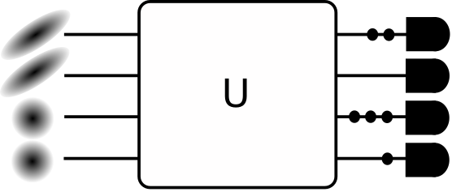

## Project 3: Shor's algorithm

This project will guide you through an exploration of the gate-model implmentation of Shor's algorithm and its scaling.

Open [INSTRUCTIONS.md](./INSTRUCTIONS.md) to begin learning about your project for this week!


**Please edit this markdown file directly with links to your completed tasks and challenges.**

## Tasks include:

## Task 1: Encrypt and decrypt RSA
* Encrypt and decrypt a message using RSA

Note that one can view the full code for the task in task_1.ipynb notebook. We do not put the helper functions here for brevity.

For our first part of the task, we were given an encrypted message to decrypt with public key e = 25, N  = 299 and private key d = 169. Following the protocol, we define the following decrypt function: 

```
def decrypt(message, private_d, N):
    """Decrypt an encoded message. 
 
    Args:
        message (list[int]): A list of integers representing the secret message.
            Each integer in the list represents a different character in the message.
        private_d (int): Your (private) portion of the RSA key.
        N (int): The modulus of the RSA key.
 
    Returns:
        str: The decoded message.
    """
    
    decoded_message = ""
    
    for i in range(len(message)):
        c = message[i]
        c_prime = c ** private_d
        m = c_prime % N
        
        m_str = decode_from_int(m)
        decoded_message += m_str

    return decoded_message
```

With this function, we can see our friend's message.

```
decrypt(message_from_friend, d, N)
```

```
'what is your favourite colour'
```

Following that, we want to give our friend a proper response, which would be:

```
answer = "my favourite colour is green and my favourite number is 369 what is yours"
```

We then encrypt it using the following function, with public key e = 29 and N = 91:

```
def encrypt(message, public_e, N):
    """Encrypt a message 

    Args:
        message (str): A string representation of the message to send. It should
            contain only the characters a-z (lowercase), numbers 0-9, and spaces.
        public_e (int): The public portion of the RSA key (e, N) used for encoding.
        N (int): The modulus of the RSA key.
 
    Returns:
        list[int]: The message, encoded using the public key as a list of integers.
    """
    encoded_message = []

    for i in range(len(message)):
        ch = message[i]
        ch_int = encode_from_char(ch)
        m_prime = ch_int ** public_e
        c = m_prime % N
        encoded_message.append(c)
        

    return encoded_message
 

encrypted = encrypt(answer, e, N)
print(encrypted)
```

Our encrypted message then looks like the following:

```
[29, 34, 43, 71, 82, 5, 33, 88, 27, 44, 22, 14, 43, 38, 33, 21, 33, 88, 27, 43, 44, 84, 43, 74, 27, 14, 14, 4, 43, 82, 4, 13, 43, 29, 34, 43, 71, 82, 5, 33, 88, 27, 44, 22, 14, 43, 4, 88, 29, 72, 14, 27, 43, 44, 84, 43, 61, 41, 81, 43, 2, 75, 82, 22, 43, 44, 84, 43, 34, 33, 88, 27, 84]
```

From Task 2 (spoiler alert), we know that N = 91 prime factorization is 7 and 13, so p = 7, q = 13. The theta in the RSA protocol in the graphic is then 6 X 12 = 72. Thus, we know that e = 29, theta = 72, so we just need to find d such that d X e = 1 mod 72. After a quick search, we see that d = 5 (or 77), either of which works, so we just need to plug those values into the decrypt function to get back the original message:

```
decrypt(encrypted, 77, N)
```

```
'my favourite colour is green and my favourite number is 369 what is yours'
```

## Task 2: Implementing Shor's Algorithm
* Research and implement the quantum algorithm for order finding

In this task, we are meant to implement the quantum algorithm for order finding, and then to test it on by using Shor's algorithm on N = 91. To do this task, therefore first implemented the classical parts of Shor's algorithm (the pseudocode given with corrections), and then created two versions of the order finding algorithm: a naive classical version; and then the quantum version that utilizes Quantum Phase Estimation. The reason why we created the classical version as well was to see how well the quantum version was able to hold up to the naive classical implementation with it's current day limitations.

Note that in our discussion, we only examine the order finding mechanism since this is the most complex part (and also most interesting). For a full idea of our code, please look at the task_2.ipynb notebook. We first tested the classical version of the algorithm, which looks like the following:

```
def order_finding_classical(a, N):
    
    m = 1
    res = copy.deepcopy(a)
    
    while res != 1:
        res = res * a
        res = res % N
        m += 1
    
    return m
```

As one can tell, this is an extremely naive way of performing order finding (without error checks I know, but let us assume that the person knows that the input given is alright). However, when N is small, like in our case of N = 91, it does the job extremely quickly, finding out that the prime factorization of 91 is 7 and 13 almost instantly:

```
shors(91)
```

```
a is  44
m is  12
Execution time: 0.0 seconds
(7, 13)
```

On the other hand, we were having trouble implementing a quantum version of the order finding algorithm. The main problem we had was that we could not think of an efficient way to create the controlled unitary we needed to implement for the Quantum Phase Estimation:

$$
U_{Na} \vert k \rangle = |a k \hbox{ mod} N \rangle.
$$

Fortunately, we were able to find an implementation someone else did on the IBMQ systems online from the GitHub: https://github.com/ttlion/ShorAlgQiskit. We therefore used their implementation to test for different N. However, we soon hit another snag in our attempt to test N = 91.

We segue a bit to discuss about the theoretical aspect for resource management in the implementation of Shor's algorithm. In the order finding (or period finding) aspect of the algorithm, we need to basically perform Quantum Phase Estimation using a controlled version of the unitary above. The source register needs to have K qubits such that $N^2 < 2^K < 2 N^2$, while the output register needs to have just enough qubits to store N (and generally more) basis state. Generally, this means that we need more than $3 log_{2} N$ qubits. For example, for N = 91, we find that we are going to need 14 qubits for the source register, and 7 qubits for the output register, so we need 21 qubits at the very least. 

Furthermore, we also need to consider the implementation of the unitary we need to use above. It is technically easy to calculate the binary representation for multiplication in classical systems (and then division), but this becomes a lot more difficult in quantum systems. It oftens requires the need for ancillary qubits in general cases, much like the implementation that we have copied from the above GitHub, further adding resources used. We note that in principle, if one knows that outcome, one does not need to use any ancillary qubits, much like the tutorial given by IBM (https://qiskit.org/textbook/ch-algorithms/shor.html#1.-The-Problem:-Period-Finding), but for general cases, one is going to need to use them.

There comes the problem that we faced while trying to run Shor's algorithm (with quantum order finding) with N = 91. Although in principle, we only need 21 qubits, with the general implementation of Shor's for any N, we are going to need 30 qubits (with a = 2). Simulators available to us are not able to handle the load of 30 qubits (admittedly, we have not tried any tensor network simulators, only statevector ones), so we could not test the implementation. We discuss our benchmarking of other values of N below.

## Task 3: Benchmarking
* Use Shor's algorithm to factor increasingly large sequences

In the previous task, we have stated our inability to factor N = 91, which requires a relatively large amount of qubits compared to what most simulators are able to handle today. But the question then lies: what can it handle?

The answer is that it is able to handle surprisingly little. For N = 15, it was able to find out that it was 3 times 5 fairly easily, requiring a little over two minutes and 18 qubits:

```
Execution time: 122.52815866470337 seconds
```

However, when we tried N = 21, the algorithm already started taking an extremely long time. However, after about two hours, the algorithm finally finished running:

```
Execution time: 7021.139513254166 seconds
```

Beyond these two values though, the other values of N we tried to benchmark required more than 24 qubits, which was the limit of the IBM QASM simulator, so we were unable to try to run them to benchmark them. We also noticed that for both N = 15 and N = 21, we had a chance of failing. From the notebook, where we left the result of N = 21, we see that:

```
Using a=2, found the factors of N=21 in 32.8000 % of the cases
```

This arises from the fact that the measurement constantly gives different measurement results, and not every measurement result is guarenteed to provide the correct factors. For a simulator, and for small values of N, it is still possible to go through all the results we get one by one until we arrive at one that provides the correct factorization, like we did in this example. However, for a quantum computer with noise, many of the measurement results will be influenced by noise, and be rubbish. For higher values of N, it becomes more and more impractical to go through one by one until we get one that provides the correct factorization if some of the measurement results are due to noise, simply because of how many values one has to get through (the values needed to be checked rises exponentially). Thus, this speaks to the need for fault tolerant quantum computers to ensure correct results to limit the number of measurement results one has to go through.

Now that we have established that we were unable to benchmark the running time, we looked at the number of qubits and the circuit depth instead. The table below shows a brief rundown of the different valus of N we tried and the number of qubits and circuit depth required:

| N             | Number of qubits | Circuit Depth  |
| ------------- |:----------------:| --------------:|
| 15            | 18               | 6433           |
| 21            | 22               | 12060          |
| 33            | 26               | 20566          |
| 51            | 26               | 20566          |
| 69            | 30               | 32755          |
| 85            | 30               | 32755          |
| 91            | 30               | 32755          |
| 143           | 34               | 49527          |
| 187           | 34               | 49527          |


As one can see, as N increases, the number of qubits and circuit depth increases at an logarithmic rate. From the table, one can tell that the boundaries for the increase in number of qubits and circuit depth comes with every exponential of 2, for example 33 and 51 needs the same number of qubits and circuit depth because they are between 32 and 64, and 65, 85 and 91 needs the same number of qubits and circuit depth because they are between 64 and 128, and so on so forth. From these results, one can tell of the algorithm's potential, as the rate of which the resources required increases with the size of N actually increases fairly slowly. 

However, the baseline resources required to run the algorithm is extremely high. Even for N = 15, we require 18 qubits to begin with, more than most current day quantum computers have, with an incredibly long circuit depth of 6433. The length of this circuit pretty much guarentees that one would need a fault-tolerant quantum computer to run it. This is inline with most current research on Quantum Phase Estimation, as it requires extremely long circuit depths to run. The only reason why our implementation of N = 15 and N = 21 succeeded was because we were running on a simulator, otherwise the long circuit depth and noise from the quantum computer would have given us basically unusable result. 

As a last experiment, we wanted to test our classical implementation to see where it fails. We note that this is no where near to the best classical implementation there is (that would be the general number field sieve), but we thought it would be instructive in interests of seeing where the quantum implementation needs to be to even beat a naive implementation. 

| N             | Elapsed Time  | Factorization  | Number of Qubits | Circuit Depth  |
| ------------- |:-------------:|:--------------:|:----------------:|:--------------:|
| 91            | 0.0           | (7, 13)        | 30               | 32755          |
| 3901          | 0.000997066   | (47, 83)       | 50               | 183805         |
| 64777         | 0.0009970664  | (307, 211)     | 66               | 488371         |
| 904279        | 0.08884477    | (907, 997)     | 82               | ?              |
| 38089591      | 16.2632269    | (5051, 7541)   | 106              | ?              |
| 99400891      | 170.481374    | (9967, 9973)   | 110              | ?              |

Note: The question marks are there because my computer started hanging trying to construct the circuit.

While we could have gone higher with the classical one, we decided to stop because the time elapsed would grow pretty quickly. That being said, we can glean from this as to how far quantum computing has to go. As mentioned earlier, the circuit depth pretty much ensures that we need fault tolerant quantum computers with proper logical qubits, and to even achieve the same results as a classical computer running a fairly naive algorithm that takes about slightly longer than two minutes to run, we are going to need around 100 logical qubits. That being said, we can also see that the scaling of the qubits with respect to N is actually quite slow, which speaks well of at least its long term potential.

## Task 4: Business Application
* Discuss a new quantum-safe protocol as part of your Business Application

After you have completed your tasks, consider the optional Challenges below!

## Further Challenges:
* Try running your implementation of Shor's algorithm on any available quantum hardware
* Explore variational quantum factoring
* Attempt factoring using quantum annealers

What is common among these three challenges is that they all investigate how NISQ devices could be used to implement a quantum algorithm that could compete with the known classical algorithms for prime number factorization. We want to do something different: let's try to see how NISQ devices could *improve* the best classical algorithms. More specifically, we propose a novel method for speeding up the number field sieve method with gaussian boson sampling.

### The number field sieve

The number field sieve (NFS) [[1]](#1) is the best known classical method for factorizing integers. It was used in 2020 to factorize the 829-bit RSA-250 number [[2]](#2). The next number in the RSA catalog is RSA-260, which has 862 bits and has not been factored so far with any method.

A high level overview of the NFS algorithm is given here [[3]](#3):


Without having to understand all the mathematical details, it is clear that the main computational pressure is on the for loop from steps 6 to 10. The algorithm is attempting to search for a pair of integers $(a,b)$, such that the integers $a+bm$ and $g(a,b)$ are y-smooth. A y-smooth integer is one which is not divisible by any primes larger than $y$.

So how could a quantum computer make this algorithm faster? The best bet is to try and find a quantum algorithm to perform the search for smoothness. In recent research it has been shown, that if a quantum computer could achieve any asymptotic speedup in this task, then the overall algorithm would become faster [[4]](#4)

There have been proposals to do this by translating the smoothness search into a circuit satisfiability problem (CircuitSAT), which is a task to find a set of boolean variables that output "TRUE" when given as input into a boolean logic circuit (which in this case is specified by the number that we are trying to factorize) [[5]](#5). The authors of this approach also provide their code on Github, freely available under MIT licence [[6]](#6). We will use this translation to CircuitSAT as our starting point and develop a pipeline which enables us to solve a CircuitSAT problem with gaussian boson sampling.

### Gaussian Boson Sampling

Gaussian boson sampling (GBS) is a non-universal scheme for quantum computing [[7]](#7). A device which executes gaussian boson sampling is called a gaussian boson sampler, and it has very limited functionality. It cannot execute arbitrary quantum algorithms, in fact it cannot even execute a simple quantum circuit, because it is a quantum computer that has no qubits. Instead, it has modes of squeezed light and the only thing it can do with those modes is to send them through an interferometer and count the number of photons that arrive at the output. Below is a schematic of a gaussian boson sampler, where the interferometer is denoted as $U$. Some inputs are squeezed coherent states (depicted with their elliptical Wigner functions), whereas others are empty (depicted with the circular Wigner function of the vacuum state). The detectors at the output (the popsicles on the far right) count the number of photons (small black circles) arriving from the output.



Two aspects make GBS particular interesting for near-term applications:

First, the physical setup only necessitates components which already exist today. Squeezed light can be generated with parametric downconversion. Interferometers can be built from a network of beam splitters and phase shifters, which are routinely manufactured for both free space optics and for integrated on-chip photonics. Finally, photons can be detected with commonly used threshold detectors, or more advanced number resolving technology such as transition edge sensors. All of this is in contrast to other attempts to perform quantum information processing with light, where NISQ devices are suffering from our limitations in building sources for single photons or for generating error-resistant photonic qubits such as GKP or optical cat qubits and from the inherent difficulties in applying multi-qubit gates between quantum states of light.

Second, it turns out that the task that GBS is preforming is difficult to simulate classically. Out of the four quantum advantage experiments that have been performed to date, two of them have used GBS.


Both of these factors make GBS a promising candidate for seeing some of the first examples of quantum advantage in real-world problems, but the major hurdle here is that the problem that GBS solves doesn't really appear anywhere in business or nature. Nonetheless, if we are creative, we can find a pathway between the calculation and an application.

### Solving a CircuitSAT with GBS

Here we will see that a CircuitSAT can be solved with GBS using the following pipeline:


First, Hamilton et al. [[7]](#7) showed that the probability distribution $p(\bar{n})$ in GBS can be used to calculate the Hafnian of a matrix $B_S$.

$$p(\bar{n})=|\sigma_Q|^{-1/2}|\text{Haf}(B_s)|^2$$

The matrix $B_S$, can be specified by choosing appropriate parameters for the squeezers, beam splitters, and phase shifters in the device. The precise values needed to implement a specific matrix can be derived using a combination of various matrix decompositions, which have also been implemented by Xanadu in an open-source package called StrawberryFields [[8]](#8)

If the matrix that we are investigating is an adjacency matrix of a graph, then the Hafnian of the matrix is equal to the number of perfect matchings in this graph [[9]](#9). For a given number of vertices, the graph which has the highest number of perfect matchings is a clique (a graph in which all vertices are connected to each other). When we perform GBS, we don't always detect photons on every output. We can actually regulate, by tuning the squeezing parameters, how many detections we would like to have on average. This means that we can take a graph, calculate its adjacency matrix, prepare the corresponding GBS experiment, and sample submatrices (which correspond to subgraphs). When we do this sampling, we detect a particular pattern of photons, each with a probability given by the equation above. With the highest probability, we will detect photons at the outputs which correspond to the submatrix with the highest hafnian, which in turn corresponds to the subgraph which is closest to being a clique. Therefore, we can use a GBS device to find cliques in graphs. This has been previously applied to an important problem in chemistry, namely molecular docking [[10]](#10) and Xanadu has a nice tutorial which explains all of this with a coded example [[11]](#11).

Now that we have established that a GBS device is able to find cliques in graphs, lets see how a CircuitSAT is equivalent to this problem. We know that this should in principle be possible if we recognize that both the CircuitSAT problem and k-Clique problem (to see if a graph contains a clique larger than k), are both NP-complete problems, which have been proven to be reducible to one another in polynomial time [[12]](#12). To do this, we take an intermediate step. First, we show that we can solve a boolean satisfiability problem (SAT) by identifying cliques in a graph. The process was essentially explained already by Karp in 1972 [[12]](#12) in almost a single sentence and there exist plenty of more detailed explanations as well, for example in Ref [[13]](#13). A short description of the procedure is the following:

In an SAT, you are given a set of $n$ boolean variables and a set of $m$ logical clauses using those variables or their negations. Each of those clauses evaluate to true if at least one of the variables or their negations in the clause are true. The task is to find out if there exist values for each boolean variable, such that all the logical clauses simultaneously evaluate to true. For every clause $C_m$, we create a vertex in the graph for every boolean variable in that clause. Then we connect all vertices, which do not belong to the same clause and also do not include opposite values for the same boolean variable. So what have we achieved? Well, we know that we have $m$ groups of vertices, which are not connected internally. Therefore, the biggest clique that could possibly exist in this graph is of size $m$. We also know that if each clause evaluates to true, then each of those groups must contain a boolean variable that has a value of true. Based on how we constructed the edges, we know that all of these vertices are connected to each other if and only if they have no contradictions. Therefore, the SAT problem is satisfiable if and only if there exists a clique of size $m$ in the graph that we have constructed! In conclusion, we can find the solution to an SAT problem by using a GBS device to search for cliques of size $m$.

Below is an example, where we can see that for the variables $x_1$, $x_2$ and $x_3$, the clauses $C_1$, $C_2$ and $C_3$ are mutually satisfiable due to the existence of a clique in the graph. Not only do we find out that there exists a solution, we can also read the solution from the graph: in this case, $x_1$ must be true, while $x_2$ and $x_3$ are false.


The last step is to show that a CircuitSAT problem can be formulated as a SAT problem. This step might not even be necessary from a mathematical point of view, because it seems to be implied from Ref [[4]](#4) that the smoothness problem can be directly expressed as a SAT. However, from a practical point of view, if we want to make use of the existing code that generates a CircuitSAT formulation for the smoothness search [[6]](#6), we ought to add this extra step. The reduction of a CircuitSAT to a SAT is not particularly complicated and can be found in chapter 3 of Ref [[14]](#14)

In summary, we have identified a series of steps that can be taken to use GBS to perform the search step in NFS. There is a lot more to explore about this approach and we leave this as a set of challenges to the next team of curious thinkers:
* How large is the overhead of each step, in terms of time and number of variables?
* What is the computational complexity of using GBS to perform the search?
* How many modes of light are needed to help factor a number?
* How can we compare this approach to the other three challenges?
* Could it be possible to make use of Xanadu's new Borealis device [[15]](#15) for this task?
* Create a code implementation of one of the steps in this pipeline
* What other problems in business or nature could be tackled with a similar approach?
* GBS is actually able to solve a *weighted* clique problem [[10]](#10). Can this additional capability be leveraged here somehow?


## Business Application
For each week, your team is asked to complete a Business Application. Questions you will be asked are:

* Explain to a layperson the technical problem you solved in this exercise.
* Explain or provide examples of the types of real-world problems this method can solve.
* Identify at least one potential customer for this solution - i.e. a business who has this problem and would consider paying to have this problem solved.
* Prepare a 90 second video explaining the value proposition of your innovation to this potential customer in non-technical language.

For more details refer to the [Business Application found here](./Business_Application.md)

## References
<a id="1">[1]</a>
Lenstra, A. K., Lenstra, H. W. Jr., Manasse, M. S. & Pollard, J. M. The number field sieve. In Proceedings of the twenty-second annual ACM symposium on Theory of computing, 564–572 (ACM, 1990).

<a id="2">[2]</a>
https://listserv.nodak.edu/cgi-bin/wa.exe?A2=NMBRTHRY;dc42ccd1.2002

<a id="3">[3]</a>
Bernstein, D. J., Biasse, J. & Mosca, M. A low-resource quantum factoring algorithm. In Post-Quantum Cryptography 330–346 (Springer, Cham, 2017).

<a id="4">[4]</a>
Mosca, M., Vensi Basso, J. M. & Verschoor, S. R. On speeding up factoring with quantum SAT solvers. Sci. Rep. 10, 1–8. https://doi.org/10.1038/s41598-020-71654-y (2020).

<a id="5">[5]</a>
Mosca, Michele, and Sebastian R. Verschoor. "Factoring semi-primes with (quantum) SAT-solvers." Scientific Reports 12.1 (2022): 1-12.

<a id="6">[6]</a>
Verschoor, S. R. SAT factoring. GitHub. https://github.com/sebastianv89/factoring-sat (2019).

<a id="7">[7]</a>
Hamilton, Craig S., et al. "Gaussian boson sampling." Physical review letters 119.17 (2017): 170501.

<a id="8">[8]</a>
https://strawberryfields.readthedocs.io/en/stable/code/api/strawberryfields.ops.Interferometer.html

<a id="9">[9]</a>
https://the-walrus.readthedocs.io/en/latest/hafnian.html

<a id="10">[10]</a>
Banchi, Leonardo, et al. "Molecular docking with Gaussian boson sampling." Science advances 6.23 (2020): eaax1950.

<a id="11">[11]</a>
https://strawberryfields.ai/photonics/apps/run_tutorial_max_clique.html

<a id="12">[12]</a>
Karp, Richard M. "Reducibility among combinatorial problems." Complexity of computer computations. Springer, Boston, MA, 1972. 85-103.

<a id="13">[13]</a>
Bronts, M. M. Giving a step-by-step reduction from SAT to TSP and giving some remarks on Neil Tennant's 'Changes of Mind'. Diss. Faculty of Science and Engineering, 2014.

<a id="14">[14]</a>
https://web.archive.org/web/20111226032218/http://www.cs.berkeley.edu/~luca/cs170/notes/lecture22.pdf

<a id="15">[15]</a>
https://www.xanadu.ai/products/borealis/
