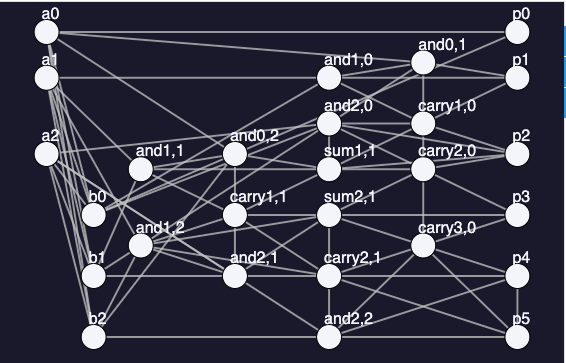

## Project 3: Shor's algorithm

Team 2 - Week 3: Mykola Maksymenko, Jordan Smith, Sourav Sen Choudhury, Ezad Shojaee, Kenneth Sharman

## Task 1: Privacy is key

Suppose you would like to send and receive messages using RSA. To start, you generate the key $(d, e, N) = (169, 25, 299)$ and publish the public part, $(25, 299)$. Shortly after, you receive an encrypted message from a friend. Implement two functions, `decrypt` and `encrypt`, according to the RSA protocol described above, to decrypt your friend's message.  Then, you can send them a response! Their public key is $(e, N) = (29, 91)$. Note that since this is a small case, you can determine by hand what their private key is. In a real-world setting, $N$ is a very large number, e.g., 2048-or 4096-bit.

Please see [task1_calculations.ipynb](./Calculations/task1_calculations.ipynb) for the calculation details associated with task #1.

### Information Security using RSA

In our digital age, the information that we send across networks is largely secured using an asymmetric cryptographic protocol called RSA. RSA depends on the mathematical difficulty of prime factorization of large numbers that are on the order of 2048+ bits long. Using classical computers, prime factorization of such numbers is intractable (requiring sub-exponential time), but a quantum computer running some derivative of Shor's algorithm could complete such a calculation in a super-polynomial time. Given a number to be prime factorized, $N=pq$, we calculate a parameter $\theta = (p-1)(q-1)$, choose a value of $e$ such that $\mbox{gcd}(e, \theta) = 1$, and then find $d$ such that $de = 1\ (\mbox{mod}\ \theta)$. Finally, the key is given as $(d, e, N)$. Now, to encrypt the plaintext message ($m$) into ciphertext ($c$), we use the equality:

$c = m^{e}\ \mbox{mod}\ N$

And to decrypt a ciphertext message into plaintext we use:

$m = c^{d}\ \mbox{mod}\ N$.

To explore how RSA works and why it can be defeated by Shor's algorithm, we will use the RSA protocol to decrypt an encrypted message, which has the following two layers of mapping: characters $\rightarrow$ plaintext $\rightarrow$ ciphertext.

After defining the 'decrypt' and 'encrypt' functions, we take a desired ciphertext message (sent from our friend, message= [292, 290, 218, 55, 127, 174, 171, 127, 112, 24, 251, 248, 127, 132, 218, 213, 24, 251, 248, 174, 55, 53, 127, 233, 24, 268, 24, 251, 248]) and decode it using the known key $(d, e, N) = (169, 25, 299)$ and our dictionary which maps character $\leftrightarrow$ plaintext, dic ={0:0, 1:1, 2:2, 3:3, 4:4, 5:5, 6:6, 7:7, 8:8, 9:9, 10:a, 11:b, 12:c, 13:d, 14:e, 15:f, 16:g, 17:h, 18:i, 19:j, 20:k, 21:l, 22:m, 23:n, 24:o, 25:p, 26:q, 27:r, 28:s, 29:t, 30:u, 31:v, 32:w, 33:x, 34:y, 35:z, 36: }.

Using our 'decrypt' function, 'dic', and our known key, we decrypt the message and find it to be: 

plaintext=[32, 17, 10, 29, 36, 18, 28, 36, 34, 24, 30, 27, 36, 15, 10, 31, 24, 30, 27, 18, 29, 14, 36, 12, 24, 21, 24, 30, 27]. 

Now we must map the message from plaintext (integers) to characters using our 'map_plaintext_to_char' function and find that the message says: 'what is your favourite colour'. The good news is that this is not jibberish, so it seems that we decrypted and mapped the message correctly.

Now let's use our dictionary and our friend's public key, $(e, N) = (29, 91)$ to map and encode a response: 

'my favourite colour is blue' $\rightarrow$ plaintext=[22, 34, 36, 15, 10, 31, 24, 30, 27, 18, 29, 14, 36, 12, 24, 21, 24, 30, 27, 36, 18, 28, 36, 11, 21, 30, 14] $\rightarrow$ ciphertext=[29, 34, 43, 71, 82, 5, 33, 88, 27, 44, 22, 14, 43, 38, 33, 21, 33, 88, 27, 43, 44, 84, 43, 72, 21, 88, 14].

Okay, so we have what appears to be a mapped and encrypted message consisting of ciphertext. Now to confirm that we encoded the message correctly, let's find the prime factors of $N = 91$ using an online calculator, calculate $\theta$, and solve for the value of the private key parameter $d$. We use this value of $d$ to decrypt our message using our 'decrypt' function to ensure that the plaintext reads correctly:

$(e, N) = (29, 91)$

$p = 7$

$q = 13$

$\theta = 72$

$d = 5$

So our friend's entire key is $(d, e, N) = (5, 29, 91)$. Now decrypting using this key, our message in plaintext is:

plaintext=[22, 34, 36, 15, 10, 31, 24, 30, 27, 18, 29, 14, 36, 12, 24, 21, 24, 30, 27, 36, 18, 28, 36, 11, 21, 30, 14]

And mapping from plaintext to characters, we recover 'my favourite colour is blue'.

Mission complete!

## Task 2: Everything is in order

Please see [task2_3_calculations.ipynb](./Calculations/task2_3_calculations.ipynb) for the calculation details associated with task #2 and #3.

Our first attempt at implementing the quantum order finding algorithm was following the $\texttt{QISKIT}$ tutorial found [here](https://qiskit.org/textbook/ch-algorithms/shor.html). Unfortunately, we were unable to determine how to implement the modular exponentiation function for $N=91$. The quantum circuit is supposed to be constructed on the single-gate level, and we were unsure how to decompose the modular exponentiation function into $\texttt{SWAP}$ gates.

Our next attempt to implement the quantum order finding algorithm was by using another $\texttt{QISKIT}$ tutorial found [here](https://qiskit.org/documentation/tutorials/algorithms/08_factorizers.html#:~:text=Shor's%20Factoring%20algorithm%C2%B6,N%20%3D%2015%20backend%20%3D%20Aer.). This approach was much simpler computationally, as the functions required to implement the entire algorithm are included in the library package- including the modular exponentiation. Again, our attempts to use this package for the case of $N=91$ failed due to insufficient memory to execute the code. Note that we also experimented with different values of $a$, with no success. Additionally, we verified that the memory issue was not a Jupyter Notebook issue, and found that running the relevant code from the command line also produced the memory error.

We decided to implement a classical algorithm to solve the order finding problem. This was not the ideal solution, but it was a method to move forward on this task. For the curious reader, please see [task2_3_calculations.ipynb](./Calculations/task2_3_calculations.ipynb) for the code we used to implement the algorithm.

For $N = 91$, our code calculates the factors to be (p,q) = (13,7). Since 13x7=91 and we know that 13 and 7 are both prime, the code produces the correct result. Further, the values of a = 2 and r = 12 yield 2^12 % 91 = 1, which is the desired result.

Our analysis shows that even using a classical order finding method, breaking RSA which uses 7 bit number (91 = 0b1011011) is very easy. It only takes ~15 microseconds to run the (rather unoptimized) code. That's just a 7 bit number though- we should expect that this will get much tougher for larger numbers.

### Note

After completing this work presented here, we found an implementation of Shor's algorithm for up to a 12-bit number, which can be found [here](https://github.com/toddwildey/shors-python/blob/master/shors.py). Unfortunately, we did not have time to investigate this software package, but the curious reader can try it out if they please!

## Task 3: Are we running Shor-t on time?

Please see [task2_3_calculations.ipynb](./Calculations/task2_3_calculations.ipynb) for the calculation details associated with task #2 and #3.

You will likely have noticed in Task 2 that Shor's algorithm is not guaranteed to find a solution. In fact, there are few potential points of failure. How often does your implementation succeed? How does this depend on the size of ? Present your results graphically and use this to infer the scaling of these resources with the size of the problem instance.

To investigate the runtime and failure rate associated with Shor's algorithm, we utilize the code as implemented in task #2 ([task2_3_calculations.ipynb](./Calculations/task2_3_calculations.ipynb)). Recall that instead of stimulating the quantum order finding algorithm, we execute a classical version. Thus, our analysis here can be veiwed as an upperbound to the runtime associated with Shor's algorithm which utilizes quantum order finding.

The plot on the left shows how the runtime, i.e., the number of operations, of the modular exponential function scales with the number of input bits. $N$ is the divisor and $n$ is the number of bits when $N$ is represented as a binary. The red data points correspond to the runtime of the modular exponential function as implemented classically in task 2 (there are so many data points that map to a particular number of bits that when plotted, they appear as a vertical line). We see that in the worst case, the algorithm scales as $O(2^n)$, i.e., it is exponential. With quantum modular exponentiation, on the other hand, the number of operations scales as $O(n^3)$ when the quantum circuit has been efficiently implemented [1].

The plot on the right shows the average numer of failures when Shor's algorithm is implemented using the classical order finding algorithm. The classical implementation has relatively few failures for inputs that are one byte in size or less. The problem is that the number of failures explodes for lager $N$. Thus, attempting to break an input key of length 2048 bits is a formidable task and classical computers have no chance. The largest number our code could factor in a reasonably short amount of time was $N = 4294967297 = 2^{32} + 1$ which takes approximately 1.6 seconds. Unfortunately, this is nowhere near a 1024 or 2048 bit number. RSA has therefore been considered an excellent cryposystem since it was first proposed in 1977, but quantum computers threaten the long-term success of this protocol.

## Task 4

Please see our [business application](./Business_Application.md)

## Challenge 1 : Shor's Algorithm requirements to run on a quantum computer

Please see [challenge1_calculations.ipynb](./Calculations/challenge1_calculations.ipynb) for the calculation details associated with challenge #1.

Try running your implementation of Shor's algorithm on real quantum hardware. How large of a number can you successfully (and reliably) factor?

We saw before that to implement Shor's algorithm one need of $\mathcal{O}(logN)$ qubits for the number and the same for the ancillary qubits, initially prepared in $\vert 0 \rangle$. According to a paper by Haner et al. [2] implementation of Shor's algorithm for factoring an N-bit integer can be done using $2N+2$ qubits.  The circuit depth and the overall gate count are in $\mathcal{O}(N^{3})$ and $\mathcal{O}(N^{3} log(N))$, respectively. Thus, we see that for the integer $91$, for example, $N = 7$ meaning that we would need $16$ qubits machine and run on it, many times. 

The following screenshot summarizes the job submission on one of the IBM machines.

## Challenge 2

As you will have discovered in Task 3 (and Challenge 1), Shor's algorithm is not going to be running at scale on NISQ devices any time soon. However, given that NISQ devices are particularly suited to variational algorithms, researchers have investigated whether factoring can be recast into this framework. For this challenge, explore and implement variational quantum factoring. Compare its resource usage and solution quality to that of your initial approach. How large of a number can you successfully factor?

### The Variational Quantum Factoring Algorithm 

The aim ofthe algorithim is given a number $m$ find $p$, $q$ such that $m = p \times q$. Both $p, q$ are primes. 

### Factoring as binary optimization:

- We want to set this factoring problem up as a optimization problem. So what are we to  optimize ? In the paper [variational quantum factoring](https://arxiv.org/abs/1808.08927) the optimization is set up as the following 

From the binary multiplication $m=p\times q$ we get the following equation [factoring as optimization](https://www.microsoft.com/en-us/research/publication/factoring-as-optimization/),

### Classical preprocessing:

After this the the above equations  are simplified (i.e truncating the summation of of the final term in equation (2) above)  by applying some  classical preprocessing rules ( see [variational quantum factoring](https://arxiv.org/abs/1808.08927))

### Constructing the Ising Hamiltonian

### VQF Algorithim

- Step 1: Feed the mixing hamiltonian and the cost Hamiltonian to the QAOA circuit

- Step 2: Obtain a set of good initial parameters (both for mixing and cost hamiltonians) from output of step 1. (quantum optimization)

- Step 3: Feed the paprametrs of step 2 to the BFGS optimizer

- Step 4:  Repeat step 2 with the optimized parameters from the output of step 3. (classical optimization)

- Step 5: Repeat steps 2,3,4 until some convergence criteria is satisfied.

- step 6: Measure quantum state to obtain results

Therefore there are essentially four blocks  in the VQFT implementation.

1. Preprocessing
2. Hamiltonian creation
3. Parameter initialization (this is where quantum optimization happens )
4. Classical optimization

### Results of Implementation

Looking at the original paper ([variational quantum factoring](https://arxiv.org/abs/1808.08927)) and the experiments performed by [mstechly](https://github.com/mstechly/vqf) we find the following- 

1. As $m$ gets bigger the the number of qubits needed to factor $m = p \times q$ icreases rapidly without classical preprocessing. With classical preprocessing however the number of qubits increases much more slowly. After the classical preprocessing, the number of qubits necessary for the VQF algorithm scales approximately as $\mathcal{O}(n_m)$. In contrast, with no classical preprocessing, VQF’s qubit requirements scale as $\mathcal{O}(n_mlog (n_m))$ asymptotically(see FIG. 1. in [variational quantum factoring](https://arxiv.org/abs/1808.08927)). 

2. Further elaborating on the above, if we don't know the length of $p, q$ in advance, the qubit scaling (with classical preprocessing)  is worse than that compared to the case when the  length of $p, q$ is known.

3. The closeness of the VQF results to the exact result crucially depends of the choice of $m$. For certain numbers the VQF results are very close to the exact one, whereas for others its very bad (see FIG. 2. in [variational quantum factoring](https://arxiv.org/abs/1808.08927)).   

4. The number of BFGS function evaluations increases with the number of circuit layers (see FIG. 3. in [variational quantum factoring](https://arxiv.org/abs/1808.08927)). (The scaling is approximately linear.) 

5. [mstechly](https://github.com/mstechly/vqf) also found that for certain numbers no matter how hard you try, you cannot find the exact solution with just one QAOA layer.

## Challenge 3

As was highlighted in Challenge 2, factoring problem $m=p \times q$ can be mapped to optimisation problem via binary representation of $m, p, q$ (see above) and a number of constraints that could result in Ising-like Hamiltonian. The result however is prone to limitations of training the variational quantum circuits and effects of noise.

The mapping to optimisation problem suggests potential to utilise quantum annealers for its solving. Here we explore CSP-based factoring on the quantum annealer and further comment on the Jiag et.al paper and its limitation.

In [challenge3_calculations.ipynb](./Calculations/challenge3_calculations.ipynb) we explored early mapping of factoring problem to Constraints Satisfaction Problem following ( https://www.dwavesys.com/media/l0tjzis2/14-1002a_b_tr_boosting_integer_factorization_via_quantum_annealing_offsets.pdf ) and solving it on the DWave machine. 

Here the global multiplication constraint that product of two numbers $a$ and $b$ should result in $p$ translates to bitwise multiplication constraints, i.e. $C_{\Lambda}(a_{0}, b_{0}, p_{0})$  and can be represented via AND logical gate. This results in mapping the initial problem to a corresponding logical circuit. For example, for 3-bit numbers $a$ and $b$ this translates in the following circuit. 

The Factoring Problem is then solved in the next steps.

1. Formulate CSP problem by building a mutiplication circuit
2. Convert CSP to a  BQM problem in which each node represents a variable
3. Find an embedding of a problem to QPU graph
4. Sample solution on a DWave machine

We experimented with up to 5-bit numbers. For example for $P = 77$ and using 5 bit binaries for $a$ and $b$ this resulted in total number of 65 binary variables to optimise for the initial BQM model.  This in turn may require significantly larger number of physical quilts to encode the problem to the hardware graph. In Jiag et.al 74 qubits of Ising model were embedded to 1803 physical quits.

We also observe that resulting samples from above BQM model not necessary result in solution that satisfies multiplication constraint. Hence additional post-recessing might be needed to filer out irrelevant samples. For the case of $P=77$ the lowest energy solution ends up being $25, 13$, while after post-recessing we arrive to the correct factoring result $7, 11$. 

| Sampled energies  | Postprocessed result |
| ------------- | ------------- |
|   |  |

**Turning to Jiag et.al**, the advantage of proposed method is in reduction of a number of necessary Ising-model qubits, which scales as $O(log^{2}(N))$.  For example factoring N=59989 requires just 59 variables. For RSA 768 this would require 147456 qubits. 

While the embedding procedure will result in significantly larger number of physical qubits (in the paper it is highlighted that 74 qubits of Ising model were embedded to 1803 physical quits) for factoring large numbers it will go far beyond capacity of current devices. 

The proposed mapping to Ising model, however, may be combined with state of the art classical simulations. In 
[Surungan et.al.](https://iopscience.iop.org/article/10.1088/1751-8121/abc72c) MC simulations were reported for system sizes of up to N = 262144 spins of 2D square lattice. While [Lin et. al.](https://www.sciencedirect.com/science/article/pii/S002199911200736X) use FPGA to simulate large Ising arrays of $1024 x 1024 = 1048576$ sites. Hence the above example of RSA 768 may be well in range of classical simulations.

## References

[1] Van Meter, Rodney, and Kohei M. Itoh. "Fast quantum modular exponentiation." Physical Review A 71.5 (2005): 052320.

[2] Haner, Thomas, Martin Roetteler, and Krysta M. Svore. "Factoring using 2n+ 2 qubits with Toffoli based modular multiplication." arXiv preprint arXiv:1611.07995 (2016).

