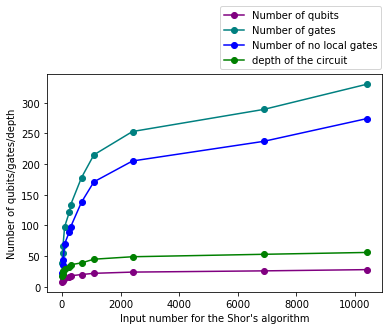
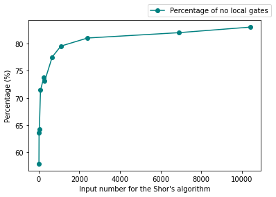
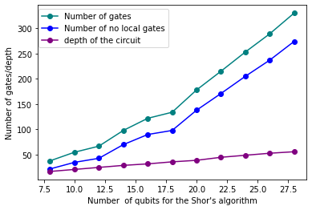
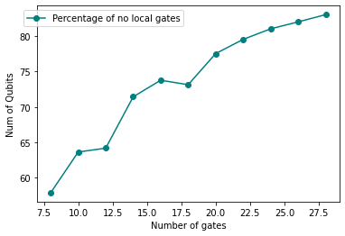
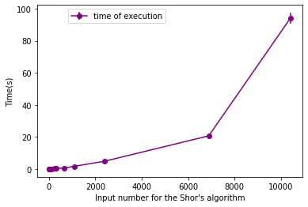
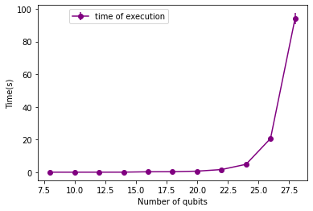

# Solution for Task 3: Are we running Shor-t on time?

You will likely have noticed in Task 2 that Shor's algorithm is not guaranteed
to find a solution. In fact, there are few potential points of failure. How
often does your implementation succeed? How does this depend on the size of $N$?

Further to this point, now that you have an implementation, let's stress test
it. Use Shor's algorithm to factor a sequence of increasingly large $N$. How
large of a number can you reliably factor with your computer?  As you are
increasing $N$, take the opportunity to perform an analysis of:

 - Run time (wall time)
 - Number of qubits required
 - Number of quantum gates required

Present your results graphically and use this to infer the scaling of these
resources with the size of the problem instance.

After, consider the following: how does the size of your largest solved instance
compare with the size of RSA keys in use today? Can you estimate the quantum
resources that would be needed to factor numbers of this size, and when we might
have a device capable of doing so? Consider the qubit count and gate count in
your estimate. To take things further, you could even estimate a rough wall time
by looking at circuit depth, and gate operation speeds of present-day hardware.elow. Use you algorithm to factor the value $N = 91$ from
the previous task.

# Implementation

Import for mathematical operators, variables o functions from math; and import a integer random generator  from random library. And using time library for check timeexecution for methods in our proposal solution.


```python
from math import gcd,ceil, pi, log2
from random import randint
import time
```

Using in the framework qiskit for the quantum computing algorithm for this we use the Quantum fourier Transform predefine method with other to run in a simulator backend.


```python
# Importing standard Qiskit libraries
from qiskit import QuantumCircuit, transpile, assemble, Aer, IBMQ
from qiskit.circuit.library import QFT
```

Method to design any unitary gate using  the format $2^i mod(N)$


```python
def unitary_gate(data_qubits,value,exp,N):
    qc = QuantumCircuit(data_qubits)
    
    ## find the output for the modulo  
    const = (value**exp)%N
    
    # obtain the binary number with the same lenght
    a = bin(const)[2:]
    while len(a) < data_qubits:
        a = '0'+a
        
    a=a[::-1]
    
    # consider a list for all the rotation we can reduce
    list_a = [0]*data_qubits  
    for i in range(data_qubits): 
        if a[i] =='1':
            k = 0
            for j in range(i,data_qubits):
                # save the values rotation in a
                list_a[data_qubits-j-1] +=pi/float(2**(k))  
                k+=1

    # apply the result of the list in a quantum circuit
    for i in range(data_qubits):
        if list_a[i] != 0:
            qc.p(list_a[i],i)
            k+=1

    # convert the quantum circuit into a quantum gate
    return qc.to_gate(label=" [ "+ str(value)+"^"+str(exp)+"% "+str(N) + "] ") 
```

Design the quantum part from the Shor algorithm using Quantum Phase Estimation method and add a return value the qc


```python
def qpe(a,N):
    # select the qubits for the quantum circuit 
    n = len(bin(N)[2:])
    m = int(ceil(log2(N)))
    
    qc = QuantumCircuit(n+m,n)
    
    # apply hadamard gates in the measurements qubits
    qc.h(range(n)) 
    qc.barrier()

    # apply the untiary gates 
    qc.h(range(n,m+n))
    for i in range(n): 
        qc.append(unitary_gate(m, a,i,N).control(1) ,[i]+[i for i in range(n,m+n)])
    
    qc.barrier()
    
    # apply inverse of the Quantum Fourier Transform QFT 
    qc.append(QFT(n,do_swaps=False).inverse(),range(n))
    
    #measure only the qubits that are equals to the lenght of N
    qc.measure(range(n), range(n))

    # apply the simulation
    aer_sim = Aer.get_backend('aer_simulator')
    t_qc = transpile(qc, aer_sim)
    qobj = assemble(t_qc, shots=1)
    result = aer_sim.run(qobj, memory=True).result()
    readings = result.get_memory()
    
    k = int(readings[0],2)/2**n
    return k,qc

```

## Generate the shor algortihm

connect our porposal of the Quantum Phase Estimation  to find the **m** value correct for the shor algorithm, and using the pseudo code provided for the task . for check the potential of the quantu malgorithm we don't consider the case when are not coprime value in the a variable.


```python
list_only_quantum = []
list_quantum = []
list_shor = []
list_num_qubits = []
list_num_gates = []
list_num_nolocal_gates = []
list_depth = []
```


```python
def shor(N):
    
    p, q = 13, 23
    
    while p * q is not N:
        
        a = randint(2, N-2)
        if gcd(a,N)!=1:
            # we are lucky!
            p = a
            q = int(N / a)
    
        else:
            #use a quantum computer to find order m of U_Na
            start_time = time.time()
            m,qc  = qpe(a,N)
            list_only_quantum.append(time.time() - start_time)
            if m %2 == 1:
                # invalid
                continue

            else:
                x = int((a ** m) % N)

                if (x == 1 or x == -1) % N:
                    # invalid
                    continue
                else:
                    # valid!
                    p = gcd(x - 1, N)
                    q = gcd(x + 1, N)
        #print(p,q,len(qc.qubits))
    return p,q,qc
```

### Run algorithm in *qasm_simulator*

Using our proposal solution with different values, and we using an extra library numpy for manipulate  list values


```python
import numpy as np
```


```python
inputs = [15,21,35,91,253,299,667,1089,2407,6887,10403]
```


```python
#N=201
for i in inputs:
    
    for each in range(30):
        a = randint(2, i-2)
        start_time_v2 = time.time()
        m,qc = qpe(a,i)
        list_only_quantum.append(time.time() - start_time_v2)
        
    list_num_qubits.append(len(qc.qubits))
    qc2 = qc.decompose().decompose()
    list_num_gates.append(qc2.size())
    list_num_nolocal_gates.append(qc2.num_nonlocal_gates())
    list_depth.append(qc2.depth())
    list_quantum.append([np.average(list_only_quantum),np.std(list_only_quantum)])
    list_only_quantum = []
    print(i, len(qc.qubits))
```

    15 8
    21 10
    35 12
    91 14
    253 16
    299 18
    667 20
    1089 22
    2407 24
    6887 26
    10403 28


## Plot the results

Consider the number of qubits, number of gates, number of no local gates, depth of the circuit and the time for each experiment. For the plot was used the matplotlib library.  


```python
import matplotlib.pyplot as plt
```

# number of qubits/gates/depth 

Using  the integer value with respect the number of qubits, depth, no local gates and gates , all of them the  increasing trend using a larger number becomes a logarithmic function.


In case of number of qubits and depth are less  comapre with the previous ones.


```python
plt.plot(inputs,list_num_qubits,label = "Number of qubits", marker='o',color ='purple')
plt.plot(inputs,list_num_gates,label = "Number of gates", marker='o',color ='teal')
plt.plot(inputs,list_num_nolocal_gates,label = "Number of no local gates", marker='o',color ='blue')
plt.plot(inputs,list_depth,label = "depth of the circuit", marker='o',color ='green')

plt.legend(bbox_to_anchor =(0.5, 1.))
plt.xlabel("Input number for the Shor's algorithm")
plt.ylabel("Number of qubits/gates/depth")
    
plt.show()
```


    

    


# Percentage of no local gates

The case of number of gates is the most bigger with more of 300 and consider only the no local gates, these are about 80% of the gates that are used for this algorithm.


```python
plt.plot(inputs,[list_num_nolocal_gates[i]*100/list_num_gates[i] for i in range(len(inputs))],label = "Percentage of no local gates", marker='o',color ='teal')

plt.legend(bbox_to_anchor =(0.5, 1.))
plt.xlabel("Input number for the Shor's algorithm")
plt.ylabel("Percentage (%)")
    
plt.show()
```


    

    


### Num of qubits

Consider the same variables but compare with  the number of qubits, the number of gates , and depth have a linear trend.


```python
plt.plot(list_num_qubits,list_num_gates,label = "Number of gates", marker='o',color ='teal')
plt.plot(list_num_qubits,list_num_nolocal_gates,label = "Number of no local gates", marker='o',color ='blue')
plt.plot(list_num_qubits,list_depth,label = "depth of the circuit", marker='o',color ='purple')

plt.legend(bbox_to_anchor =(0.5, 1.))
plt.xlabel("Number  of qubits for the Shor's algorithm")
plt.ylabel("Number of gates/depth")
    
plt.show()
```


    

    


The percentage of no local gates are in a logarithmic trend.


```python
plt.plot(list_num_qubits,[list_num_nolocal_gates[i]*100/list_num_gates[i] for i in range(len(inputs))],label = "Percentage of no local gates", marker='o',color ='teal')

plt.legend(bbox_to_anchor =(0.5, 1.))
plt.xlabel("Number of gates")
plt.ylabel("Num of Qubits")
    
plt.show()
```


    

    


# time of execution


Consider an average of 30 times for each experiment, in **qasm_simulator**, the icnrease are exponential when the quantum circuit execute the number *10403*, this is almost 5 times with respect the previous.


```python
plt.errorbar(inputs, [i[0] for i in list_quantum], [i[1] for i in list_quantum],color = 'purple',label = "time of execution", marker='o')
plt.legend(bbox_to_anchor =(0.5, 1.))
plt.xlabel("Input number for the Shor's algorithm")
plt.ylabel("Time(s)")
    
plt.show()
```


    

    


Is more clear if we consdier the number of qubits when the time of execution using 28 qubits are 5 times bigger than the 26 qubits.


```python
plt.errorbar(list_num_qubits, [i[0] for i in list_quantum], [i[1] for i in list_quantum],color = 'purple', label = "time of execution", marker='o')
plt.legend(bbox_to_anchor =(0.5, 1.))
plt.xlabel("Number of qubits")
plt.ylabel("Time(s)")
    
plt.show()
```


    

    


#### Conclusion

The posibility to find in a simulator try to use Shor's algorithm in a real problem sounds complciate, because the number of gates increse in a logaritmith gate, and the time of execution is exponential, similar to the cxlassical algorithm RSA. Exist the possibility to works with a quantum hardware, but the limitation of the number of qubits do this proposal limitate for now. when you can try with number of more of 5 digits.
